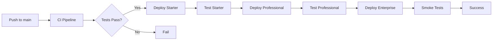
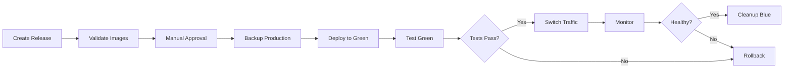

# SAHOOL CI/CD Pipeline Documentation

Complete CI/CD pipeline configuration for the SAHOOL Agricultural Platform v16.0.0

## Overview

This directory contains GitHub Actions workflows that automate the entire software delivery lifecycle:

- **Continuous Integration (CI)**: Automated testing and quality checks
- **Continuous Deployment (CD)**: Automated deployment to staging and production
- **Security Scanning**: Comprehensive security analysis
- **Documentation**: Automated API and developer documentation generation

## Workflows

### 1. `ci.yml` - Continuous Integration

**Triggers:**

- Push to any branch
- Pull requests to `main` or `develop`

**Jobs:**

```
lint-python → test-python ──┐
lint-nodejs → test-nodejs ──┼→ build-images → integration-test → ci-summary
typecheck-python ───────────┤
typecheck-nodejs ───────────┘
```

**What it does:**

1. **Code Quality Checks**
   - Python: Ruff linting, Black formatting, isort import sorting
   - Node.js: ESLint
   - Type checking: mypy (Python), tsc (TypeScript)

2. **Unit Tests**
   - Python services tested in parallel groups:
     - Core Services (agro-advisor, weather-core, field-ops)
     - AI Services (crop-health-ai, yield-engine, irrigation-smart)
     - Advanced Services (satellite-service, weather-advanced)
     - Business Services (billing-core, inventory-service)
   - Node.js services: Jest/Vitest with coverage

3. **Docker Image Build**
   - Multi-platform builds (amd64, arm64)
   - Images pushed to GitHub Container Registry on main/develop
   - Build cache optimization with GitHub Actions cache

4. **Integration Tests**
   - Full stack testing with PostgreSQL, Redis, NATS
   - API endpoint testing
   - Database connectivity verification

**Configuration:**

```yaml
env:
  PYTHON_VERSION: "3.11"
  NODE_VERSION: "20"
  REGISTRY: ghcr.io
```

**Required Secrets:**

- `CODECOV_TOKEN` - For coverage reporting (optional)
- `GITHUB_TOKEN` - Automatically provided

---

### 2. `cd-staging.yml` - Staging Deployment

**Triggers:**

- Push to `main` branch
- Manual workflow dispatch

**Deployment Strategy:**
Phased deployment with testing between each package:

```
Starter Package → Integration Tests → Professional Package → Integration Tests → Enterprise Package → Smoke Tests
```

**Package Deployment Order:**

1. **Starter Package**
   - Infrastructure (PostgreSQL, Redis, NATS)
   - field-ops
   - weather-core
   - agro-advisor

2. **Professional Package**
   - crop-health
   - ndvi-engine
   - irrigation-smart

3. **Enterprise Package**
   - satellite-service
   - weather-advanced
   - crop-health-ai
   - yield-engine
   - billing-core
   - inventory-service

**Required Secrets:**

- `KUBE_CONFIG_STAGING` - Kubernetes configuration
- `JWT_SECRET_STAGING` - JWT secret key
- `DATABASE_URL_STAGING` - Database connection string
- `OPENWEATHER_API_KEY` - Weather API key
- `SENTINEL_HUB_ID` - Sentinel Hub client ID
- `SENTINEL_HUB_SECRET` - Sentinel Hub client secret
- `STRIPE_SECRET_KEY_TEST` - Stripe test key
- `STAGING_API_KEY` - API key for testing
- `SLACK_WEBHOOK_URL` - Slack notifications (optional)

---

### 3. `cd-production.yml` - Production Deployment

**Triggers:**

- Release published
- Manual workflow dispatch with version tag

**Deployment Strategy:**
Blue-Green deployment with automatic rollback on failure

```
Validate → Approval → Backup → Deploy Green → Test Green → Switch Traffic → Verify → Cleanup Blue
                                     ↓ (on failure)
                                  Rollback
```

**Key Features:**

- **Manual Approval Gate**: Required before production deployment
- **Backup**: Full state backup before deployment
- **Blue-Green Deployment**: Zero-downtime deployment
- **Automatic Rollback**: Reverts to Blue on failure
- **Health Monitoring**: Continuous health checks during switch
- **30-minute Safety Window**: Blue environment kept for 30 minutes

**Required Secrets:**

- `KUBE_CONFIG_PRODUCTION` - Production Kubernetes config
- `JWT_SECRET_PRODUCTION` - Production JWT secret
- `DATABASE_URL_PRODUCTION` - Production database URL
- `OPENWEATHER_API_KEY_PROD` - Production weather API key
- `SENTINEL_HUB_ID_PROD` - Production Sentinel Hub ID
- `SENTINEL_HUB_SECRET_PROD` - Production Sentinel Hub secret
- `STRIPE_SECRET_KEY_PROD` - Production Stripe key
- `PRODUCTION_API_KEY` - Production API key
- `SLACK_WEBHOOK_URL` - Slack notifications

**Example Usage:**

```bash
# Via GitHub UI: Create a new release with tag v1.2.3
# Or manually trigger with version tag
gh workflow run cd-production.yml -f version=v1.2.3
```

---

### 4. `security.yml` - Security Scanning

**Triggers:**

- Push to `main` or `develop`
- Pull requests to `main` or `develop`
- Daily at 2 AM UTC
- Manual workflow dispatch

**Security Scans:**

1. **Secrets Detection**
   - TruffleHog for secret scanning
   - Hardcoded credentials check
   - API key detection
   - Private key verification
   - Sensitive file detection

2. **Dependency Vulnerability Scanning**
   - **Python**: Safety, pip-audit
   - **Node.js**: npm audit, Snyk
   - Severity threshold: HIGH and CRITICAL

3. **SAST (Static Application Security Testing)**
   - **Bandit**: Python security linting
   - **Semgrep**: Multi-language security patterns
   - **CodeQL**: Advanced semantic analysis
   - Results uploaded to GitHub Security

4. **Container Security**
   - **Trivy**: Container vulnerability scanning
   - **Grype**: Additional container analysis
   - **Hadolint**: Dockerfile linting
   - Best practices verification

5. **Infrastructure as Code**
   - **Checkov**: IaC security scanning
   - Kubernetes manifest validation
   - Security context verification

**Required Secrets:**

- `SNYK_TOKEN` - Snyk API token (optional)
- `SLACK_WEBHOOK_URL` - For critical alerts

**SARIF Reports:**
All security findings are uploaded to GitHub Security tab for centralized tracking.

---

### 5. `docs.yml` - Documentation Generation

**Triggers:**

- Push to `main` or `develop` (when service files change)
- Pull requests to `main`
- Manual workflow dispatch

**Documentation Types:**

1. **OpenAPI Specifications**
   - Auto-generated from FastAPI services
   - Validated with @ibm/openapi-validator
   - Stored as artifacts

2. **API Documentation**
   - Generated with Redoc
   - Beautiful, interactive API docs
   - Organized by service package (Starter, Professional, Enterprise)
   - Custom branded HTML with SAHOOL theme

3. **Developer Documentation**
   - Built with MkDocs Material
   - Includes:
     - Getting Started guides
     - Architecture documentation
     - API references
     - Development guides
     - Contributing guidelines

4. **Deployment**
   - Auto-deployed to GitHub Pages
   - Available at `docs.sahool.io`
   - Updated on every main branch push

**Generated Artifacts:**

- `openapi-specs` - OpenAPI JSON files
- `api-documentation` - HTML API docs
- `developer-documentation` - MkDocs site

---

## Secrets Management

### Required Secrets by Environment

#### Staging

```
KUBE_CONFIG_STAGING
JWT_SECRET_STAGING
DATABASE_URL_STAGING
OPENWEATHER_API_KEY
SENTINEL_HUB_ID
SENTINEL_HUB_SECRET
STRIPE_SECRET_KEY_TEST
STAGING_API_KEY
```

#### Production

```
KUBE_CONFIG_PRODUCTION
JWT_SECRET_PRODUCTION
DATABASE_URL_PRODUCTION
OPENWEATHER_API_KEY_PROD
SENTINEL_HUB_ID_PROD
SENTINEL_HUB_SECRET_PROD
STRIPE_SECRET_KEY_PROD
PRODUCTION_API_KEY
```

#### Optional

```
CODECOV_TOKEN          # Code coverage reporting
SNYK_TOKEN             # Snyk security scanning
SLACK_WEBHOOK_URL      # Slack notifications
TEST_USER_PASSWORD     # E2E testing
```

### Setting Secrets

```bash
# Via GitHub CLI
gh secret set SECRET_NAME --body "secret-value"

# Via GitHub UI
Settings → Secrets and variables → Actions → New repository secret
```

---

## Environment Protection Rules

### Staging

- Auto-deploy on main branch push
- No approval required
- Review after deployment

### Production

- Manual approval required
- Reviewers: DevOps team
- Deployment delay: Wait for approval
- Environment secrets isolated

**Setup:**

```
Settings → Environments → production → Configure environment
- Required reviewers: Add DevOps team
- Deployment branches: Only release tags
```

---

## Monitoring and Notifications

### Slack Notifications

All critical events are sent to Slack:

- ✅ Successful deployments
- ❌ Failed deployments
- 🚨 Security alerts
- 🔄 Rollbacks

**Setup:**

1. Create Slack webhook: https://api.slack.com/messaging/webhooks
2. Add `SLACK_WEBHOOK_URL` secret

### GitHub Actions Dashboard

Monitor workflow runs:

```
Repository → Actions tab
```

Filter by:

- Workflow name
- Branch
- Status (success, failure, in progress)

---

## Deployment Process

### Staging Deployment



### Production Deployment



---

## Best Practices

### 1. Branch Strategy

- `main` - Production-ready code
- `develop` - Integration branch
- `feature/*` - Feature branches
- `hotfix/*` - Urgent fixes
- `release/*` - Release preparation

### 2. Commit Messages

Follow conventional commits:

```
feat(satellite): Add new SAR processing endpoint
fix(billing): Resolve subscription calculation bug
docs(api): Update authentication guide
chore(deps): Update dependencies
```

### 3. Pull Requests

- All PRs must pass CI checks
- Require at least 1 approval
- Keep PRs small and focused
- Link to related issues

### 4. Versioning

Follow Semantic Versioning (SemVer):

```
v1.2.3
 │ │ │
 │ │ └─ Patch: Bug fixes
 │ └─── Minor: New features (backward compatible)
 └───── Major: Breaking changes
```

### 5. Security

- Never commit secrets
- Use GitHub Secrets for sensitive data
- Review security scan results
- Keep dependencies updated
- Regular security audits

---

## Troubleshooting

### CI Failures

**Linting errors:**

```bash
# Fix Python linting
ruff check --fix apps/services/ shared/
black apps/services/ shared/
isort apps/services/ shared/

# Fix Node.js linting
npm run lint:all -- --fix
```

**Test failures:**

```bash
# Run tests locally
pytest apps/services/SERVICE_NAME/tests -v
npm test

# With coverage
pytest --cov=apps/services/SERVICE_NAME
```

**Build failures:**

```bash
# Test Docker build locally
docker build -t test-build apps/services/SERVICE_NAME
```

### Deployment Failures

**Check logs:**

```bash
# Kubernetes logs
kubectl logs -n sahool-staging deployment/SERVICE_NAME

# GitHub Actions logs
gh run view RUN_ID --log
```

**Rollback staging:**

```bash
helm rollback SERVICE_NAME -n sahool-staging
```

**Rollback production:**
Production rollback is automatic on failure. Manual rollback:

```bash
# Switch back to blue
kubectl patch service SERVICE_NAME -n sahool-production \
  -p '{"spec":{"selector":{"deploymentSlot":"blue"}}}'
```

---

## Performance Optimization

### CI Optimization

- ✅ Parallel job execution
- ✅ Docker build caching
- ✅ Dependency caching (pip, npm)
- ✅ Matrix builds for services
- ✅ Fail-fast strategy

### Deployment Optimization

- ✅ Helm chart reusability
- ✅ Image pre-warming
- ✅ Progressive rollout
- ✅ Health check optimization
- ✅ Resource pre-allocation

---

## Contributing

### Adding a New Service

1. Create service directory: `apps/services/new-service/`
2. Add to CI matrix in `ci.yml`
3. Add to deployment workflows
4. Update documentation

### Modifying Workflows

1. Test changes in feature branch
2. Use workflow_dispatch for testing
3. Document changes in PR
4. Update this README

---

## Support

- **Documentation**: https://docs.sahool.io
- **Issues**: GitHub Issues
- **Security**: security@sahool.io
- **Slack**: #sahool-devops

---

## License

Proprietary - KAFAAT Team © 2024

---

**Last Updated**: 2024-12-25
**Version**: 16.0.0
**Maintainer**: KAFAAT DevOps Team
