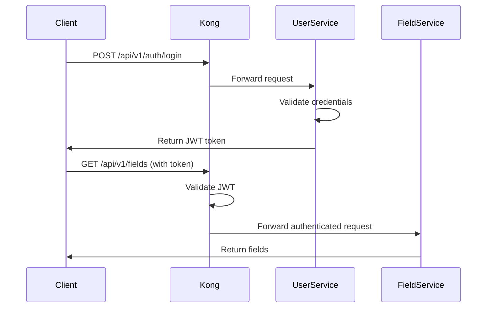

# OpenAPI Schema Documentation - README

## Overview

This directory contains comprehensive OpenAPI schema documentation for all 80+ active services in the SAHOOL Agricultural Intelligence Platform. The documentation enables dynamic development of the admin web application and provides a complete API reference for developers.

## Documentation Files

### 1. 📖 [openapi-schema.md](./openapi-schema.md)
**Complete OpenAPI 3.0.3 Specification**

Comprehensive API documentation including:
- Full OpenAPI schemas for all services
- Authentication and security patterns
- Request/response examples
- Error handling reference
- Rate limiting policies
- Common data models

**Size:** 2,515 lines  
**Use Case:** Reference documentation, API contract validation, code generation

### 2. ⚡ [OPENAPI_QUICK_REFERENCE.md](./OPENAPI_QUICK_REFERENCE.md)
**Quick Reference Guide**

Condensed guide for rapid API access:
- Common endpoints and examples
- cURL command templates
- Quick service lookup
- Testing patterns
- Development tools

**Size:** ~500 lines  
**Use Case:** Daily development, testing, troubleshooting

## Service Categories

### Infrastructure Services (13)
Database, caching, messaging, API gateway, secrets management
- postgres, pgbouncer, redis, nats, vault, kong, minio, qdrant, milvus, ollama, mlflow, mqtt, etcd

### Node.js Services (23)
NestJS microservices for business logic
- field-management-service, user-service, marketplace-service, community-chat, billing-core, etc.

### Python Services (45+)
FastAPI services for agricultural intelligence
- advisory-service, irrigation-smart, crop-intelligence-service, weather-service, vegetation-analysis-service, etc.

### AI/ML Services (12)
Computer vision, LLM orchestration, knowledge graphs
- yolo26-vision-service, llm-orchestrator-service, ai-agents-service, pest-detection-service, etc.

## How to Use This Documentation

### For Frontend Developers

1. **Authentication Flow**
   ```bash
   # See OPENAPI_QUICK_REFERENCE.md > Authentication section
   POST /api/v1/auth/login → Get JWT token
   Use token in Authorization header
   ```

2. **Service Discovery**
   ```bash
   # Find service by domain
   grep -A 10 "Field Management" openapi-schema.md
   ```

3. **API Integration**
   - Copy OpenAPI schemas from `openapi-schema.md`
   - Generate TypeScript types using openapi-typescript
   - Use example requests from documentation

### For Backend Developers

1. **Service Consistency**
   - Follow patterns in `openapi-schema.md`
   - Implement standard health endpoints
   - Use common response formats

2. **API Contract Testing**
   ```bash
   # Validate service against OpenAPI spec
   openapi-cli validate service-spec.yaml
   ```

### For the Admin Web App (Antigravity Agent)

The documentation enables the coding agent to:

1. **Discover Available APIs**
   - Parse service categories
   - Extract endpoint definitions
   - Understand authentication requirements

2. **Generate Dynamic Forms**
   - Read request schemas
   - Create input validation
   - Map field types to UI components

3. **Build API Clients**
   - Generate TypeScript interfaces
   - Create API service classes
   - Handle errors consistently

**Example Usage:**
```typescript
// Generated from openapi-schema.md
interface FieldCreateRequest {
  name: string;
  name_en?: string;
  area_hectares: number;
  boundary: GeoJSONPolygon;
  crop_type: string;
  irrigation_type?: string;
}

// Auto-generated API client
class FieldManagementAPI {
  async createField(data: FieldCreateRequest): Promise<Field> {
    return this.post('/api/v1/fields', data);
  }
}
```

## Quick Access Links

### Common Endpoints

| Service | Port | Routes | Documentation |
|---------|------|--------|---------------|
| **User Service** | 3025 | `/api/v1/auth/*`, `/api/v1/users/*` | [Link](#user-service) |
| **Field Management** | 3000 | `/api/v1/fields/*` | [Link](#field-management-service) |
| **Advisory Service** | 8093 | `/api/v1/advisory/*` | [Link](#advisory-service) |
| **Irrigation** | 8094 | `/api/v1/irrigation/*` | [Link](#irrigation-smart-service) |
| **Weather** | 8092 | `/api/v1/weather/*` | [Link](#weather-service) |
| **IoT** | 8117 | `/api/v1/iot/*` | [Link](#iot-service) |

### Base URLs

```
Development:  http://localhost:8000 (Kong Gateway)
Staging:      https://api-staging.sahool.io
Production:   https://api.sahool.io
```

## API Gateway Configuration

All services are accessible through **Kong API Gateway** with:

- ✅ Global CORS handling
- ✅ Rate limiting (service-specific)
- ✅ Authentication (JWT)
- ✅ Request/response transformation
- ✅ Security headers
- ✅ Bot detection
- ✅ Prometheus metrics

**Configuration:** See [infrastructure/gateway/kong/kong.yml](./infrastructure/gateway/kong/kong.yml)

## Authentication

### JWT Token Flow



### Token Structure

```json
{
  "sub": "user_id",
  "tenant_id": "tenant_001",
  "role": "farmer|admin|agronomist|operator",
  "permissions": ["field:read", "field:write"],
  "iat": 1707674400,
  "exp": 1707760800
}
```

## Common Patterns

### Pagination

All list endpoints support pagination:

```http
GET /api/v1/fields?page=1&limit=20
```

Response:
```json
{
  "data": [...],
  "pagination": {
    "page": 1,
    "limit": 20,
    "total": 150,
    "total_pages": 8
  }
}
```

### GeoJSON Format

All geospatial data uses GeoJSON RFC 7946:

```json
{
  "type": "Feature",
  "geometry": {
    "type": "Polygon",
    "coordinates": [[[44.191, 15.369], ...]]
  },
  "properties": {
    "field_id": "field_001",
    "name": "حقل القمح"
  }
}
```

### Error Handling

Standard error response:

```json
{
  "error": {
    "code": "FIELD_NOT_FOUND",
    "message": "Field with ID 'field_001' not found",
    "message_ar": "لم يتم العثور على الحقل",
    "request_id": "uuid",
    "timestamp": "2026-02-11T19:51:45Z"
  }
}
```

## Rate Limiting

| Service | Per Minute | Per Hour |
|---------|------------|----------|
| Public Auth | 30 | 500 |
| Protected APIs | 100 | 2000 |
| Marketplace | 60 | 1000 |
| Billing | 20 | 200 |

Rate limit headers:
```http
X-RateLimit-Limit-Minute: 100
X-RateLimit-Remaining-Minute: 95
X-RateLimit-Reset: 1707674460
```

## Health Checks

All services implement:

```bash
GET /healthz        # Liveness probe
GET /readyz         # Readiness probe
GET /metrics        # Prometheus metrics
```

## Development Workflow

### 1. Start Services

```bash
# Full stack
make dev

# Infrastructure only
make infra-up

# Specific package
make dev-professional
```

### 2. Test API

```bash
# Login and get token
TOKEN=$(curl -s -X POST http://localhost:8000/api/v1/auth/login \
  -H "Content-Type: application/json" \
  -d '{"email":"farmer@example.com","password":"password"}' \
  | jq -r '.access_token')

# Test endpoint
curl -H "Authorization: Bearer $TOKEN" \
  http://localhost:8000/api/v1/fields
```

### 3. View Logs

```bash
# All services
docker compose logs -f

# Specific service
docker compose logs -f advisory-service
```

### 4. Check Health

```bash
# Service health
curl http://localhost:8000/healthz

# Kong admin
curl http://localhost:8001/routes
```

## Code Generation

### Generate TypeScript Types

```bash
# Install tool
npm install -g openapi-typescript

# Generate types
openapi-typescript openapi-schema.md \
  --output src/types/api.ts
```

### Generate API Client

```bash
# Install tool
npm install -g @openapitools/openapi-generator-cli

# Generate client
openapi-generator-cli generate \
  -i openapi-schema.md \
  -g typescript-axios \
  -o src/api-client
```

## Testing

### Integration Tests

```bash
# Run tests
npm run test:integration

# Test specific service
npm run test:integration -- --grep "Field Management"
```

### Load Testing

```bash
# Using k6
k6 run tests/load/fields-api.js

# Using Locust
locust -f tests/load/locustfile.py
```

## Monitoring

### Prometheus Metrics

```bash
# View metrics
curl http://localhost:8000/metrics

# Grafana dashboard
http://localhost:3001
```

### Request Tracing

All requests include correlation ID:

```http
X-Correlation-Id: uuid-v4
```

Track requests across services using this ID.

## Security

### Best Practices

1. **Never commit secrets**
   - Use environment variables
   - Vault for production secrets

2. **Always validate input**
   - Use OpenAPI schemas
   - Implement request validation

3. **Use HTTPS in production**
   - TLS certificates required
   - Certificate pinning for mobile

4. **Rate limit all endpoints**
   - Protect against abuse
   - Different limits per service

5. **Log security events**
   - Authentication failures
   - Authorization denials
   - Suspicious patterns

## Troubleshooting

### Common Issues

**1. 401 Unauthorized**
```bash
# Check token expiration
jwt decode $TOKEN

# Refresh token
curl -X POST /api/v1/auth/refresh \
  -d '{"refresh_token": "..."}'
```

**2. 429 Rate Limit Exceeded**
```bash
# Check rate limit headers
curl -I /api/v1/fields

# Wait for reset time
# X-RateLimit-Reset: 1707674460
```

**3. 404 Not Found**
```bash
# Verify route in Kong
curl http://localhost:8001/routes | jq

# Check service is running
docker compose ps
```

**4. 500 Internal Server Error**
```bash
# Check service logs
docker compose logs advisory-service

# Check service health
curl http://localhost:8000/healthz
```

## Contributing

### Adding New Endpoints

1. Update service OpenAPI spec
2. Add to `openapi-schema.md`
3. Add to `OPENAPI_QUICK_REFERENCE.md`
4. Update Kong routes in `kong.yml`
5. Test with integration tests
6. Document in service README

### Updating Documentation

```bash
# Validate OpenAPI spec
openapi-cli validate openapi-schema.md

# Lint markdown
markdownlint openapi-schema.md

# Spell check
cspell openapi-schema.md
```

## Additional Resources

- **Service Registry:** [governance/services.yaml](./governance/services.yaml)
- **Kong Configuration:** [infrastructure/gateway/kong/kong.yml](./infrastructure/gateway/kong/kong.yml)
- **Docker Compose:** [docker-compose.yml](./docker-compose.yml)
- **Architecture Docs:** [docs/](./docs/)
- **API Gateway Docs:** [docs/API_GATEWAY.md](./docs/API_GATEWAY.md)
- **Security Docs:** [docs/SECURITY.md](./docs/SECURITY.md)

## Version History

- **16.0.0** (2026-02-11) - Initial comprehensive documentation
  - 80+ services documented
  - OpenAPI 3.0.3 schemas
  - Kong gateway configuration
  - Quick reference guide

## License

Proprietary - KAFAAT © 2026

## Support

For questions or issues:
- **Documentation:** support@sahool.io
- **GitHub Issues:** https://github.com/kafaat/sahool-unified-v15-idp/issues
- **Slack:** #sahool-api-support

---

**Generated:** 2026-02-11  
**Maintainer:** KAFAAT DevOps Team  
**Status:** ✅ Production Ready
