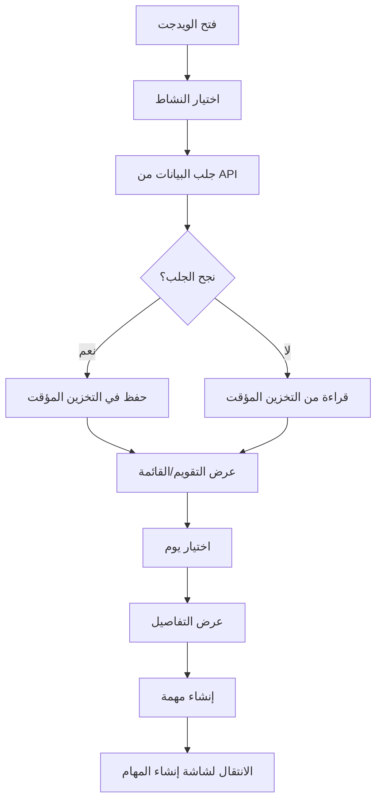

# Astronomical Task Widget - ويدجت المهام الفلكية

## نظرة عامة

ويدجت متكامل لعرض أفضل الأيام للأنشطة الزراعية بناءً على التقويم الفلكي اليمني التقليدي، مع إمكانية إنشاء مهام مباشرة من الأيام المقترحة.

## الميزات الرئيسية

### 1. اختيار النشاط
- زراعة 🌱
- ري 💧
- حصاد 🌾
- تسميد 🌿

### 2. أنماط العرض
- **عرض التقويم**: شبكة تقويمية شهرية مع ترميز لوني حسب الدرجة
- **عرض القائمة**: قائمة مرتبة بأفضل الأيام مع التفاصيل الكاملة

### 3. تفاصيل اليوم
عند اختيار يوم معين، يتم عرض:
- التاريخ الميلادي والهجري
- طور القمر الحالي
- المنزلة القمرية
- درجة الملاءمة للنشاط (0-100)
- السبب الفلكي للتوصية

### 4. إنشاء المهام
- زر مباشر لإنشاء مهمة في اليوم المحدد
- تكامل كامل مع شاشة إنشاء المهام الموجودة
- تعبئة تلقائية للتاريخ والنشاط

### 5. التخزين المؤقت (Offline Support)
- حفظ تلقائي للبيانات الفلكية
- العمل بدون اتصال بالإنترنت
- صلاحية البيانات: 7 أيام
- استخدام SharedPreferences للتخزين

### 6. الترميز اللوني
- **أخضر داكن** (90-100): ممتاز - أفضل الأيام
- **أخضر** (80-89): جيد جداً
- **أخضر فاتح** (70-79): جيد
- **أصفر مخضر** (60-69): مقبول
- **برتقالي** (أقل من 60): متوسط

## الاستخدام

### طريقة 1: عرض كـ Bottom Sheet (موصى بها)

```dart
import 'package:flutter/material.dart';
import 'astronomical_task_widget.dart';

void showAstronomicalTaskSheet(BuildContext context, {String? fieldId, String? fieldName}) {
  showModalBottomSheet(
    context: context,
    isScrollControlled: true,
    backgroundColor: Colors.transparent,
    builder: (context) => DraggableScrollableSheet(
      initialChildSize: 0.9,
      minChildSize: 0.5,
      maxChildSize: 0.95,
      builder: (context, scrollController) => AstronomicalTaskWidget(
        fieldId: fieldId,
        fieldName: fieldName,
      ),
    ),
  );
}

// الاستخدام
ElevatedButton(
  onPressed: () => showAstronomicalTaskSheet(
    context,
    fieldId: 'field_123',
    fieldName: 'حقل القمح الشمالي',
  ),
  child: Text('التقويم الفلكي'),
)
```

### طريقة 2: كشاشة كاملة

```dart
import 'package:flutter/material.dart';
import 'astronomical_task_widget.dart';

class AstronomicalTaskScreen extends StatelessWidget {
  final String? fieldId;
  final String? fieldName;

  const AstronomicalTaskScreen({
    super.key,
    this.fieldId,
    this.fieldName,
  });

  @override
  Widget build(BuildContext context) {
    return Scaffold(
      body: AstronomicalTaskWidget(
        fieldId: fieldId,
        fieldName: fieldName,
      ),
    );
  }
}
```

### طريقة 3: كتبويب في شاشة موجودة

```dart
TabBarView(
  children: [
    // تبويبات أخرى...
    AstronomicalTaskWidget(
      fieldId: fieldId,
      fieldName: fieldName,
    ),
  ],
)
```

## المعاملات (Parameters)

| المعامل | النوع | مطلوب | الوصف |
|---------|------|-------|-------|
| `fieldId` | String? | لا | معرف الحقل الذي سيتم إنشاء المهمة له |
| `fieldName` | String? | لا | اسم الحقل (للعرض) |

## المزودات (Providers)

### astronomicalTaskActivityProvider
```dart
final astronomicalTaskActivityProvider = StateProvider<String>((ref) => 'زراعة');
```
يدير النشاط المحدد حالياً.

### selectedAstroDayProvider
```dart
final selectedAstroDayProvider = StateProvider<BestDay?>((ref) => null);
```
يدير اليوم المحدد من التقويم.

### astroViewModeProvider
```dart
final astroViewModeProvider = StateProvider<AstroViewMode>((ref) => AstroViewMode.calendar);
```
يدير نمط العرض (تقويم أو قائمة).

### astronomicalCacheProvider
```dart
final astronomicalCacheProvider = FutureProvider.family<BestDaysResult?, String>((ref, activity) async {...});
```
يدير جلب البيانات والتخزين المؤقت.

## البنية التقنية

### نموذج البيانات

```dart
class BestDay {
  final String date;           // التاريخ الميلادي (yyyy-MM-dd)
  final String hijriDate;      // التاريخ الهجري
  final String moonPhase;      // طور القمر
  final String lunarMansion;   // المنزلة القمرية
  final int score;             // الدرجة (0-100)
  final String reason;         // سبب التوصية
}

class BestDaysResult {
  final String activity;       // النشاط المطلوب
  final int searchPeriodDays;  // عدد الأيام المبحوث فيها
  final List<BestDay> bestDays; // قائمة أفضل الأيام
  final int totalFound;        // إجمالي الأيام المناسبة
}
```

### مكونات الويدجت

1. **_CalendarGrid**: شبكة التقويم الشهرية
2. **_DayDetailsCard**: بطاقة تفاصيل اليوم المحدد
3. **_DayListTile**: عنصر في عرض القائمة
4. **_buildActivitySelector**: محدد النشاط
5. **_buildCreateTaskButton**: زر إنشاء المهمة

## التدفق البرمجي



## التخزين المؤقت

### آلية العمل

1. **الجلب الأول**: محاولة الجلب من الخادم
2. **الحفظ**: حفظ البيانات مع طابع زمني
3. **الفشل**: قراءة البيانات المخزنة
4. **التحقق**: فحص صلاحية البيانات (7 أيام)

### هيكل البيانات المخزنة

```json
{
  "result": {
    "activity": "زراعة",
    "searchPeriodDays": 30,
    "bestDays": [...],
    "totalFound": 15
  },
  "timestamp": "2024-01-15T10:30:00.000Z"
}
```

### مفتاح التخزين
```dart
'astronomical_data_{activity}'
// مثال: 'astronomical_data_زراعة'
```

## التكامل مع شاشة إنشاء المهام

عند النقر على "إنشاء مهمة":

1. تحليل التاريخ المحدد
2. الانتقال إلى `CreateTaskScreen`
3. تمرير `fieldId` و `fieldName`
4. المستخدم يكمل بيانات المهمة
5. العودة بنتيجة النجاح
6. عرض رسالة التأكيد

```dart
final result = await Navigator.push<bool>(
  context,
  MaterialPageRoute(
    builder: (context) => CreateTaskScreen(
      fieldId: fieldId,
      fieldName: fieldName,
    ),
  ),
);

if (result == true) {
  // نجح الإنشاء
  ScaffoldMessenger.of(context).showSnackBar(
    SnackBar(content: Text('تم إنشاء المهمة بنجاح')),
  );
}
```

## التخصيص

### تغيير الألوان

```dart
// في _getScoreColor
Color _getScoreColor(int score) {
  if (score >= 90) return Colors.green.shade700;  // ممتاز
  if (score >= 80) return Colors.green;           // جيد جداً
  if (score >= 70) return Colors.lightGreen;      // جيد
  if (score >= 60) return Colors.lime.shade600;   // مقبول
  return Colors.orange;                           // متوسط
}
```

### تغيير مدة التخزين المؤقت

```dart
// في _loadFromCache
if (DateTime.now().difference(timestamp).inDays > 7) {  // 7 أيام
  return null;
}
```

### تغيير عدد الأيام المبحوث فيها

```dart
final cacheAsync = ref.watch(
  astronomicalCacheProvider(selectedActivity),
  // لتغيير عدد الأيام، عدّل في BestDaysParams
);

// في المزود:
BestDaysParams(activity: selectedActivity, days: 30)  // 30 يوماً
```

## الأمثلة

راجع ملف `astronomical_task_widget_example.dart` للأمثلة الكاملة:

1. عرض كـ Bottom Sheet
2. دمج في شاشة المهام
3. دمج كتبويب
4. عرض كشاشة منفصلة
5. استخدام مع قائمة الحقول
6. دمج في شاشة إنشاء المهمة

## المتطلبات

### Dependencies

```yaml
dependencies:
  flutter_riverpod: ^2.4.0
  intl: ^0.19.0
  shared_preferences: ^2.3.3
```

### الحد الأدنى من Flutter SDK

```yaml
environment:
  sdk: ">=3.0.0 <4.0.0"
```

## الاعتبارات الأمنية

- البيانات الفلكية غير حساسة، يمكن تخزينها بدون تشفير
- استخدام SharedPreferences للتخزين البسيط
- عدم تخزين معلومات المستخدم الحساسة

## الأداء

### التحسينات المطبقة

1. **Lazy Loading**: تحميل البيانات عند الطلب فقط
2. **Caching**: تقليل الطلبات للخادم
3. **AutoDispose**: تنظيف المزودات تلقائياً
4. **Efficient Rebuilds**: استخدام Consumer للتحديثات الانتقائية

### الذاكرة

- حجم البيانات المخزنة: ~10-20 KB لكل نشاط
- إجمالي الذاكرة: ~50-80 KB لجميع الأنشطة

## الإصلاحات الشائعة

### البيانات لا تظهر

```dart
// تحقق من الاتصال بالإنترنت
// امسح التخزين المؤقت
final prefs = await SharedPreferences.getInstance();
await prefs.remove('astronomical_data_زراعة');
```

### خطأ في التاريخ

```dart
// تحقق من صيغة التاريخ
DateFormat('yyyy-MM-dd').parse(day.date)
```

### لا يتم إنشاء المهمة

```dart
// تحقق من fieldId
// تحقق من التنقل
Navigator.push<bool>(...)
```

## المساهمة

عند إضافة ميزات جديدة:

1. اتبع نمط البرمجة الحالي
2. أضف تعليقات باللغة العربية
3. حافظ على التوافق مع التخزين المؤقت
4. اختبر في وضع عدم الاتصال

## الترخيص

جزء من نظام SAHOOL الزراعي المتكامل.

---

## ملاحظات إضافية

### التقويم الفلكي اليمني

يعتمد الويدجت على:
- **28 منزلة قمرية**: كل منزلة لها خصائص زراعية مختلفة
- **أطوار القمر**: تأثير القمر على نمو النباتات
- **التاريخ الهجري**: التقويم التقليدي المستخدم في اليمن
- **الأمثال الشعبية**: حكمة الأجداد في الزراعة

### الأنشطة المدعومة

1. **زراعة**: زراعة البذور والشتلات
2. **ري**: سقي المحاصيل
3. **حصاد**: جني المحصول
4. **تسميد**: إضافة الأسمدة للتربة

كل نشاط له معايير فلكية خاصة به.
