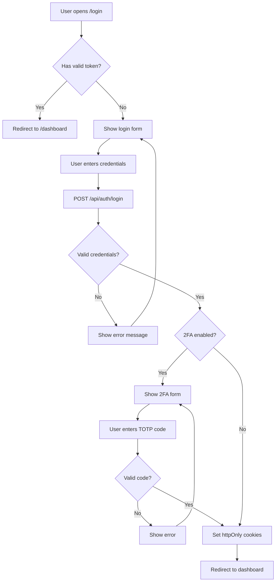
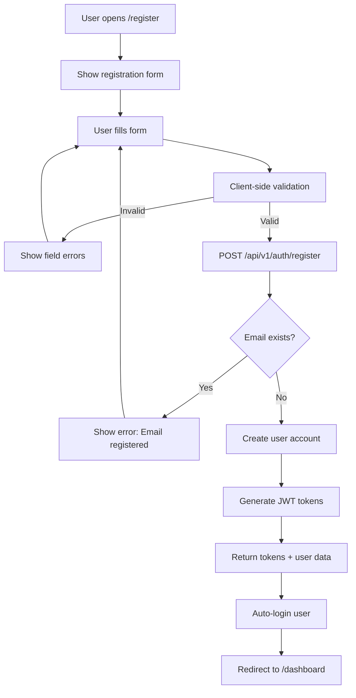
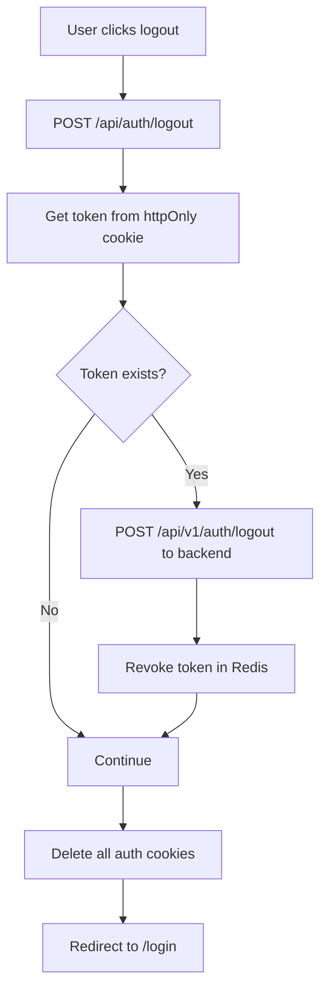

# Authentication UX Audit Report | تقرير فحص تجربة المستخدم للمصادقة

**Date | التاريخ**: January 2025
**Version | الإصدار**: 16.0.0
**Platforms Audited | المنصات المفحوصة**: Admin Portal, Web Dashboard, Backend User Service

---

## Executive Summary | الملخص التنفيذي

This report provides a comprehensive audit of the authentication user experience across SAHOOL platform applications, covering login, registration, session management, and security mechanisms.

يقدم هذا التقرير فحصاً شاملاً لتجربة المستخدم في المصادقة عبر تطبيقات منصة سهول، ويشمل تسجيل الدخول والتسجيل وإدارة الجلسات وآليات الأمان.

---

## 1. Authentication Flows | تدفقات المصادقة

### 1.1 Login Flow | تدفق تسجيل الدخول



#### Supported Features | الميزات المدعومة:
| Feature | Admin | Web | Status |
|---------|-------|-----|--------|
| Email/Password login | ✅ | ✅ | Working |
| Two-Factor Auth (TOTP) | ✅ | ✅ | Working |
| Remember return URL | ✅ | ✅ | Working |
| Show/Hide password | ✅ | ✅ | Working |
| Demo credentials (dev) | ✅ | ❌ | Admin only |

#### Files Involved | الملفات المعنية:
- `apps/admin/src/app/login/page.tsx` - Admin login UI
- `apps/web/src/app/(auth)/login/LoginClient.tsx` - Web login UI
- `apps/admin/src/app/api/auth/login/route.ts` - API proxy route
- `apps/services/user-service/src/auth/auth.controller.ts` - Backend endpoint
- `apps/services/user-service/src/auth/auth.service.ts` - Authentication logic

---

### 1.2 Registration Flow | تدفق التسجيل



#### Registration Fields | حقول التسجيل:
| Field | Admin | Web | Required | Validation |
|-------|-------|-----|----------|------------|
| First Name | ✅ | ✅ | ✅ | min 2 chars |
| Last Name | ✅ | ✅ | ✅ | min 2 chars |
| Email | ✅ | ✅ | ✅ | Valid email format |
| Password | ✅ | ✅ | ✅ | min 8 chars |
| Confirm Password | ❌ | ✅ | Web only | Must match password |
| Phone | ✅ | ✅ | ❌ | Optional, valid format |

#### Password Requirements | متطلبات كلمة المرور:
- **Admin**: Minimum 8 characters
- **Web**: Minimum 8 characters + uppercase + lowercase + number

---

### 1.3 Forgot Password Flow | تدفق نسيان كلمة المرور

| Feature | Status | Notes |
|---------|--------|-------|
| Forgot password page | ❌ Not Implemented | No `/forgot-password` route exists |
| Password reset email | ❌ Not Implemented | Backend endpoint not created |
| Reset password page | ❌ Not Implemented | No `/reset-password` route exists |

**Recommendation | التوصية**: Implement forgot password functionality for production use.

---

### 1.4 Logout Flow | تدفق تسجيل الخروج



#### Cookies Cleared | الكوكيز المحذوفة:
- `sahool_admin_token` - Access token
- `sahool_admin_refresh_token` - Refresh token
- `sahool_admin_last_activity` - Activity timestamp

---

## 2. Session Management | إدارة الجلسات

### 2.1 Token Configuration | تكوين التوكنات

| Token Type | Expiry | Storage | Purpose |
|------------|--------|---------|---------|
| Access Token | 30 minutes | httpOnly cookie | API authentication |
| Refresh Token | 7 days | httpOnly cookie | Token renewal |
| CSRF Token | 24 hours | Regular cookie | CSRF protection |

### 2.2 Idle Timeout | مهلة الخمول

- **Timeout Period**: 30 minutes of inactivity
- **Activity Tracking**: Mouse, keyboard, scroll, touch events
- **Server Update**: Every 30 seconds when active
- **Check Interval**: Every 60 seconds

### 2.3 Token Refresh | تحديث التوكن

- **Automatic Refresh**: Every 5 minutes
- **Rotation**: New refresh token on each use
- **Reuse Detection**: Token family invalidation on replay attack

---

## 3. Route Protection | حماية المسارات

### 3.1 Public Routes (No Auth Required) | المسارات العامة

**Admin App**:
```
/login
/register
/api/auth/login
/api/auth/register
/api/auth/refresh
/api/health
```

**Web App**:
```
/login
/register
/forgot-password
/reset-password
/api/auth
/
```

### 3.2 Protected Routes by Role | المسارات المحمية حسب الدور

| Route | Admin | Supervisor | Viewer |
|-------|-------|------------|--------|
| `/dashboard` | ✅ | ✅ | ✅ |
| `/analytics` | ✅ | ✅ | ✅ |
| `/farms` | ✅ | ✅ | ❌ |
| `/settings` | ✅ | ❌ | ❌ |
| `/api/users` | ✅ | ❌ | ❌ |

---

## 4. Security Features | ميزات الأمان

### 4.1 Implemented Security Measures | إجراءات الأمان المطبقة

| Feature | Status | Description |
|---------|--------|-------------|
| httpOnly Cookies | ✅ | Tokens stored in httpOnly cookies |
| CSRF Protection | ✅ | Token validation on state-changing requests |
| JWT Verification | ✅ | Signature verification with secret key |
| Password Hashing | ✅ | bcrypt with 12 rounds |
| Rate Limiting | ✅ | 5 login attempts/minute, 10 register attempts/minute |
| Token Revocation | ✅ | Redis-based blacklist |
| Security Headers | ✅ | CSP, HSTS, X-Frame-Options, etc. |
| Role-based Access | ✅ | Admin/Supervisor/Viewer hierarchy |

### 4.2 Security Headers | رؤوس الأمان

```
X-Frame-Options: DENY
X-Content-Type-Options: nosniff
Referrer-Policy: strict-origin-when-cross-origin
X-XSS-Protection: 1; mode=block
Strict-Transport-Security: max-age=31536000; includeSubDomains
Content-Security-Policy: [nonce-based policy]
```

---

## 5. Issues Found | المشاكل المكتشفة

### 5.1 Critical Issues | مشاكل حرجة

| # | Issue | Impact | Status |
|---|-------|--------|--------|
| 1 | ~~`/register` not in PUBLIC_ROUTES~~ | Registration redirect to login | ✅ Fixed |

### 5.2 Missing Features | الميزات الناقصة

| # | Feature | Priority | Recommendation |
|---|---------|----------|----------------|
| 1 | Forgot Password | High | Implement email-based password reset |
| 2 | Email Verification | Medium | Add email verification after registration |
| 3 | Account Lockout | Medium | Lock account after N failed attempts |
| 4 | Password Strength Meter | Low | Visual feedback during password entry |
| 5 | Social Login | Low | OAuth with Google/Apple (optional) |

### 5.3 UX Improvements | تحسينات تجربة المستخدم

| # | Improvement | Description |
|---|-------------|-------------|
| 1 | Loading States | Add skeleton loading for better perceived performance |
| 2 | Error Messages | Standardize error message format across apps |
| 3 | Success Feedback | Add toast notifications after successful actions |
| 4 | Form Validation | Real-time validation feedback as user types |
| 5 | Accessibility | Add ARIA labels and keyboard navigation support |

---

## 6. User Journey Scenarios | سيناريوهات رحلة المستخدم

### Scenario 1: New User Registration | تسجيل مستخدم جديد

```
1. User visits /register
2. Fills registration form
3. Submits form
4. Account created with FARMER role
5. Auto-login with JWT tokens
6. Redirected to /dashboard
```

**Status**: ✅ Working

### Scenario 2: Returning User Login | تسجيل دخول مستخدم عائد

```
1. User visits /login
2. Enters email and password
3. Credentials validated
4. If 2FA enabled → Enter TOTP code
5. Tokens set in httpOnly cookies
6. Redirected to /dashboard or returnTo URL
```

**Status**: ✅ Working

### Scenario 3: Session Expiry | انتهاء الجلسة

```
1. User inactive for 30 minutes
2. Next request triggers middleware check
3. Idle timeout detected
4. Cookies cleared
5. Redirected to /login with reason=session_expired
```

**Status**: ✅ Working

### Scenario 4: Token Refresh | تحديث التوكن

```
1. Access token expires (30 min)
2. Frontend calls /api/auth/refresh
3. Refresh token validated
4. New access + refresh tokens generated
5. Old refresh token marked as used
6. Session continues seamlessly
```

**Status**: ✅ Working

### Scenario 5: Unauthorized Access | وصول غير مصرح

```
1. Viewer user tries to access /settings
2. Middleware checks role
3. User role (viewer) not in required roles (admin)
4. Redirected to /dashboard with error=unauthorized
```

**Status**: ✅ Working

### Scenario 6: Password Reset | إعادة تعيين كلمة المرور

```
1. User clicks "Forgot Password"
2. → Feature not implemented
```

**Status**: ❌ Not Implemented

---

## 7. API Endpoints | نقاط الواجهة البرمجية

### Authentication Endpoints | نقاط المصادقة

| Method | Endpoint | Description | Auth Required |
|--------|----------|-------------|---------------|
| POST | `/api/v1/auth/login` | User login | No |
| POST | `/api/v1/auth/register` | User registration | No |
| POST | `/api/v1/auth/refresh` | Refresh tokens | No (uses refresh token) |
| POST | `/api/v1/auth/logout` | Logout (revoke token) | Yes |
| POST | `/api/v1/auth/logout-all` | Logout all devices | Yes |
| POST | `/api/v1/auth/me` | Get current user | Yes |

### Rate Limits | حدود المعدل

| Endpoint | Limit | Period |
|----------|-------|--------|
| `/auth/login` | 5 requests | 60 seconds |
| `/auth/register` | 10 requests | 60 seconds |
| `/auth/refresh` | 10 requests | 60 seconds |

---

## 8. Recommendations | التوصيات

### High Priority | أولوية عالية

1. **Implement Forgot Password Flow**
   - Add `/forgot-password` and `/reset-password` routes
   - Create backend endpoints for password reset
   - Implement secure token-based email verification

2. **Add Account Lockout**
   - Lock account after 5 failed login attempts
   - Implement progressive delays between attempts
   - Send notification email on lockout

### Medium Priority | أولوية متوسطة

3. **Email Verification**
   - Send verification email on registration
   - Add `/verify-email` route
   - Optional: Require verification before full access

4. **Enhanced Logging**
   - Log all authentication events
   - Track failed login attempts by IP
   - Alert on suspicious patterns

### Low Priority | أولوية منخفضة

5. **UI Enhancements**
   - Password strength indicator
   - "Remember me" checkbox
   - Social login buttons (Google, Apple)

---

## 9. Testing Checklist | قائمة الاختبار

### Manual Testing | الاختبار اليدوي

- [ ] Login with valid credentials
- [ ] Login with invalid credentials
- [ ] Login with 2FA enabled
- [ ] Register new account
- [ ] Register with existing email
- [ ] Navigate to protected route without auth
- [ ] Test idle timeout (wait 30 min)
- [ ] Test role-based access (admin vs viewer)
- [ ] Logout and verify cookies cleared
- [ ] Test "Back" button after logout

### Automated Testing | الاختبار الآلي

- [ ] Unit tests for auth service
- [ ] Integration tests for login/register API
- [ ] E2E tests for complete auth flows
- [ ] Security tests for CSRF, XSS protection

---

## 10. Conclusion | الخلاصة

The authentication system in SAHOOL platform is well-implemented with modern security practices including:
- JWT-based authentication with httpOnly cookies
- Token rotation and revocation
- Role-based access control
- CSRF protection
- Comprehensive security headers

The main gap is the missing forgot password functionality which should be prioritized for production deployment.

نظام المصادقة في منصة سهول مطبق بشكل جيد مع ممارسات أمان حديثة تشمل:
- المصادقة المستندة إلى JWT مع كوكيز httpOnly
- تدوير وإلغاء التوكنات
- التحكم في الوصول القائم على الأدوار
- حماية CSRF
- رؤوس أمان شاملة

الفجوة الرئيسية هي وظيفة نسيان كلمة المرور الناقصة والتي يجب إعطاؤها الأولوية للنشر في الإنتاج.

---

**Report Generated**: January 2025
**Auditor**: Claude AI
**Platform Version**: 16.0.0
