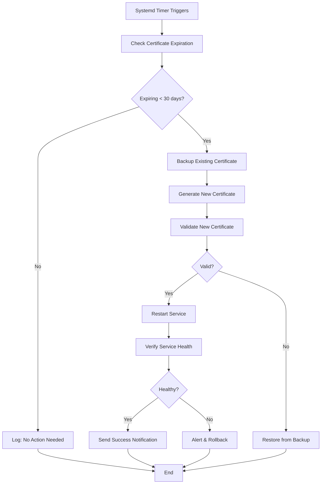

# SAHOOL Certificate Rotation Guide

## Table of Contents

- [Overview](#overview)
- [Architecture](#architecture)
- [Quick Start](#quick-start)
- [Certificate Management](#certificate-management)
- [Automated Rotation](#automated-rotation)
- [Manual Rotation](#manual-rotation)
- [Monitoring & Validation](#monitoring--validation)
- [Troubleshooting](#troubleshooting)
- [Security Best Practices](#security-best-practices)
- [Production Deployment](#production-deployment)

---

## Overview

The SAHOOL platform uses TLS certificates to secure internal communication between infrastructure services. This guide covers the automated certificate rotation system that ensures continuous security without service disruption.

### Covered Services

The certificate rotation system manages TLS certificates for:

| Service | Description | Port(s) |
|---------|-------------|---------|
| **PostgreSQL** | Main database server | 5432 |
| **PgBouncer** | Database connection pooler | 6432 |
| **Redis** | Cache and session store | 6379 |
| **NATS** | Message queue and event bus | 4222 |
| **Kong** | API Gateway | 8443 |

### Key Features

- ✅ **Automated rotation** - Systemd timer runs daily checks
- ✅ **Zero-downtime** - Rolling restarts for each service
- ✅ **Backup management** - Automatic backups with retention
- ✅ **Validation checks** - Pre and post-rotation verification
- ✅ **Multiple output formats** - Text, JSON, Nagios compatible
- ✅ **Notification support** - Email and Slack integration
- ✅ **Dry-run mode** - Test rotation without making changes

---

## Architecture

### Certificate Hierarchy

```
config/certs/
├── ca/                          # Certificate Authority (10 years)
│   ├── ca.crt                  # Root CA certificate (public)
│   └── ca.key                  # CA private key (SECRET)
├── postgres/                    # PostgreSQL certificates (2.25 years)
│   ├── server.crt
│   ├── server.key              # (SECRET)
│   └── ca.crt                  # CA copy
├── pgbouncer/                   # PgBouncer certificates (2.25 years)
│   ├── server.crt
│   ├── server.key              # (SECRET)
│   └── ca.crt
├── redis/                       # Redis certificates (2.25 years)
│   ├── server.crt
│   ├── server.key              # (SECRET)
│   └── ca.crt
├── nats/                        # NATS certificates (2.25 years)
│   ├── server.crt
│   ├── server.key              # (SECRET)
│   └── ca.crt
├── kong/                        # Kong certificates (2.25 years)
│   ├── server.crt
│   ├── server.key              # (SECRET)
│   └── ca.crt
├── backups/                     # Certificate backups
│   ├── postgres/
│   ├── pgbouncer/
│   ├── redis/
│   ├── nats/
│   └── kong/
└── rotation.log                 # Rotation history
```

### Certificate Validity Periods

- **CA Certificate**: 10 years (3650 days)
- **Service Certificates**: ~2.25 years (825 days)
- **Rotation Threshold**: 30 days before expiration
- **Warning Threshold**: 30 days
- **Critical Threshold**: 7 days

### Rotation Workflow



---

## Quick Start

### Initial Setup

1. **Generate initial certificates:**

```bash
cd /home/user/sahool-unified-v15-idp
./scripts/certs/generate-certs.sh
```

2. **Validate certificates:**

```bash
./scripts/certs/validate-certs.sh
```

3. **Enable automated rotation (systemd):**

```bash
# Copy systemd files
sudo cp infrastructure/certs/cert-rotation.service /etc/systemd/system/
sudo cp infrastructure/certs/cert-rotation.timer /etc/systemd/system/

# Update paths in service file if not using /opt/sahool
sudo sed -i 's|/opt/sahool|/home/user/sahool-unified-v15-idp|g' /etc/systemd/system/cert-rotation.service

# Enable and start timer
sudo systemctl daemon-reload
sudo systemctl enable cert-rotation.timer
sudo systemctl start cert-rotation.timer

# Verify timer is active
sudo systemctl status cert-rotation.timer
```

4. **Configure notifications (optional):**

```bash
# Create configuration file
sudo tee /etc/default/sahool-certs <<EOF
# Email notifications
NOTIFICATION_EMAIL=admin@example.com

# Slack notifications
SLACK_WEBHOOK_URL=https://hooks.slack.com/services/YOUR/WEBHOOK/URL
EOF
```

### Alternative: Cron Job Setup

If you prefer cron instead of systemd:

```bash
# Edit crontab
sudo crontab -e

# Add daily rotation check at 2 AM
0 2 * * * cd /home/user/sahool-unified-v15-idp && ./scripts/certs/rotate-certs.sh --backup >> /var/log/sahool-cert-rotation.log 2>&1
```

---

## Certificate Management

### Generate Certificates

#### Generate All Certificates

```bash
./scripts/certs/generate-certs.sh
```

#### Force Regenerate All Certificates

```bash
./scripts/certs/generate-certs.sh --force
```

#### Generate Certificate for Specific Service

```bash
./scripts/certs/generate-certs.sh --service redis
```

#### View Certificate Information

```bash
# Show detailed info for a service
./scripts/certs/generate-certs.sh --info postgres

# Verify all certificates
./scripts/certs/generate-certs.sh --verify
```

### Manual Certificate Inspection

```bash
# View certificate details
openssl x509 -in config/certs/postgres/server.crt -noout -text

# Check expiration date
openssl x509 -in config/certs/postgres/server.crt -noout -dates

# Verify certificate chain
openssl verify -CAfile config/certs/ca/ca.crt config/certs/postgres/server.crt

# Check if private key matches certificate
diff <(openssl x509 -noout -modulus -in config/certs/postgres/server.crt | openssl md5) \
     <(openssl rsa -noout -modulus -in config/certs/postgres/server.key | openssl md5)
```

---

## Automated Rotation

### Systemd Timer Configuration

The systemd timer runs daily at 2:00 AM and checks if any certificates need rotation.

#### Check Timer Status

```bash
# View timer status
sudo systemctl status cert-rotation.timer

# List all timers
sudo systemctl list-timers cert-rotation.timer

# View last rotation logs
sudo journalctl -u cert-rotation.service -n 50
```

#### Trigger Manual Rotation via Systemd

```bash
# Run rotation service immediately
sudo systemctl start cert-rotation.service

# Check status
sudo systemctl status cert-rotation.service

# View real-time logs
sudo journalctl -u cert-rotation.service -f
```

#### Modify Timer Schedule

Edit `/etc/systemd/system/cert-rotation.timer`:

```ini
[Timer]
# Run weekly instead of daily
OnCalendar=weekly

# Run every Monday at 3 AM
# OnCalendar=Mon *-*-* 03:00:00

# Run on the 1st and 15th of each month
# OnCalendar=*-*-01,15 02:00:00
```

Then reload:

```bash
sudo systemctl daemon-reload
sudo systemctl restart cert-rotation.timer
```

### Environment Variables

Configure in `/etc/default/sahool-certs`:

```bash
# Rotation threshold (days before expiration to rotate)
ROTATION_THRESHOLD_DAYS=30

# Email notifications
NOTIFICATION_EMAIL=admin@example.com

# Slack webhook for notifications
SLACK_WEBHOOK_URL=https://hooks.slack.com/services/XXX/YYY/ZZZ

# Backup retention (number of backups to keep)
BACKUP_RETENTION=10

# Skip service restart (only rotate certs)
# SKIP_RESTART=true
```

---

## Manual Rotation

### Rotate All Expiring Certificates

```bash
./scripts/certs/rotate-certs.sh
```

### Dry Run (Preview What Would Happen)

```bash
./scripts/certs/rotate-certs.sh --dry-run
```

### Rotate Specific Service

```bash
./scripts/certs/rotate-certs.sh --service redis
```

### Force Rotation (Even if Not Expiring)

```bash
./scripts/certs/rotate-certs.sh --force
```

### Rotate Without Restarting Services

Useful when you want to rotate during a maintenance window:

```bash
# Rotate certificates but don't restart
./scripts/certs/rotate-certs.sh --skip-restart

# Later, manually restart services
docker-compose restart postgres pgbouncer redis nats kong
```

### Rotate Without Backup

⚠️ **Not recommended for production!**

```bash
./scripts/certs/rotate-certs.sh --no-backup --force
```

---

## Monitoring & Validation

### Validate All Certificates

```bash
./scripts/certs/validate-certs.sh
```

Output:

```
═══════════════════════════════════════════════════════════════════════════════
  SAHOOL Certificate Validation Report
  Date: Tue Jan  7 02:00:00 UTC 2026
═══════════════════════════════════════════════════════════════════════════════

[SUCCESS] postgres: Certificate valid for 795 days
[SUCCESS] pgbouncer: Certificate valid for 795 days
[WARNING] redis: Certificate expires in 25 days (Expires: Mar 12 02:00:00 2026 GMT)
[SUCCESS] nats: Certificate valid for 795 days
[SUCCESS] kong: Certificate valid for 795 days

─────────────────────────────────────────────────────────────────────────────
Summary:
  Total Certificates:   5
  Valid:                4
  Warnings:             1
  Errors/Critical:      0
─────────────────────────────────────────────────────────────────────────────
```

### Validate Specific Service

```bash
./scripts/certs/validate-certs.sh --service redis
```

### JSON Output (for Monitoring Tools)

```bash
./scripts/certs/validate-certs.sh --json
```

Output:

```json
{
  "timestamp": "2026-01-07T02:00:00Z",
  "validation_results": [
    {
      "service": "postgres",
      "status": "valid",
      "days_until_expiry": 795,
      "message": "Certificate valid for 795 days",
      "expiry_date": "Nov 10 02:00:00 2027 GMT"
    },
    {
      "service": "redis",
      "status": "warning",
      "days_until_expiry": 25,
      "message": "Certificate expires in 25 days",
      "expiry_date": "Mar 12 02:00:00 2026 GMT"
    }
  ]
}
```

### Nagios/Icinga Integration

```bash
./scripts/certs/validate-certs.sh --nagios
```

Output formats:

```
OK: All 5 certificates valid | critical=0 warning=0 ok=5
WARNING: 1 certificate(s) expiring soon: redis(25 days); | critical=0 warning=1 ok=4
CRITICAL: 1 certificate(s) expired/invalid: postgres(Certificate expired 5 days ago); | critical=1 warning=0 ok=4
```

Exit codes:
- `0` = OK
- `1` = WARNING
- `2` = CRITICAL

### Custom Warning Threshold

```bash
# Warn if expiring within 60 days
./scripts/certs/validate-certs.sh --warning-days 60
```

### Check Expiration Dates for All Certificates

```bash
for cert in config/certs/*/server.crt; do
  echo "=== $cert ==="
  openssl x509 -in "$cert" -noout -dates
  echo ""
done
```

---

## Troubleshooting

### Common Issues

#### Certificate Validation Failed

**Problem**: Certificate chain validation fails

```bash
# Check CA certificate
openssl x509 -in config/certs/ca/ca.crt -noout -text

# Verify certificate was signed by CA
openssl verify -CAfile config/certs/ca/ca.crt config/certs/postgres/server.crt
```

**Solution**: Regenerate the certificate:

```bash
./scripts/certs/generate-certs.sh --force --service postgres
```

#### Private Key Mismatch

**Problem**: Private key doesn't match certificate

```bash
# Check modulus match
cert_modulus=$(openssl x509 -noout -modulus -in config/certs/redis/server.crt | openssl md5)
key_modulus=$(openssl rsa -noout -modulus -in config/certs/redis/server.key | openssl md5)

echo "Cert: $cert_modulus"
echo "Key:  $key_modulus"
```

**Solution**: Both must match. If not, regenerate the certificate.

#### Service Won't Start After Rotation

**Problem**: Service fails to start with new certificate

```bash
# Check Docker logs
docker-compose logs postgres

# Common error: "certificate verify failed"
# Solution: Verify certificate permissions
ls -la config/certs/postgres/
chmod 600 config/certs/postgres/server.key
chmod 644 config/certs/postgres/server.crt
```

**Rollback procedure:**

```bash
# Find latest backup
ls -lt config/certs/backups/postgres/

# Restore from backup
cp config/certs/backups/postgres/server_20260107_020000.crt config/certs/postgres/server.crt
cp config/certs/backups/postgres/server_20260107_020000.key config/certs/postgres/server.key

# Restart service
docker-compose restart postgres
```

#### Systemd Timer Not Running

**Problem**: Timer doesn't execute

```bash
# Check timer status
sudo systemctl status cert-rotation.timer

# Check if service is enabled
sudo systemctl is-enabled cert-rotation.timer

# View timer schedule
sudo systemctl list-timers cert-rotation.timer
```

**Solution:**

```bash
# Enable timer
sudo systemctl enable cert-rotation.timer

# Start timer
sudo systemctl start cert-rotation.timer

# Check logs
sudo journalctl -u cert-rotation.timer -u cert-rotation.service
```

#### Certificate Expired

**Problem**: Certificate has already expired

```bash
# Check expiration
openssl x509 -in config/certs/nats/server.crt -noout -dates
```

**Solution**: Force immediate rotation

```bash
# Rotate expired certificate
./scripts/certs/rotate-certs.sh --force --service nats

# Restart service
docker-compose restart nats
```

### Debug Mode

Run scripts with bash debug mode:

```bash
bash -x ./scripts/certs/rotate-certs.sh --dry-run
```

### View Rotation History

```bash
# View rotation log
cat config/certs/rotation.log

# View systemd journal
sudo journalctl -u cert-rotation.service --since "7 days ago"
```

---

## Security Best Practices

### Certificate Storage

✅ **DO:**

- Store private keys with `600` permissions (read/write owner only)
- Store certificates with `644` permissions (world-readable)
- Keep CA private key in secure storage (Hardware Security Module in production)
- Use separate certificates for each environment (dev/staging/prod)
- Enable TLS for all internal service communication
- Rotate certificates before expiration (30-day threshold)
- Keep backups in encrypted storage
- Monitor certificate expiration continuously

❌ **DON'T:**

- Never commit private keys (`.key` files) to version control
- Never share private keys via email/chat
- Never use the same certificates across environments
- Never disable certificate validation (`sslmode=disable`)
- Never ignore certificate expiration warnings
- Never use self-signed certificates for public-facing services

### Git Configuration

Ensure `.gitignore` excludes private keys:

```bash
# Verify .gitignore
grep -E "\.key$" .gitignore

# Add if missing
cat >> .gitignore <<EOF
# TLS Certificate Private Keys (DO NOT COMMIT)
config/certs/**/*.key
config/certs/backups/**/*.key
*.key
EOF
```

### File Permissions

```bash
# Set correct permissions on all certificates
find config/certs -name "*.key" -type f -exec chmod 600 {} \;
find config/certs -name "*.crt" -type f -exec chmod 644 {} \;
chmod 700 config/certs/ca
```

### Audit Trail

Enable audit logging for certificate operations:

```bash
# Add to /etc/audit/rules.d/sahool-certs.rules
-w /opt/sahool/config/certs/ -p wa -k sahool_cert_changes

# Reload audit rules
sudo augenrules --load
```

---

## Production Deployment

### Pre-Production Checklist

- [ ] Generate production CA certificate (store in HSM/vault)
- [ ] Generate service certificates signed by production CA
- [ ] Configure automated rotation (systemd timer or Kubernetes CronJob)
- [ ] Set up monitoring and alerting (30-day warning, 7-day critical)
- [ ] Configure notification channels (email, Slack, PagerDuty)
- [ ] Test rotation in staging environment
- [ ] Document rollback procedures
- [ ] Schedule regular certificate audits
- [ ] Enable audit logging for certificate operations
- [ ] Backup CA private key to secure offline storage

### Using Proper CA Certificates

For production, replace self-signed certificates with CA-signed certificates:

#### Option 1: Let's Encrypt

```bash
# Install certbot
sudo apt-get install certbot

# Generate certificate
sudo certbot certonly --standalone -d api.sahool.example.com

# Copy to SAHOOL cert directory
sudo cp /etc/letsencrypt/live/api.sahool.example.com/fullchain.pem config/certs/kong/server.crt
sudo cp /etc/letsencrypt/live/api.sahool.example.com/privkey.pem config/certs/kong/server.key
```

#### Option 2: Corporate PKI

```bash
# Generate CSR
openssl req -new -key config/certs/postgres/server.key -out postgres.csr \
  -subj "/C=SA/ST=Riyadh/L=Riyadh/O=SAHOOL/CN=postgres.sahool.internal"

# Submit CSR to corporate CA
# Receive signed certificate

# Install signed certificate
cp signed-postgres.crt config/certs/postgres/server.crt
cp corporate-ca.crt config/certs/postgres/ca.crt
```

#### Option 3: HashiCorp Vault

```bash
# Configure Vault PKI
vault secrets enable pki
vault secrets tune -max-lease-ttl=87600h pki

# Generate root CA
vault write pki/root/generate/internal \
  common_name=sahool-ca \
  ttl=87600h

# Generate service certificate
vault write pki/issue/sahool-postgres \
  common_name=postgres.sahool.internal \
  ttl=720h
```

### Kubernetes Deployment

For Kubernetes environments, use cert-manager:

```yaml
# cert-manager Certificate resource
apiVersion: cert-manager.io/v1
kind: Certificate
metadata:
  name: postgres-tls
  namespace: sahool
spec:
  secretName: postgres-tls-secret
  duration: 2160h # 90 days
  renewBefore: 360h # 15 days
  issuerRef:
    name: sahool-ca-issuer
    kind: ClusterIssuer
  commonName: postgres.sahool.svc.cluster.local
  dnsNames:
    - postgres
    - postgres.sahool
    - postgres.sahool.svc
    - postgres.sahool.svc.cluster.local
```

### Monitoring Integration

#### Prometheus Metrics

Create a metrics exporter:

```bash
# /usr/local/bin/cert-metrics-exporter.sh
#!/bin/bash
while true; do
  for cert in /opt/sahool/config/certs/*/server.crt; do
    service=$(basename $(dirname $cert))
    expiry=$(openssl x509 -in "$cert" -noout -enddate | cut -d= -f2)
    expiry_epoch=$(date -d "$expiry" +%s)
    current_epoch=$(date +%s)
    days_until_expiry=$(( ($expiry_epoch - $current_epoch) / 86400 ))

    echo "sahool_cert_expiry_days{service=\"$service\"} $days_until_expiry"
  done
  sleep 60
done
```

#### Grafana Dashboard

Import the certificate monitoring dashboard (create as JSON):

```json
{
  "dashboard": {
    "title": "SAHOOL Certificate Expiration",
    "panels": [
      {
        "title": "Certificate Expiration (Days)",
        "targets": [
          {
            "expr": "sahool_cert_expiry_days"
          }
        ],
        "alert": {
          "conditions": [
            {
              "evaluator": {
                "params": [30],
                "type": "lt"
              }
            }
          ]
        }
      }
    ]
  }
}
```

### High Availability Considerations

For HA deployments:

1. **Synchronize certificates** across all nodes
2. **Use shared storage** for certificates (NFS, S3, etc.)
3. **Coordinate rotation** to avoid simultaneous restarts
4. **Implement health checks** before rotation
5. **Use rolling updates** for zero-downtime rotation

---

## Additional Resources

### Documentation

- [PostgreSQL SSL/TLS](https://www.postgresql.org/docs/current/ssl-tcp.html)
- [Redis TLS](https://redis.io/docs/management/security/encryption/)
- [NATS TLS](https://docs.nats.io/running-a-nats-service/configuration/securing_nats/tls)
- [Kong TLS](https://docs.konghq.com/gateway/latest/production/networking/cp-dp-proxy/)
- [OpenSSL Documentation](https://www.openssl.org/docs/)
- [systemd Timers](https://www.freedesktop.org/software/systemd/man/systemd.timer.html)

### Related SAHOOL Documentation

- [TLS Setup Summary](../TLS_SETUP_SUMMARY.md)
- [Security Best Practices](../SECURITY.md)
- [Deployment Checklist](../DEPLOYMENT_CHECKLIST.md)

### Support

For issues or questions:

1. Check this documentation
2. Review service logs: `docker-compose logs <service>`
3. Validate certificates: `./scripts/certs/validate-certs.sh`
4. Check rotation logs: `sudo journalctl -u cert-rotation.service`
5. Contact the platform team

---

## Appendix

### Script Reference

| Script | Purpose | Location |
|--------|---------|----------|
| `generate-certs.sh` | Generate TLS certificates | `scripts/certs/` |
| `validate-certs.sh` | Validate certificates | `scripts/certs/` |
| `rotate-certs.sh` | Rotate certificates | `scripts/certs/` |

### Certificate Specifications

**X.509 Extensions:**

- **Basic Constraints**: CA:FALSE
- **Key Usage**: digitalSignature, keyEncipherment
- **Extended Key Usage**: serverAuth, clientAuth
- **Subject Alternative Names**: Service-specific DNS and IP entries

**Key Specifications:**

- **Algorithm**: RSA
- **Key Size**: 4096 bits
- **Signature Algorithm**: SHA-256 with RSA Encryption

### Service-Specific Notes

#### PostgreSQL

- Uses `sslmode` parameter in connection string
- Supports `verify-ca` and `verify-full` modes
- Certificate must be readable by `postgres` user

#### PgBouncer

- Proxies TLS connections to PostgreSQL
- Can use same CA as PostgreSQL
- Must have `client_tls_sslmode` configured

#### Redis

- Use `rediss://` protocol (note double 's')
- Supports `tls-auth-clients` for mutual TLS
- Sentinel also supports TLS

#### NATS

- Supports mutual TLS authentication
- Can verify client certificates
- Supports certificate reloading without restart

#### Kong

- Terminates TLS for API Gateway
- Supports SNI for multiple domains
- Can use different certificates per route

---

**Last Updated**: 2026-01-07
**Version**: 1.0
**Maintainer**: SAHOOL Platform Team
