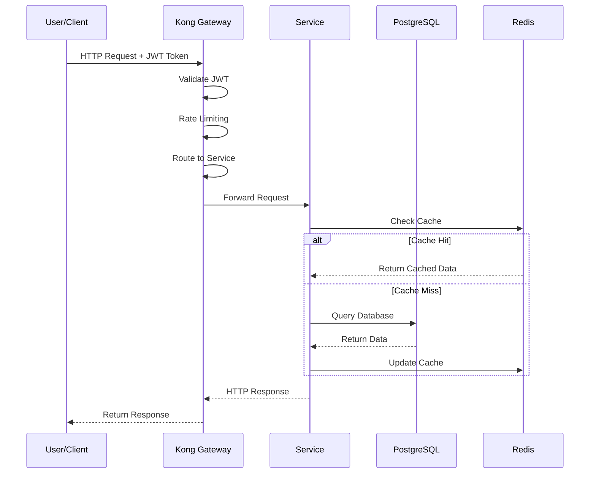
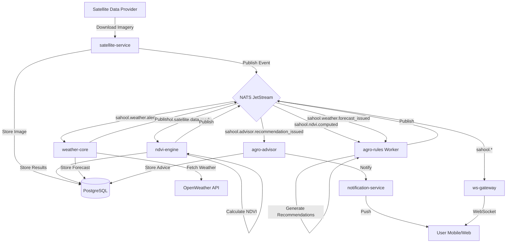
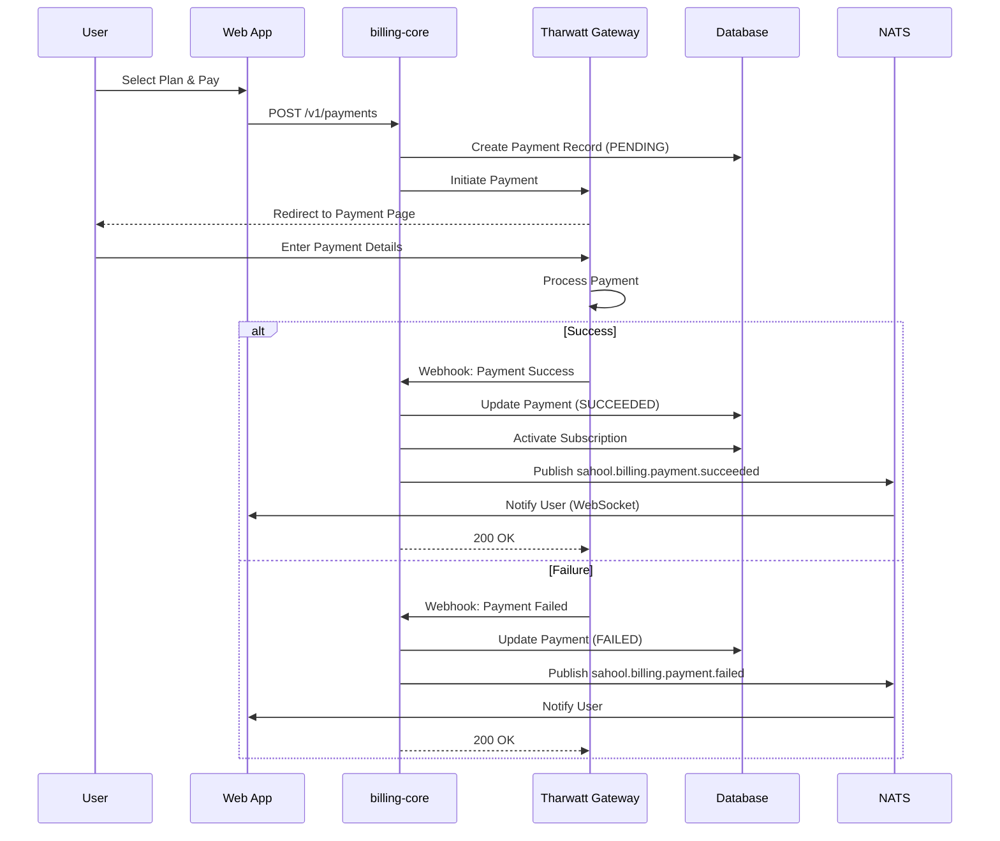
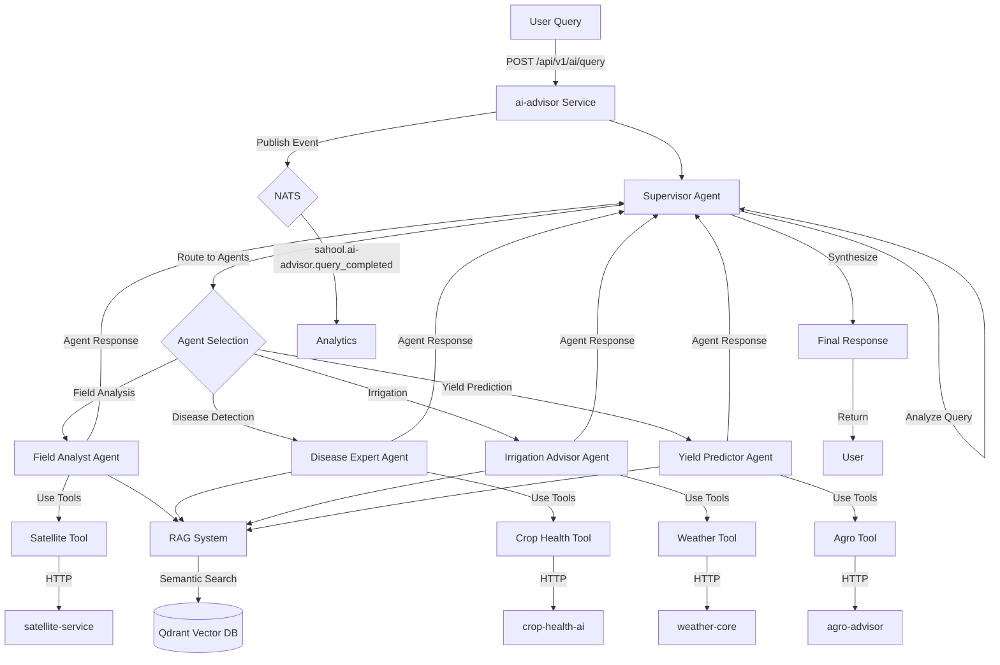
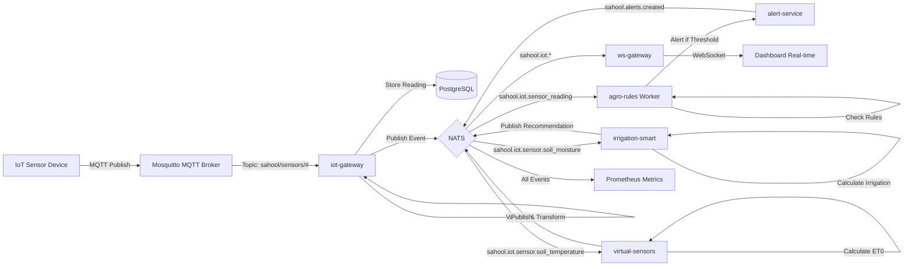
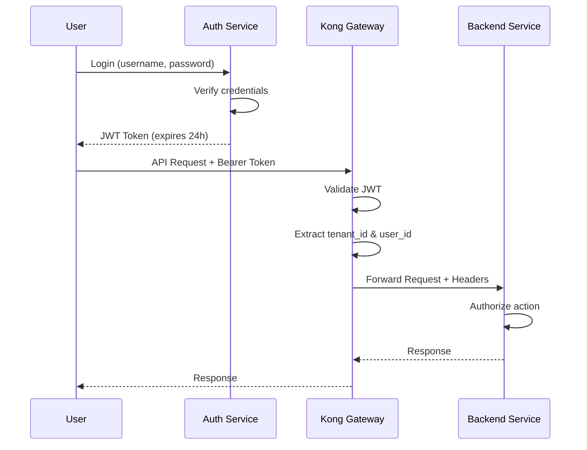

# تدفق البيانات في منصة سهول | SAHOOL Platform Data Flow

**النسخة:** 15.3.2
**التاريخ:** 2024-12-24
**الحالة:** Production Ready

---

## جدول المحتويات | Table of Contents

1. [نظرة عامة | Overview](#overview)
2. [أنماط الاتصال بين الخدمات | Service Communication Patterns](#communication-patterns)
3. [مخططات تدفق البيانات | Data Flow Diagrams](#data-flow-diagrams)
4. [كتالوج الأحداث | Event Catalog](#event-catalog)
5. [نظرة عامة على قاعدة البيانات | Database Schema Overview](#database-overview)
6. [نقاط التكامل | Integration Points](#integration-points)

---

<a name="overview"></a>

## 1. نظرة عامة | Overview

### البنية المعمارية | Architecture

منصة سهول تستخدم **بنية الخدمات الصغرية متعددة اللغات (Polyglot Microservices)** مع **الهندسة الموجهة بالأحداث (Event-Driven Architecture)**.

SAHOOL platform uses **Polyglot Microservices Architecture** with **Event-Driven Architecture (EDA)**.

### المكونات الأساسية | Core Components

```
┌─────────────────────────────────────────────────────────────────┐
│                      SAHOOL Platform v15                         │
├─────────────────────────────────────────────────────────────────┤
│                                                                  │
│  ┌──────────┐  ┌──────────┐  ┌──────────┐  ┌──────────┐       │
│  │   Kong   │  │   NATS   │  │Postgres  │  │  Redis   │       │
│  │ Gateway  │  │JetStream │  │ PostGIS  │  │  Cache   │       │
│  └──────────┘  └──────────┘  └──────────┘  └──────────┘       │
│                                                                  │
│  ┌──────────┐  ┌──────────┐  ┌──────────┐  ┌──────────┐       │
│  │  Qdrant  │  │   MQTT   │  │Prometheus│  │ Grafana  │       │
│  │  Vector  │  │  Broker  │  │ Metrics  │  │Dashboard │       │
│  └──────────┘  └──────────┘  └──────────┘  └──────────┘       │
│                                                                  │
│  ┌────────────────────────────────────────────────────────┐    │
│  │              35+ Microservices                          │    │
│  │  Python (FastAPI) | Node.js (NestJS) | TypeScript      │    │
│  └────────────────────────────────────────────────────────┘    │
│                                                                  │
└─────────────────────────────────────────────────────────────────┘
```

---

<a name="communication-patterns"></a>

## 2. أنماط الاتصال بين الخدمات | Service Communication Patterns

### 2.1 المتزامن (HTTP/REST عبر Kong) | Synchronous (HTTP/REST via Kong)

**الوصف | Description:**
جميع طلبات HTTP الخارجية تمر عبر Kong API Gateway الذي يوفر:

- التوجيه (Routing)
- المصادقة (Authentication)
- تحديد المعدل (Rate Limiting)
- فحوصات الصحة (Health Checks)
- تحميل التوازن (Load Balancing)

All external HTTP requests go through Kong API Gateway which provides routing, authentication, rate limiting, health checks, and load balancing.

**الخدمات المعرضة عبر Kong | Services Exposed via Kong:**

| الخدمة       | Service          | المنفذ | Port              | المسار           | Path             | الوصف | Description |
| ------------ | ---------------- | ------ | ----------------- | ---------------- | ---------------- | ----- | ----------- |
| field-ops    | Field Operations | 8080   | `/api/v1/fields`  | إدارة الحقول     | Field Management |
| ndvi-engine  | NDVI Engine      | 8107   | `/api/v1/ndvi`    | تحليل NDVI       | NDVI Analysis    |
| weather-core | Weather Core     | 8108   | `/api/v1/weather` | الطقس            | Weather          |
| field-chat   | Field Chat       | 8099   | `/api/v1/chat`    | المحادثات        | Chat             |
| iot-gateway  | IoT Gateway      | 8106   | `/api/v1/iot`     | إنترنت الأشياء   | IoT              |
| agro-advisor | Agro Advisor     | 8105   | `/api/v1/advisor` | المستشار الزراعي | Agro Advisor     |
| billing-core | Billing Core     | 8089   | `/v1/billing`     | الفوترة          | Billing          |
| ai-advisor   | AI Advisor       | 8112   | `/api/v1/ai`      | المستشار الذكي   | AI Advisor       |

**مثال على تدفق الطلب | Request Flow Example:**

```
User/Client
    ↓
Kong Gateway :8000
    ↓ (routing + auth + rate limit)
Backend Service (e.g., field-ops:8080)
    ↓
PostgreSQL Database
    ↓
Response ← Kong ← Service
```

---

### 2.2 اللامتزامن (NATS JetStream) | Asynchronous (NATS JetStream)

**الوصف | Description:**
تستخدم المنصة NATS JetStream للاتصال القائم على الأحداث بين الخدمات.

The platform uses NATS JetStream for event-based communication between services.

**فوائد | Benefits:**

- ✅ فك الارتباط بين الخدمات | Service Decoupling
- ✅ معالجة غير متزامنة | Asynchronous Processing
- ✅ موثوقية الرسائل | Message Reliability
- ✅ إمكانية التوسع | Scalability
- ✅ تحمل الأخطاء | Fault Tolerance

**نمط النشر/الاشتراك | Pub/Sub Pattern:**

```
┌──────────────┐         ┌──────────────┐         ┌──────────────┐
│   Publisher  │────────>│ NATS Server  │<────────│  Subscriber  │
│   Service    │ publish │  JetStream   │subscribe│   Service    │
└──────────────┘         └──────────────┘         └──────────────┘
                              ↓
                         [Persistent]
                         [Messages]
```

---

### 2.3 الوقت الفعلي (WebSocket عبر ws-gateway) | Real-time (WebSocket via ws-gateway)

**الوصف | Description:**
خدمة ws-gateway توفر اتصالات WebSocket للتحديثات الفورية.

The ws-gateway service provides WebSocket connections for real-time updates.

**حالات الاستخدام | Use Cases:**

- 📱 إشعارات فورية | Real-time Notifications
- 💬 رسائل الدردشة | Chat Messages
- 📊 تحديثات لوحة القيادة المباشرة | Live Dashboard Updates
- 🌡️ بيانات المستشعرات الحية | Live Sensor Data
- 🗺️ تتبع الموقع | Location Tracking

**التدفق | Flow:**

```
Client (Web/Mobile)
    ↓ WebSocket
ws-gateway :8081
    ↓ Subscribe to NATS
NATS (sahool.*)
    ↓ Events
ws-gateway → Client (Push)
```

---

### 2.4 إنترنت الأشياء (MQTT عبر iot-gateway) | IoT (MQTT via iot-gateway)

**الوصف | Description:**
أجهزة IoT تتصل عبر بروتوكول MQTT ويتم معالجة البيانات بواسطة iot-gateway.

IoT devices connect via MQTT protocol and data is processed by iot-gateway.

**التدفق | Flow:**

```
IoT Sensors/Devices
    ↓ MQTT Protocol
Mosquitto MQTT Broker :1883
    ↓ Subscribe
iot-gateway Service :8106
    ↓ Publish Events
NATS (sahool.iot.*)
    ↓
Storage + Real-time Consumers
```

**أنواع المستشعرات | Sensor Types:**

- 💧 رطوبة التربة | Soil Moisture
- 🌡️ حرارة التربة | Soil Temperature
- ⚡ التوصيل الكهربائي للتربة | Soil EC
- 🌡️ حرارة الهواء | Air Temperature
- 💨 رطوبة الهواء | Air Humidity
- 💦 تدفق المياه | Water Flow
- 📏 مستوى المياه | Water Level

---

<a name="data-flow-diagrams"></a>

## 3. مخططات تدفق البيانات | Data Flow Diagrams

### 3.1 تدفق طلب المستخدم | User Request Flow



---

### 3.2 تدفق تحليل الحقل | Field Analysis Flow



**الخطوات | Steps:**

1. 🛰️ تحميل صور الأقمار الصناعية | Download Satellite Imagery
2. 📊 حساب NDVI | Calculate NDVI
3. 🌤️ جلب بيانات الطقس | Fetch Weather Data
4. 🤖 توليد التوصيات التلقائية | Generate Recommendations
5. 🔔 إرسال الإشعارات | Send Notifications
6. 📱 تحديث الوقت الفعلي | Real-time Updates

---

### 3.3 تدفق الدفع (Tharwatt) | Payment Flow (Tharwatt)



**مزودو الدفع | Payment Providers:**

- 💳 Stripe (International)
- 🇾🇪 Tharwatt (Yemen)
- 💰 Mobile Money
- 🏦 Bank Transfer
- 💵 Cash

---

### 3.4 تدفق المستشار الذكي المتعدد الوكلاء | AI Multi-Agent Advisor Flow



**الوكلاء | Agents:**

1. 🎯 **Supervisor** - ينسق بين الوكلاء | Coordinates agents
2. 🗺️ **Field Analyst** - تحليل الحقول | Field analysis
3. 🦠 **Disease Expert** - كشف الأمراض | Disease detection
4. 💧 **Irrigation Advisor** - نصائح الري | Irrigation advice
5. 🌾 **Yield Predictor** - التنبؤ بالإنتاج | Yield prediction

**الأدوات | Tools:**

- Satellite Tool → satellite-service
- Weather Tool → weather-core
- Crop Health Tool → crop-health-ai
- Agro Tool → agro-advisor
- NDVI Tool → ndvi-engine

**RAG (Retrieval-Augmented Generation):**

- 📚 Embeddings: `paraphrase-multilingual-MiniLM-L12-v2`
- 🔍 Vector DB: Qdrant
- 💡 LLM: Claude (Anthropic)

---

### 3.5 تدفق مستشعرات IoT | IoT Sensor Flow



**موضوعات MQTT | MQTT Topics:**

```
sahool/sensors/{device_id}/soil_moisture
sahool/sensors/{device_id}/soil_temperature
sahool/sensors/{device_id}/soil_ec
sahool/sensors/{device_id}/air_temperature
sahool/sensors/{device_id}/air_humidity
sahool/sensors/{device_id}/water_flow
sahool/sensors/{device_id}/water_level
```

---

<a name="event-catalog"></a>

## 4. كتالوج الأحداث | Event Catalog

### 4.1 مساحات الأسماء | Namespaces

جميع أحداث NATS تستخدم المساحة `sahool.*` مع التسلسل الهرمي التالي:

All NATS events use the `sahool.*` namespace with the following hierarchy:

```
sahool.{domain}.{event_type}
```

---

### 4.2 أحداث الحقول | Field Events

**المساحة | Namespace:** `sahool.fields.*`

| الحدث                            | Event     | الناشر                         | Publisher          | المشتركون              | Subscribers | الوصف | Description |
| -------------------------------- | --------- | ------------------------------ | ------------------ | ---------------------- | ----------- | ----- | ----------- |
| `sahool.fields.created`          | field-ops | analytics, reports             | حقل جديد تم إنشاؤه | New field created      |
| `sahool.fields.updated`          | field-ops | cache-invalidator              | تحديث بيانات الحقل | Field data updated     |
| `sahool.fields.deleted`          | field-ops | cleanup-workers                | حذف حقل            | Field deleted          |
| `sahool.fields.boundary.updated` | field-ops | ndvi-engine, satellite-service | تحديث حدود الحقل   | Field boundary updated |
| `sahool.fields.season.started`   | field-ops | crop-growth-model              | بدء موسم جديد      | New season started     |
| `sahool.fields.season.closed`    | field-ops | yield-prediction, reports      | إغلاق موسم         | Season closed          |
| `sahool.fields.zone.created`     | field-ops | irrigation-smart               | منطقة إدارة جديدة  | New management zone    |
| `sahool.fields.zone.deleted`     | field-ops | irrigation-smart               | حذف منطقة          | Zone deleted           |

**مثال على حمولة الحدث | Event Payload Example:**

```json
{
  "event_id": "evt_abc123",
  "timestamp": "2024-12-24T10:30:00Z",
  "topic": "sahool.fields.created",
  "field_id": "field_xyz789",
  "tenant_id": "tenant_001",
  "name": "North Field",
  "area_hectares": 12.5,
  "geometry": {
    "type": "Polygon",
    "coordinates": [[[35.5, 15.2], ...]]
  },
  "crop_type": "wheat",
  "correlation_id": "req_123"
}
```

---

### 4.3 أحداث NDVI | NDVI Events

**المساحة | Namespace:** `sahool.ndvi.*`

| الحدث                         | Event       | الناشر                    | Publisher           | المشتركون                  | Subscribers | الوصف | Description |
| ----------------------------- | ----------- | ------------------------- | ------------------- | -------------------------- | ----------- | ----- | ----------- |
| `sahool.ndvi.computed`        | ndvi-engine | agro-rules, field-ops     | حساب NDVI اكتمل     | NDVI computation completed |
| `sahool.ndvi.anomaly`         | ndvi-engine | alert-service, agro-rules | اكتشاف شذوذ في NDVI | NDVI anomaly detected      |
| `sahool.ndvi.zone_classified` | ndvi-engine | field-ops                 | تصنيف مناطق الحقل   | Field zones classified     |

**مثال | Example:**

```json
{
  "event_id": "evt_ndvi_001",
  "timestamp": "2024-12-24T12:00:00Z",
  "topic": "sahool.ndvi.computed",
  "field_id": "field_xyz789",
  "ndvi_mean": 0.72,
  "ndvi_min": 0.45,
  "ndvi_max": 0.89,
  "analysis_date": "2024-12-24",
  "image_url": "https://cdn.sahool.io/ndvi/field_xyz789_20241224.png",
  "zones": [
    { "zone_id": "z1", "ndvi_range": [0.7, 0.9], "health": "excellent" },
    { "zone_id": "z2", "ndvi_range": [0.5, 0.7], "health": "good" },
    { "zone_id": "z3", "ndvi_range": [0.3, 0.5], "health": "poor" }
  ]
}
```

---

### 4.4 أحداث الطقس | Weather Events

**المساحة | Namespace:** `sahool.weather.*`

| الحدث                                  | Event        | الناشر                       | Publisher        | المشتركون                      | Subscribers | الوصف | Description |
| -------------------------------------- | ------------ | ---------------------------- | ---------------- | ------------------------------ | ----------- | ----- | ----------- |
| `sahool.weather.alert`                 | weather-core | alert-service, agro-rules    | تنبيه طقس        | Weather alert                  |
| `sahool.weather.forecast_issued`       | weather-core | agro-rules, irrigation-smart | توقعات طقس جديدة | New weather forecast           |
| `sahool.weather.irrigation_adjustment` | weather-core | irrigation-smart, agro-rules | تعديل جدول الري  | Irrigation schedule adjustment |

**مثال | Example:**

```json
{
  "event_id": "evt_weather_001",
  "timestamp": "2024-12-24T06:00:00Z",
  "topic": "sahool.weather.alert",
  "alert_type": "heavy_rain",
  "severity": "high",
  "field_id": "field_xyz789",
  "location": { "lat": 15.3694, "lon": 44.191 },
  "start_time": "2024-12-24T14:00:00Z",
  "end_time": "2024-12-24T20:00:00Z",
  "precipitation_mm": 45,
  "recommendations": ["Postpone irrigation", "Check drainage systems"]
}
```

---

### 4.5 أحداث IoT | IoT Events

**المساحة | Namespace:** `sahool.iot.*`

| الحدث                          | Event       | الناشر                | Publisher       | المشتركون             | Subscribers | الوصف | Description |
| ------------------------------ | ----------- | --------------------- | --------------- | --------------------- | ----------- | ----- | ----------- |
| `sahool.iot.sensor_reading`    | iot-gateway | agro-rules, analytics | قراءة مستشعر    | Sensor reading        |
| `sahool.iot.device_status`     | iot-gateway | monitoring            | حالة جهاز       | Device status         |
| `sahool.iot.device_registered` | iot-gateway | inventory             | تسجيل جهاز جديد | New device registered |
| `sahool.iot.device_alert`      | iot-gateway | alert-service         | تنبيه جهاز      | Device alert          |
| `sahool.iot.batch_reading`     | iot-gateway | analytics             | قراءات دفعية    | Batch readings        |

**أحداث حسب نوع المستشعر | Sensor-specific Events:**

| الحدث                                | Event                   | الوصف                    | Description |
| ------------------------------------ | ----------------------- | ------------------------ | ----------- |
| `sahool.iot.sensor.soil_moisture`    | قراءة رطوبة التربة      | Soil moisture reading    |
| `sahool.iot.sensor.soil_temperature` | قراءة حرارة التربة      | Soil temperature reading |
| `sahool.iot.sensor.soil_ec`          | قراءة التوصيل الكهربائي | Soil EC reading          |
| `sahool.iot.sensor.air_temperature`  | قراءة حرارة الهواء      | Air temperature reading  |
| `sahool.iot.sensor.air_humidity`     | قراءة رطوبة الهواء      | Air humidity reading     |
| `sahool.iot.sensor.water_flow`       | قراءة تدفق المياه       | Water flow reading       |
| `sahool.iot.sensor.water_level`      | قراءة مستوى المياه      | Water level reading      |

**مثال | Example:**

```json
{
  "event_id": "evt_iot_001",
  "timestamp": "2024-12-24T10:15:30Z",
  "topic": "sahool.iot.sensor.soil_moisture",
  "device_id": "device_sm_001",
  "field_id": "field_xyz789",
  "sensor_type": "soil_moisture",
  "value": 35.7,
  "unit": "percentage",
  "location": { "lat": 15.3694, "lon": 44.191 },
  "battery_level": 87,
  "signal_strength": -65
}
```

---

### 4.6 أحداث المحادثات | Chat Events

**المساحة | Namespace:** `sahool.chat.*`

| الحدث                            | Event      | الناشر                           | Publisher    | المشتركون          | Subscribers | الوصف | Description |
| -------------------------------- | ---------- | -------------------------------- | ------------ | ------------------ | ----------- | ----- | ----------- |
| `sahool.chat.thread_created`     | field-chat | ws-gateway                       | محادثة جديدة | New chat thread    |
| `sahool.chat.message_sent`       | field-chat | ws-gateway, notification-service | رسالة جديدة  | New message        |
| `sahool.chat.message_edited`     | field-chat | ws-gateway                       | تعديل رسالة  | Message edited     |
| `sahool.chat.message_deleted`    | field-chat | ws-gateway                       | حذف رسالة    | Message deleted    |
| `sahool.chat.participant_joined` | field-chat | ws-gateway                       | مشارك انضم   | Participant joined |
| `sahool.chat.participant_left`   | field-chat | ws-gateway                       | مشارك غادر   | Participant left   |
| `sahool.chat.messages_read`      | field-chat | ws-gateway                       | قراءة رسائل  | Messages read      |

---

### 4.7 أحداث التنبيهات | Alert Events

**المساحة | Namespace:** `sahool.alerts.*`

| الحدث                        | Event         | الناشر                           | Publisher           | المشتركون          | Subscribers | الوصف | Description |
| ---------------------------- | ------------- | -------------------------------- | ------------------- | ------------------ | ----------- | ----- | ----------- |
| `sahool.alerts.created`      | alert-service | ws-gateway, notification-service | تنبيه جديد          | New alert          |
| `sahool.alerts.updated`      | alert-service | ws-gateway                       | تحديث تنبيه         | Alert updated      |
| `sahool.alerts.acknowledged` | alert-service | ws-gateway                       | إقرار بتنبيه        | Alert acknowledged |
| `sahool.alerts.resolved`     | alert-service | ws-gateway, analytics            | حل تنبيه            | Alert resolved     |
| `sahool.alerts.expired`      | alert-service | cleanup-workers                  | انتهاء صلاحية تنبيه | Alert expired      |

**أنواع التنبيهات | Alert Types:**

- `ndvi_anomaly` - شذوذ في NDVI
- `weather_alert` - تنبيه طقس
- `iot_threshold` - تجاوز حد مستشعر
- `crop_health_alert` - تنبيه صحة المحصول
- `irrigation_alert` - تنبيه ري
- `pre_harvest` - ما قبل الحصاد
- `harvest_readiness` - جاهزية الحصاد
- `stress_detection` - كشف إجهاد
- `lai_anomaly` - شذوذ LAI

---

### 4.8 أحداث المستشار الزراعي | Advisor Events

**المساحة | Namespace:** `sahool.advisor.*`

| الحدث                                       | Event        | الناشر                          | Publisher    | المشتركون           | Subscribers | الوصف | Description |
| ------------------------------------------- | ------------ | ------------------------------- | ------------ | ------------------- | ----------- | ----- | ----------- |
| `sahool.advisor.recommendation_issued`      | agro-advisor | notification-service, field-ops | توصية جديدة  | New recommendation  |
| `sahool.advisor.fertilizer_plan_issued`     | agro-advisor | notification-service            | خطة تسميد    | Fertilizer plan     |
| `sahool.advisor.nutrient_assessment_issued` | agro-advisor | reports                         | تقييم مغذيات | Nutrient assessment |
| `sahool.advisor.disease_detected`           | agro-advisor | alert-service                   | اكتشاف مرض   | Disease detected    |

---

### 4.9 أحداث المستشار الذكي | AI Advisor Events

**المساحة | Namespace:** `sahool.ai-advisor.*`

| الحدث                               | Event          | الوصف           | Description |
| ----------------------------------- | -------------- | --------------- | ----------- |
| `sahool.ai-advisor.query_received`  | استلام استعلام | Query received  |
| `sahool.ai-advisor.query_completed` | اكتمال استعلام | Query completed |
| `sahool.ai-advisor.agent_invoked`   | تفعيل وكيل     | Agent invoked   |
| `sahool.ai-advisor.tool_called`     | استدعاء أداة   | Tool called     |

---

### 4.10 أحداث العمليات | Operation Events

**المساحة | Namespace:** `sahool.operations.*`

| الحدث                         | Event     | الوصف        | Description         |
| ----------------------------- | --------- | ------------ | ------------------- |
| `sahool.operations.completed` | field-ops | اكتمال عملية | Operation completed |

---

### 4.11 أحداث الفوترة | Billing Events

**المساحة | Namespace:** `sahool.billing.*`

| الحدث                                   | Event        | الوصف                  | Description |
| --------------------------------------- | ------------ | ---------------------- | ----------- |
| `sahool.billing.subscription.created`   | إنشاء اشتراك | Subscription created   |
| `sahool.billing.subscription.updated`   | تحديث اشتراك | Subscription updated   |
| `sahool.billing.subscription.cancelled` | إلغاء اشتراك | Subscription cancelled |
| `sahool.billing.payment.succeeded`      | دفع ناجح     | Payment succeeded      |
| `sahool.billing.payment.failed`         | فشل دفع      | Payment failed         |
| `sahool.billing.invoice.generated`      | توليد فاتورة | Invoice generated      |
| `sahool.billing.quota.exceeded`         | تجاوز الحصة  | Quota exceeded         |

---

### 4.12 أحداث التحليل | Analysis Events

**المساحة | Namespace:** `sahool.analysis.*`

| الحدث               | Event                | المشتركون          | Subscribers         | الوصف | Description |
| ------------------- | -------------------- | ------------------ | ------------------- | ----- | ----------- |
| `sahool.analysis.*` | notification-service | جميع أحداث التحليل | All analysis events |

---

### 4.13 أحداث الإجراءات | Action Events

**المساحة | Namespace:** `sahool.actions.*`

| الحدث              | Event                | المشتركون            | Subscribers       | الوصف | Description |
| ------------------ | -------------------- | -------------------- | ----------------- | ----- | ----------- |
| `sahool.actions.*` | notification-service | جميع أحداث الإجراءات | All action events |

---

<a name="database-overview"></a>

## 5. نظرة عامة على قاعدة البيانات | Database Schema Overview

### 5.1 PostgreSQL (PostGIS) - قاعدة البيانات الرئيسية

**المحرك | Engine:** PostgreSQL 16 + PostGIS 3.4

**الامتدادات | Extensions:**

- `postgis` - بيانات جغرافية مكانية | Geospatial data
- `postgis_topology` - طبولوجيا | Topology
- `uuid-ossp` - UUIDs
- `pg_trgm` - بحث نصي | Text search

#### 5.1.1 الجداول الأساسية | Core Tables

| الجدول    | Table                      | الوصف                             | Description | الصفوف المتوقعة | Est. Rows |
| --------- | -------------------------- | --------------------------------- | ----------- | --------------- | --------- |
| `tenants` | المستأجرين/المنظمات        | Tenants/Organizations             | 10K - 100K  |
| `users`   | المستخدمين                 | Users                             | 50K - 1M    |
| `fields`  | الحقول الزراعية (GEOMETRY) | Agricultural fields with geometry | 100K - 1M   |
| `farms`   | المزارع                    | Farms                             | 50K - 500K  |
| `crops`   | أنواع المحاصيل             | Crop types                        | 100 - 500   |

#### 5.1.2 جداول NDVI والأقمار الصناعية | NDVI & Satellite Tables

| الجدول              | Table                | الوصف                      | Description |
| ------------------- | -------------------- | -------------------------- | ----------- |
| `ndvi_observations` | مشاهدات NDVI         | NDVI observations          |
| `ndvi_alerts`       | تنبيهات NDVI         | NDVI alerts                |
| `ndvi_records`      | سجلات NDVI           | NDVI records               |
| `satellite_imagery` | صور الأقمار الصناعية | Satellite imagery metadata |

#### 5.1.3 جداول البحث العلمي | Research Tables

| الجدول                | Table             | الوصف              | Description |
| --------------------- | ----------------- | ------------------ | ----------- |
| `experiments`         | التجارب           | Experiments        |
| `research_protocols`  | البروتوكولات      | Protocols          |
| `research_plots`      | قطع التجارب       | Research plots     |
| `treatments`          | المعاملات         | Treatments         |
| `research_daily_logs` | السجلات اليومية   | Daily logs         |
| `lab_samples`         | العينات المختبرية | Lab samples        |
| `digital_signatures`  | التوقيعات الرقمية | Digital signatures |

#### 5.1.4 جداول السوق | Marketplace Tables

| الجدول         | Table             | الوصف                  | Description |
| -------------- | ----------------- | ---------------------- | ----------- |
| `products`     | المنتجات          | Products               |
| `orders`       | الطلبات           | Orders                 |
| `order_items`  | عناصر الطلب       | Order items            |
| `wallets`      | المحافظ المالية   | Wallets                |
| `transactions` | المعاملات المالية | Financial transactions |
| `loans`        | القروض            | Loans                  |

#### 5.1.5 جداول المحادثات | Chat Tables

| الجدول              | Table          | الوصف        | Description |
| ------------------- | -------------- | ------------ | ----------- |
| `chat_threads`      | خيوط المحادثات | Chat threads |
| `chat_messages`     | الرسائل        | Messages     |
| `chat_participants` | المشاركون      | Participants |
| `chat_attachments`  | المرفقات       | Attachments  |

#### 5.1.6 جداول IoT | IoT Tables

| الجدول             | Table             | الوصف            | Description |
| ------------------ | ----------------- | ---------------- | ----------- |
| `iot_devices`      | أجهزة IoT         | IoT devices      |
| `iot_readings`     | قراءات المستشعرات | Sensor readings  |
| `device_locations` | مواقع الأجهزة     | Device locations |

#### 5.1.7 جداول الطقس | Weather Tables

| الجدول              | Table        | الوصف             | Description |
| ------------------- | ------------ | ----------------- | ----------- |
| `weather_records`   | سجلات الطقس  | Weather records   |
| `weather_forecasts` | توقعات الطقس | Weather forecasts |

#### 5.1.8 جداول التنبيهات والمهام | Alerts & Tasks Tables

| الجدول             | Table         | الوصف            | Description |
| ------------------ | ------------- | ---------------- | ----------- |
| `tasks`            | المهام        | Tasks            |
| `alerts`           | التنبيهات     | Alerts           |
| `notification_log` | سجل الإشعارات | Notification log |

#### 5.1.9 جداول الفوترة | Billing Tables

| الجدول          | Table           | الوصف          | Description |
| --------------- | --------------- | -------------- | ----------- |
| `subscriptions` | الاشتراكات      | Subscriptions  |
| `invoices`      | الفواتير        | Invoices       |
| `payments`      | المدفوعات       | Payments       |
| `usage_records` | سجلات الاستخدام | Usage tracking |

#### 5.1.10 جداول المزامنة والتدقيق | Sync & Audit Tables

| الجدول          | Table                | الوصف                  | Description |
| --------------- | -------------------- | ---------------------- | ----------- |
| `sync_status`   | حالة المزامنة        | Synchronization status |
| `audit_logs`    | سجلات التدقيق        | Audit logs             |
| `outbox_events` | أحداث Outbox Pattern | Outbox pattern events  |

---

### 5.2 Redis - التخزين المؤقت والجلسات | Cache & Sessions

**النسخة | Version:** Redis 7.4

**حالات الاستخدام | Use Cases:**

- 🔐 جلسات المستخدمين | User sessions
- 💾 تخزين مؤقت للاستعلامات | Query caching
- 📊 عدادات في الوقت الفعلي | Real-time counters
- 🔒 قفل موزع | Distributed locks
- 📝 قوائم انتظار | Job queues

**مفاتيح نموذجية | Sample Keys:**

```
session:{user_id}                    # User session (TTL: 24h)
cache:field:{field_id}               # Field data cache (TTL: 1h)
cache:ndvi:{field_id}:{date}         # NDVI cache (TTL: 24h)
cache:weather:{location}             # Weather cache (TTL: 30m)
quota:{tenant_id}:{resource_type}    # Usage quotas
lock:billing:{tenant_id}             # Distributed lock
ws:connections:{user_id}             # WebSocket connections
```

---

### 5.3 Qdrant - قاعدة البيانات المتجهة | Vector Database

**النسخة | Version:** Qdrant v1.10.1

**حالات الاستخدام | Use Cases:**

- 🤖 RAG (Retrieval-Augmented Generation) للمستشار الذكي
- 🔍 البحث الدلالي | Semantic search
- 📚 تخزين المعرفة الزراعية | Agricultural knowledge storage

**المجموعات | Collections:**

| المجموعة                 | Collection       | الوصف                       | Description | الأبعاد | Dimensions |
| ------------------------ | ---------------- | --------------------------- | ----------- | ------- | ---------- |
| `agricultural_knowledge` | المعرفة الزراعية | Agricultural knowledge base | 384         |
| `crop_diseases`          | أمراض المحاصيل   | Crop diseases database      | 384         |
| `best_practices`         | أفضل الممارسات   | Best practices              | 384         |

**نموذج التضمين | Embedding Model:**

```
paraphrase-multilingual-MiniLM-L12-v2
```

---

### 5.4 NATS JetStream - تخزين الأحداث | Event Storage

**تكوين الدفق | Stream Configuration:**

```yaml
Streams:
  - Name: SAHOOL_EVENTS
    Subjects:
      - sahool.>
    Storage: file
    Retention: limits
    MaxAge: 168h # 7 days
    MaxBytes: 10GB
    Replicas: 1
```

**المستهلكون | Consumers:**

- `ws-gateway` - يستمع لجميع الأحداث `sahool.>` | Listens to all `sahool.>` events
- `notification-service` - يستمع لـ `sahool.analysis.*` و `sahool.actions.*`
- `agro-rules` - يستمع لـ `sahool.ndvi.*`, `sahool.weather.*`

---

<a name="integration-points"></a>

## 6. نقاط التكامل | Integration Points

### 6.1 واجهات برمجة التطبيقات الخارجية | External APIs

#### 6.1.1 الطقس | Weather

| المزود              | Provider         | الخدمة  | Service   | الحالة  | Status    | الأولوية | Priority |
| ------------------- | ---------------- | ------- | --------- | ------- | --------- | -------- | -------- |
| **Open-Meteo**      | weather-advanced | ✅ مفعل | Active    | الأساسي | Primary   |
| **OpenWeatherMap**  | weather-core     | ✅ مفعل | Active    | الثانوي | Secondary |
| **Weather API**     | weather-advanced | 🔄 متاح | Available | الثالث  | Tertiary  |
| **Visual Crossing** | weather-advanced | 🔄 متاح | Available | احتياطي | Fallback  |

**سلسلة الفشل | Failover Chain:**

```
Open-Meteo (Free) → OpenWeatherMap (API Key) → Weather API → Visual Crossing
```

---

#### 6.1.2 الأقمار الصناعية | Satellite

| المزود           | Provider          | الخدمة         | Service      | الحالة  | Status    | الأولوية | Priority |
| ---------------- | ----------------- | -------------- | ------------ | ------- | --------- | -------- | -------- |
| **Sentinel Hub** | satellite-service | 🔄 متاح        | Available    | الأساسي | Primary   |
| **Planet Labs**  | satellite-service | 🔑 يتطلب مفتاح | Requires Key | الثانوي | Secondary |
| **Landsat**      | satellite-service | ✅ مجاني       | Free         | الثالث  | Tertiary  |
| **Copernicus**   | satellite-service | ✅ مجاني       | Free         | احتياطي | Fallback  |

**سلسلة الفشل | Failover Chain:**

```
Planet Labs (High-res, Paid) → Sentinel Hub → Landsat (Free) → Copernicus
```

---

#### 6.1.3 الدفع | Payment

| المزود       | Provider        | الدولة       | Country      | الخدمة  | Service   | الحالة | Status |
| ------------ | --------------- | ------------ | ------------ | ------- | --------- | ------ | ------ |
| **Stripe**   | 🌍 عالمي        | Global       | billing-core | ✅ مفعل | Active    |
| **Tharwatt** | 🇾🇪 اليمن        | Yemen        | billing-core | ✅ مفعل | Active    |
| **Moyasar**  | 🇸🇦 السعودية     | Saudi Arabia | billing-core | 🔄 متاح | Available |
| **HyperPay** | 🌍 الشرق الأوسط | Middle East  | billing-core | 🔄 متاح | Available |
| **Tap**      | 🇰🇼 الكويت       | Kuwait       | billing-core | 🔄 متاح | Available |

**تكوين Tharwatt | Tharwatt Configuration:**

```env
THARWATT_BASE_URL=https://developers-test.tharwatt.com:5253
THARWATT_API_KEY=your_api_key
THARWATT_MERCHANT_ID=your_merchant_id
THARWATT_WEBHOOK_SECRET=your_webhook_secret
```

**نقاط النهاية | Endpoints:**

- `POST /api/v1/payment/deposit` - بدء دفع | Initiate payment
- `POST /webhook/tharwatt` - Webhook لحالة الدفع | Payment status webhook

---

#### 6.1.4 الإشعارات | Notifications

| المزود           | Provider   | النوع | Type                 | الخدمة  | Service   | الحالة | Status |
| ---------------- | ---------- | ----- | -------------------- | ------- | --------- | ------ | ------ |
| **Firebase FCM** | دفع        | Push  | notification-service | 🔄 متاح | Available |
| **OneSignal**    | دفع        | Push  | notification-service | 🔄 متاح | Available |
| **Twilio SMS**   | رسائل نصية | SMS   | notification-service | 🔄 متاح | Available |
| **Unifonic**     | رسائل نصية | SMS   | notification-service | 🔄 متاح | Available |

---

### 6.2 تكوين المزودين | Provider Configuration

**الخدمة | Service:** `provider-config` (Port: 8104)

**الأنواع | Types:**

- 🗺️ `map` - مزودو الخرائط | Map providers
- 🌤️ `weather` - مزودو الطقس | Weather providers
- 🛰️ `satellite` - مزودو الأقمار الصناعية | Satellite providers
- 💳 `payment` - مزودو الدفع | Payment providers
- 📱 `notification` - مزودو الإشعارات | Notification providers
- 📲 `sms` - مزودو الرسائل النصية | SMS providers

**الأولويات | Priorities:**

- `primary` - الأساسي | Primary
- `secondary` - الثانوي | Secondary
- `tertiary` - الثالث | Tertiary
- `disabled` - معطل | Disabled

**سلاسل الفشل | Failover Chains:**

يتم تكوين سلاسل الفشل للتبديل التلقائي عند فشل المزود الأساسي.

Failover chains are configured to automatically switch when the primary provider fails.

**مثال على التكوين | Configuration Example:**

```json
{
  "provider_type": "weather",
  "provider_name": "open_meteo",
  "priority": "primary",
  "enabled": true,
  "config": {
    "base_url": "https://api.open-meteo.com",
    "timeout": 10,
    "retry_count": 3
  },
  "failover_to": "openweathermap"
}
```

---

### 6.3 المصادقة والتفويض | Authentication & Authorization

**نوع المصادقة | Auth Type:** JWT (JSON Web Tokens)

**الخوارزميات المدعومة | Supported Algorithms:**

- `RS256` (الافتراضي) | (Default)
- `HS256`

**تدفق المصادقة | Auth Flow:**



**رؤوس HTTP | HTTP Headers:**

```
Authorization: Bearer {jwt_token}
X-Tenant-Id: {tenant_id}
X-User-Id: {user_id}
```

---

### 6.4 المراقبة والرصد | Observability

#### 6.4.1 المقاييس | Metrics

**النظام | System:** Prometheus + Grafana

**المقاييس المجمعة | Collected Metrics:**

- HTTP request duration
- Request count by endpoint
- Error rate
- Database connection pool
- NATS message throughput
- Redis cache hit/miss ratio
- WebSocket connections
- IoT sensor readings count

**نقاط النهاية | Endpoints:**

- Prometheus: `http://localhost:9090`
- Grafana: `http://localhost:3002`

#### 6.4.2 السجلات | Logs

**التنسيق | Format:** JSON structured logs

**مستويات السجلات | Log Levels:**

- `DEBUG` - تطوير | Development
- `INFO` - إنتاج | Production (default)
- `WARNING` - تحذيرات | Warnings
- `ERROR` - أخطاء | Errors
- `CRITICAL` - حرجة | Critical

**مثال | Example:**

```json
{
  "timestamp": "2024-12-24T10:30:00Z",
  "level": "INFO",
  "service": "field-ops",
  "message": "Field created successfully",
  "field_id": "field_xyz789",
  "tenant_id": "tenant_001",
  "user_id": "user_abc123",
  "correlation_id": "req_123"
}
```

---

## 7. الخلاصة | Summary

### المميزات الرئيسية | Key Features

✅ **بنية موزعة قابلة للتوسع | Scalable Distributed Architecture**

- 35+ خدمة صغرية | 35+ microservices
- دعم متعدد اللغات (Python, Node.js, TypeScript) | Polyglot support

✅ **اتصالات متنوعة | Multiple Communication Patterns**

- متزامن (HTTP/REST) | Synchronous (HTTP/REST)
- لامتزامن (NATS) | Asynchronous (NATS)
- وقت فعلي (WebSocket) | Real-time (WebSocket)
- IoT (MQTT) | IoT (MQTT)

✅ **هندسة موجهة بالأحداث | Event-Driven Architecture**

- 100+ نوع حدث | 100+ event types
- مساحة أسماء موحدة `sahool.*` | Unified `sahool.*` namespace
- دفق موثوق للأحداث | Reliable event streaming

✅ **تكاملات خارجية | External Integrations**

- سلاسل فشل تلقائية | Automatic failover chains
- مزودون متعددون للطقس والأقمار الصناعية | Multiple weather/satellite providers
- بوابات دفع متعددة | Multiple payment gateways

✅ **مستشار ذكي متعدد الوكلاء | Multi-Agent AI Advisor**

- 5 وكلاء متخصصين | 5 specialized agents
- RAG مع Qdrant | RAG with Qdrant
- دعم Claude (Anthropic) | Claude (Anthropic) support

✅ **رصد ومراقبة شاملة | Comprehensive Observability**

- Prometheus metrics
- Grafana dashboards
- Structured JSON logs
- Health checks

---

## 8. مراجع إضافية | Additional References

- [SERVICES_MAP.md](./SERVICES_MAP.md) - خريطة الخدمات | Service Map
- [EVENT_CATALOG.md](./EVENT_CATALOG.md) - كتالوج الأحداث | Event Catalog
- [DATABASE_SCHEMA_ANALYSIS_AR.md](../DATABASE_SCHEMA_ANALYSIS_AR.md) - تحليل قاعدة البيانات | Database Analysis
- [BACKEND_SERVICES_DOCUMENTATION.md](./BACKEND_SERVICES_DOCUMENTATION.md) - وثائق الخدمات | Services Documentation
- [AI_ARCHITECTURE.md](./AI_ARCHITECTURE.md) - البنية المعمارية للذكاء الاصطناعي | AI Architecture

---

**آخر تحديث | Last Updated:** 2024-12-24
**الإصدار | Version:** 15.3.2
**الحالة | Status:** ✅ Production Ready
