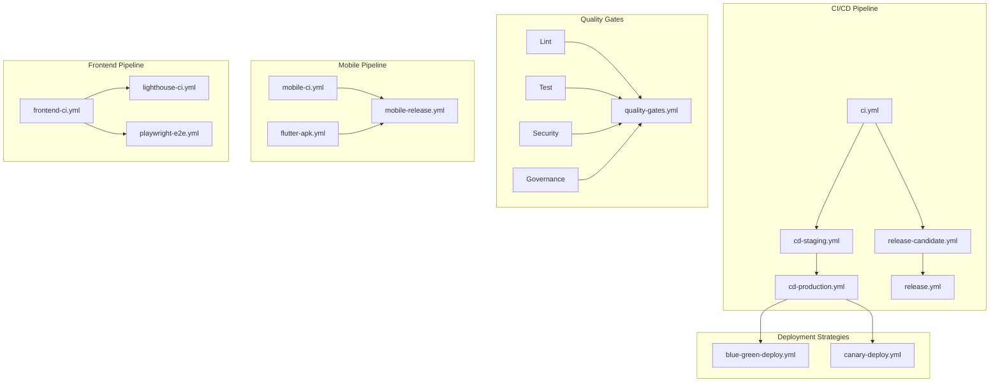

# GitHub Actions Workflows Reference

This document provides a comprehensive reference for all 54 GitHub Actions workflows in the SAHOOL platform repository.

---

## Table of Contents

1. [CI/CD Core](#1-cicd-core-7-workflows)
2. [Security](#2-security-6-workflows)
3. [Testing](#3-testing-9-workflows)
4. [Deployment](#4-deployment-6-workflows)
5. [Build/Docker](#5-builddocker-3-workflows)
6. [Governance](#6-governance-11-workflows)
7. [Documentation](#7-documentation-1-workflow)
8. [Mobile](#8-mobile-3-workflows)
9. [Frontend](#9-frontend-1-workflow)
10. [AI/Agents](#10-aiagents-1-workflow)
11. [Specialized CI](#11-specialized-ci-4-workflows)
12. [Automation](#12-automation-2-workflows)
13. [Workflow Dependencies](#workflow-dependencies)
14. [Secrets Reference](#secrets-reference)

---

## 1. CI/CD Core (7 Workflows)

### ci.yml - Main CI Pipeline

**Purpose**: Primary continuous integration pipeline that runs on every push and pull request.

| Property | Value |
|----------|-------|
| **File** | `.github/workflows/ci.yml` |
| **Triggers** | `push` (main, develop), `pull_request` (main, develop) |
| **Runs On** | ubuntu-latest |

**Jobs**:
- `lint` - Code linting (Ruff for Python, ESLint for TypeScript)
- `test` - Unit and integration tests
- `build` - Build validation

**Required Secrets**: None (uses GITHUB_TOKEN)

---

### cd-staging.yml - Staging Deployment

**Purpose**: Continuous deployment to staging environment after successful CI.

| Property | Value |
|----------|-------|
| **File** | `.github/workflows/cd-staging.yml` |
| **Triggers** | `push` (develop), `workflow_dispatch` |
| **Environment** | staging |

**Jobs**:
- `deploy` - Deploy to staging cluster
- `smoke-test` - Post-deployment validation
- `notify` - Slack/Teams notification

**Required Secrets**:
- `STAGING_KUBECONFIG`
- `SLACK_WEBHOOK_URL` (optional)

---

### cd-production.yml - Production Deployment

**Purpose**: Production deployment with approval gates.

| Property | Value |
|----------|-------|
| **File** | `.github/workflows/cd-production.yml` |
| **Triggers** | `push` (main), `release` (published), `workflow_dispatch` |
| **Environment** | production (requires approval) |

**Jobs**:
- `validate` - Pre-deployment checks
- `deploy` - Blue-green deployment
- `verify` - Health checks
- `rollback` - Automatic rollback on failure

**Required Secrets**:
- `PRODUCTION_KUBECONFIG`
- `SLACK_WEBHOOK_URL`

---

### release.yml - Release Management

**Purpose**: Automates release creation, changelog generation, and artifact publishing.

| Property | Value |
|----------|-------|
| **File** | `.github/workflows/release.yml` |
| **Triggers** | `push` (tags: v*), `workflow_dispatch` |
| **Permissions** | contents: write |

**Jobs**:
- `validate` - Validate release requirements
- `build` - Build release artifacts
- `publish` - Create GitHub release
- `notify` - Announcement notifications

**Required Secrets**:
- `GITHUB_TOKEN` (automatic)

---

### release-candidate.yml - Release Candidates

**Purpose**: Creates and tests release candidates before production release.

| Property | Value |
|----------|-------|
| **File** | `.github/workflows/release-candidate.yml` |
| **Triggers** | `push` (branches: release/*), `workflow_dispatch` |

**Jobs**:
- `create-rc` - Create release candidate tag
- `test-rc` - Run full test suite
- `deploy-staging` - Deploy RC to staging
- `validate` - Acceptance testing

**Required Secrets**: None

---

### reusable-setup.yml - Reusable Setup

**Purpose**: Reusable workflow providing common setup steps for Python, Node.js, Flutter, and Docker BuildX environments with caching.

| Property | Value |
|----------|-------|
| **File** | `.github/workflows/reusable-setup.yml` |
| **Triggers** | `workflow_call` |

**Inputs**:
- `setup-python` - Set up Python environment (default: false)
- `python-version` - Python version (default: "3.11")
- `setup-node` - Set up Node.js environment (default: false)
- `node-version` - Node.js version (default: "20")

**Jobs**:
- Provides reusable setup steps called by other workflows

**Required Secrets**: None

---

### cd-new-services.yml - Deploy New Services

**Purpose**: Continuous deployment for new services (yolo26-vision, terrain-core, hydrology, leveling-optimizer, edge-orchestrator) using ArgoCD GitOps with staged rollout.

| Property | Value |
|----------|-------|
| **File** | `.github/workflows/cd-new-services.yml` |
| **Triggers** | `push` (tags: v*), `workflow_dispatch` |

**Inputs** (workflow_dispatch):
- `environment` - Deployment environment (staging or production)
- `services` - Services to deploy (comma-separated or "all")

**Jobs**:
- Deploy selected services to target environment

**Required Secrets**:
- `KUBECONFIG`

---

## 2. Security (6 Workflows)

### codeql-analysis.yml - CodeQL Semantic Analysis

**Purpose**: GitHub's semantic code analysis for security vulnerabilities.

| Property | Value |
|----------|-------|
| **File** | `.github/workflows/codeql-analysis.yml` |
| **Triggers** | `push`, `pull_request`, `schedule` (weekly) |
| **Languages** | Python, JavaScript/TypeScript |

**Jobs**:
- `analyze` - Run CodeQL analysis with auto-detection

**Required Secrets**: None (uses GITHUB_TOKEN)

---

### security-checks.yml - Security Scanning

**Purpose**: Comprehensive security scanning pipeline.

| Property | Value |
|----------|-------|
| **File** | `.github/workflows/security-checks.yml` |
| **Triggers** | `push`, `pull_request`, `schedule` |

**Jobs**:
- `trivy-scan` - Container vulnerability scanning
- `bandit-scan` - Python security linting
- `gitleaks` - Secret detection
- `dependency-check` - Dependency vulnerability scanning

**Required Secrets**: None

---

### security.yml - Dependency Security

**Purpose**: Dependency vulnerability scanning and alerting.

| Property | Value |
|----------|-------|
| **File** | `.github/workflows/security.yml` |
| **Triggers** | `push`, `pull_request`, `schedule` (daily) |

**Jobs**:
- `npm-audit` - Node.js dependency audit
- `pip-audit` - Python dependency audit
- `flutter-audit` - Dart/Flutter dependency audit

**Required Secrets**: None

---

### security-audit.yml - Security Audit

**Purpose**: Deep security audit with reporting.

| Property | Value |
|----------|-------|
| **File** | `.github/workflows/security-audit.yml` |
| **Triggers** | `schedule` (weekly), `workflow_dispatch` |

**Jobs**:
- `audit` - Full security audit
- `report` - Generate security report
- `alert` - Send alerts for critical findings

**Required Secrets**:
- `SECURITY_ALERT_EMAIL` (optional)

---

### scorecard.yml - OSSF Scorecard

**Purpose**: OpenSSF Scorecard analysis for supply chain security.

| Property | Value |
|----------|-------|
| **File** | `.github/workflows/scorecard.yml` |
| **Triggers** | `push` (main), `schedule` (weekly) |
| **Permissions** | security-events: write |

**Jobs**:
- `analysis` - Run OSSF Scorecard
- `upload` - Upload results to GitHub Security

**Required Secrets**:
- `SCORECARD_TOKEN` (optional, for higher rate limits)

---

### ci-ai-rag-security.yml - AI/RAG Container Security

**Purpose**: Comprehensive security scanning for all AI and RAG services including dependency vulnerability scanning, container security, SBOM generation, and license compliance.

| Property | Value |
|----------|-------|
| **File** | `.github/workflows/ci-ai-rag-security.yml` |
| **Triggers** | `push` (main, develop, copilot/\*\*, claude/\*\*), `pull_request` (main, develop), `schedule` (daily at 3 AM UTC), `workflow_dispatch` |
| **Paths** | apps/services/ai-advisor/\*\*, apps/services/ai-agents-service/\*\*, apps/services/llm-orchestrator-service/\*\*, apps/services/yolo26-vision-service/\*\*, shared/ai/\*\*, docker/constraints-ai.txt |

**Jobs**:
- Dependency vulnerability scanning (Safety, pip-audit)
- Container security scanning (Trivy, Grype)
- SBOM generation
- License compliance checks

**Required Secrets**: None

---

## 3. Testing (9 Workflows)

### test.yml - Python Unit Tests

**Purpose**: Comprehensive Python testing with coverage reporting.

| Property | Value |
|----------|-------|
| **File** | `.github/workflows/test.yml` |
| **Triggers** | `push`, `pull_request` |
| **Coverage Threshold** | 60% |

**Jobs**:
- `test` - Run pytest with coverage
- `upload-coverage` - Upload to Codecov

**Required Secrets**:
- `CODECOV_TOKEN` (optional)

---

### container-tests.yml - Container Tests

**Purpose**: Tests that run inside Docker containers with service dependencies.

| Property | Value |
|----------|-------|
| **File** | `.github/workflows/container-tests.yml` |
| **Triggers** | `push`, `pull_request` |

**Services**:
- PostgreSQL 16 with PostGIS
- Redis 7
- NATS

**Jobs**:
- `test-python` - Python service tests
- `test-node` - Node.js service tests

**Required Secrets**: None

---

### frontend-tests.yml - Frontend Component Tests

**Purpose**: React/Next.js component and integration tests.

| Property | Value |
|----------|-------|
| **File** | `.github/workflows/frontend-tests.yml` |
| **Triggers** | `push`, `pull_request` (apps/web/**, apps/admin/**, packages/**) |

**Jobs**:
- `test` - Vitest unit tests
- `coverage` - Coverage reporting

**Required Secrets**: None

---

### e2e-tests.yml - End-to-End Tests

**Purpose**: End-to-end testing for critical user flows.

| Property | Value |
|----------|-------|
| **File** | `.github/workflows/e2e-tests.yml` |
| **Triggers** | `push` (main), `workflow_dispatch` |

**Jobs**:
- `e2e` - Run E2E test suite
- `report` - Generate test report

**Required Secrets**:
- `E2E_BASE_URL` (optional)

---

### playwright-e2e.yml - Playwright E2E Tests

**Purpose**: Cross-browser E2E testing with Playwright.

| Property | Value |
|----------|-------|
| **File** | `.github/workflows/playwright-e2e.yml` |
| **Triggers** | `push`, `pull_request` (apps/web/**, tests/e2e/**) |

**Jobs**:
- `setup-tests` - Prepare test environment
- `playwright-tests` - Run tests on Chromium, Firefox, WebKit
- `visual-regression` - Screenshot comparison (PRs only)
- `test-summary` - Generate summary report

**Matrix**:
- Browsers: chromium, firefox, webkit

**Required Secrets**:
- `E2E_BASE_URL` (optional)

---

### load-testing.yml - Load/Performance Tests

**Purpose**: Load testing with Locust for performance validation.

| Property | Value |
|----------|-------|
| **File** | `.github/workflows/load-testing.yml` |
| **Triggers** | `schedule` (nightly), `workflow_dispatch` |

**Jobs**:
- `load-test` - Run Locust load tests
- `analyze` - Analyze results
- `report` - Generate performance report

**Required Secrets**:
- `LOAD_TEST_TARGET_URL`

---

### load-test-validation.yml - Load Test Validation

**Purpose**: Validates load test configurations and baselines.

| Property | Value |
|----------|-------|
| **File** | `.github/workflows/load-test-validation.yml` |
| **Triggers** | `pull_request` (tests/load/**) |

**Jobs**:
- `validate` - Validate Locust configurations
- `baseline` - Compare against baselines

**Required Secrets**: None

---

### skills-tests.yml - AI Skills Tests

**Purpose**: Tests for AI skills and context engineering modules.

| Property | Value |
|----------|-------|
| **File** | `.github/workflows/skills-tests.yml` |
| **Triggers** | `push`, `pull_request` (.claude/skills/**) |

**Jobs**:
- `test-skills` - Validate skill definitions
- `test-context` - Test context compression

**Required Secrets**: None

---

### lighthouse-ci.yml - Lighthouse Performance

**Purpose**: Frontend performance auditing with Lighthouse.

| Property | Value |
|----------|-------|
| **File** | `.github/workflows/lighthouse-ci.yml` |
| **Triggers** | `push` (main, develop), `workflow_dispatch` |
| **Paths** | apps/web/**, apps/mobile/** |

**Jobs**:
- `lighthouse-web` - Web app performance audit
- `lighthouse-flutter-web` - Flutter web build audit

**Metrics Evaluated**:
- Performance (target: >90%)
- Accessibility (target: >90%)
- Best Practices (target: >90%)
- SEO (target: >90%)

**Required Secrets**: None

---

## 4. Deployment (6 Workflows)

### deploy-preview.yml - Preview Deployments

**Purpose**: Deploys preview environments for pull requests.

| Property | Value |
|----------|-------|
| **File** | `.github/workflows/deploy-preview.yml` |
| **Triggers** | `pull_request` |

**Jobs**:
- `build` - Build preview artifacts
- `deploy` - Deploy to preview environment
- `comment` - Add preview URL to PR

**Required Secrets**:
- `PREVIEW_DEPLOY_TOKEN`

---

### vercel-preview.yml - Vercel Preview

**Purpose**: Deploys Next.js apps to Vercel for previews.

| Property | Value |
|----------|-------|
| **File** | `.github/workflows/vercel-preview.yml` |
| **Triggers** | `pull_request` (apps/web/**, apps/admin/**) |

**Jobs**:
- `deploy-preview` - Deploy to Vercel preview

**Required Secrets**:
- `VERCEL_TOKEN`
- `VERCEL_ORG_ID`
- `VERCEL_PROJECT_ID`

---

### blue-green-deploy.yml - Blue-Green Deployments

**Purpose**: Zero-downtime deployments using blue-green strategy.

| Property | Value |
|----------|-------|
| **File** | `.github/workflows/blue-green-deploy.yml` |
| **Triggers** | `workflow_dispatch`, `workflow_call` |

**Jobs**:
- `prepare` - Prepare green environment
- `deploy` - Deploy to green
- `test` - Validate green environment
- `switch` - Switch traffic to green
- `cleanup` - Remove blue environment

**Required Secrets**:
- `KUBECONFIG`

---

### canary-deploy.yml - Canary Deployments

**Purpose**: Gradual rollout with traffic splitting.

| Property | Value |
|----------|-------|
| **File** | `.github/workflows/canary-deploy.yml` |
| **Triggers** | `workflow_dispatch` |

**Inputs**:
- `service` - Service to deploy
- `percentage` - Initial traffic percentage (default: 10%)

**Jobs**:
- `deploy-canary` - Deploy canary version
- `monitor` - Monitor error rates
- `promote` - Increase traffic or rollback

**Required Secrets**:
- `KUBECONFIG`

---

### infra-sync.yml - Infrastructure Sync

**Purpose**: Validates that generated infrastructure files are in sync with `governance/services.yaml`.

| Property | Value |
|----------|-------|
| **File** | `.github/workflows/infra-sync.yml` |
| **Triggers** | `pull_request`, `push` (governance/services.yaml, docker/compose.generated.yml, helm/**) |

**Jobs**:
- `check-sync` - Verify generated files match source
- `generate-report` - Create sync status report

**Checks**:
- `docker/compose.generated.yml` is in sync
- `helm/sahool/values.generated.yaml` is in sync
- Docker Compose validates
- Helm values are valid YAML

**Required Secrets**: None

---

### notifications.yml - Notifications

**Purpose**: Centralized reusable notification system supporting Slack, Discord, email (via SendGrid), and GitHub Issues for critical alerts.

| Property | Value |
|----------|-------|
| **File** | `.github/workflows/notifications.yml` |
| **Triggers** | `workflow_call` |

**Inputs**:
- `type` - Notification type (success, failure, warning, info)
- `title` - Notification title
- `message` - Notification message
- `environment` - Environment (staging, production)
- `create-issue` - Create GitHub issue for failures (default: false)

**Jobs**:
- Send notifications to configured channels (Slack, Discord, email)
- Optionally create GitHub issues for failures

**Required Secrets**:
- `SLACK_WEBHOOK_URL` (optional)
- `DISCORD_WEBHOOK_URL` (optional)
- `SENDGRID_API_KEY` (optional)

---

## 5. Build/Docker (3 Workflows)

### docker-image.yml - Docker Image CI

**Purpose**: Builds and validates Docker images for all microservices.

| Property | Value |
|----------|-------|
| **File** | `.github/workflows/docker-image.yml` |
| **Triggers** | `push` (main), `pull_request` (main) |

**Jobs**:
- `validate` - Validate Dockerfiles (PRs only)
- `build` - Full Docker builds (push to main only)

**Services Matrix** (13 services):
- crop-growth-model
- indicators-service
- irrigation-smart
- yield-engine
- notification-service
- marketplace-service
- iot-service
- virtual-sensors
- vegetation-analysis-service
- advisory-service
- weather-service
- crop-intelligence-service
- field-management-service

**Required Secrets**:
- `DOCKERHUB_USERNAME`
- `DOCKERHUB_TOKEN`

---

### docker-buildx.yml - Multi-Platform Docker Builds

**Purpose**: Builds multi-architecture Docker images with buildx.

| Property | Value |
|----------|-------|
| **File** | `.github/workflows/docker-buildx.yml` |
| **Triggers** | `push` (main), `release` (published), `workflow_dispatch` |

**Platforms**:
- linux/amd64
- linux/arm64

**Features**:
- SBOM generation
- Provenance attestation
- GHCR publishing
- Docker Hub publishing

**Required Secrets**:
- `DOCKERHUB_USERNAME`
- `DOCKERHUB_TOKEN`
- `GITHUB_TOKEN` (automatic)

---

### dockerfile-lint.yml - Dockerfile Linting

**Purpose**: Lints all Dockerfiles using hadolint to enforce best practices and security standards.

| Property | Value |
|----------|-------|
| **File** | `.github/workflows/dockerfile-lint.yml` |
| **Triggers** | `pull_request` (\*\*/Dockerfile\*, .hadolint.yaml), `push` (main, develop; \*\*/Dockerfile\*, .hadolint.yaml) |
| **Runs On** | ubuntu-latest |

**Jobs**:
- `hadolint` - Lint all Dockerfiles with hadolint

**Required Secrets**: None

---

## 6. Governance (11 Workflows)

### governance-ci.yml - Governance Validation

**Purpose**: Validates governance policies, schemas, and security configurations.

| Property | Value |
|----------|-------|
| **File** | `.github/workflows/governance-ci.yml` |
| **Triggers** | `push`, `pull_request` (governance/**, gitops/**, helm/**, apps/**) |

**Jobs**:
- `validate-yaml` - YAML linting with yamllint
- `validate-schemas` - JSON Schema validation with ajv-cli
- `validate-kyverno` - Kyverno policy syntax validation
- `security-checks` - Check for :latest tags and hardcoded secrets
- `structure-guard` - Validate repository structure
- `governance-report` - Generate summary report

**Required Secrets**: None

---

### governance-structure.yml - Structure Guard

**Purpose**: Enforces repository structure conventions.

| Property | Value |
|----------|-------|
| **File** | `.github/workflows/governance-structure.yml` |
| **Triggers** | `push`, `pull_request` (main, develop) |

**Jobs**:
- `structure-guard` - Validate structure
- `summary` - Generate report

**Forbidden Paths** (will fail if exist):
- `kernel/`
- `kernel-services-v15.3/`
- `frontend/`
- `web_admin/`
- `services/`
- `advisor/`
- `field_suite/`
- `kernel_domain/`

**Allowed Paths**:
- `apps/services/` - Backend microservices
- `apps/web/` - Web dashboard
- `apps/admin/` - Admin panel
- `apps/mobile/` - Mobile app
- `packages/` - Shared packages
- `shared/` - Shared domain
- `archive/` - Legacy code

**Required Secrets**: None

---

### event-contracts-guard.yml - Event Contracts

**Purpose**: Validates event schema contracts and backward compatibility.

| Property | Value |
|----------|-------|
| **File** | `.github/workflows/event-contracts-guard.yml` |
| **Triggers** | `pull_request` (shared/events/**, packages/shared-events/**) |

**Jobs**:
- `validate` - Validate event schemas
- `compatibility` - Check backward compatibility
- `document` - Generate event documentation

**Required Secrets**: None

---

### generator-guard.yml - Generator Sync

**Purpose**: Ensures generated files are kept in sync with source definitions.

| Property | Value |
|----------|-------|
| **File** | `.github/workflows/generator-guard.yml` |
| **Triggers** | `pull_request` (governance/services.yaml, scripts/generators/**) |

**Jobs**:
- `check` - Regenerate and compare files
- `report` - Report differences

**Required Secrets**: None

---

### quality-gates.yml - Quality Gates

**Purpose**: Comprehensive quality gates before merge.

| Property | Value |
|----------|-------|
| **File** | `.github/workflows/quality-gates.yml` |
| **Triggers** | `pull_request` (main, develop) |

**Jobs**:
- `python-quality` - Python linting and type checking
- `frontend-quality` - TypeScript and ESLint checks
- `security-gate` - Security scan must pass
- `governance-gate` - Governance checks must pass
- `agent-evaluation-gate` - AI agent evaluation (if applicable)

**Required Secrets**: None

---

### api-contracts-guard.yml - API Contracts Guard

**Purpose**: Validates unified API contracts, checks for breaking changes, and ensures TypeScript/Dart contract synchronization.

| Property | Value |
|----------|-------|
| **File** | `.github/workflows/api-contracts-guard.yml` |
| **Triggers** | `pull_request` (main, develop; packages/shared-types/src/contracts/\*\*, apps/mobile/lib/core/contracts/\*\*, packages/api-client/src/\*\*) |

**Jobs**:
- `validate-contracts` - Validate contract integrity and synchronization

**Required Secrets**: None

---

### api-openapi-guard.yml - OpenAPI & Kong Guard

**Purpose**: Validates OpenAPI specs, detects breaking API changes, and ensures Kong gateway routes match the documented API specifications.

| Property | Value |
|----------|-------|
| **File** | `.github/workflows/api-openapi-guard.yml` |
| **Triggers** | `pull_request` (main, develop; docs/api/openapi/\*\*, api/gateway-openapi.yaml, infrastructure/gateway/kong/\*\*, packages/shared-types/src/contracts/\*\*) |

**Jobs**:
- Validate OpenAPI specification syntax and completeness
- Detect breaking API changes
- Verify Kong routes match OpenAPI specs

**Required Secrets**: None

---

### governance-validation.yml - Governance Validation

**Purpose**: Validates service governance rules, ensuring all apps, packages, and governance definitions conform to platform standards.

| Property | Value |
|----------|-------|
| **File** | `.github/workflows/governance-validation.yml` |
| **Triggers** | `pull_request` (apps/\*\*, packages/\*\*, governance/\*\*, idp/\*\*), `push` (main, develop; governance/\*\*) |

**Jobs**:
- `validate-services` - Validate service governance rules

**Required Secrets**: None

---

### advanced-quality.yml - Advanced Quality Analysis

**Purpose**: Deep code analysis including dead code detection, security scanning, and performance metrics.

| Property | Value |
|----------|-------|
| **File** | `.github/workflows/advanced-quality.yml` |
| **Triggers** | `workflow_dispatch` (full_scan input), `schedule` (weekly, Sunday 2 AM UTC), `pull_request` (main; apps/services/\*\*.py, shared/\*\*.py) |

**Inputs** (workflow_dispatch):
- `full_scan` - Run full comprehensive scan (default: false)

**Jobs**:
- `dead-code` - Dead code analysis with Vulture
- Security scanning
- Performance metrics analysis

**Required Secrets**: None

---

### stability-gates.yml - Stability Gates

**Purpose**: Comprehensive stability checks including import verification, configuration validation, and drift detection for shared modules and services.

| Property | Value |
|----------|-------|
| **File** | `.github/workflows/stability-gates.yml` |
| **Triggers** | `pull_request` (main, develop; shared/\*\*, apps/services/\*\*, governance/\*\*, docker-compose\*.yml, .env.example, packages/shared-types/\*\*), `push` (main, develop), `schedule` (daily at 6 AM UTC) |

**Jobs**:
- Stability and drift detection checks across shared modules and services

**Required Secrets**: None

---

### drift-detection.yml - Drift Detection

**Purpose**: Detects configuration, schema, contract, event, security, and Docker drift across the platform with automated PR comments and issue creation.

| Property | Value |
|----------|-------|
| **File** | `.github/workflows/drift-detection.yml` |
| **Triggers** | `pull_request` (main, develop), `push` (main, develop), `schedule` (daily at 6 AM UTC), `workflow_dispatch` |

**Inputs** (workflow_dispatch):
- `categories` - Drift categories to check (comma-separated or "all", default: "all")
- `environment` - Target environment (development, staging, production)

**Jobs**:
- `preflight` - Pre-flight analysis to determine changed areas
- Category-specific drift detection (Python, config, schema, contracts, events, security, Docker)

**Required Secrets**: None

---

## 7. Documentation (1 Workflow)

### docs.yml - Documentation Generation

**Purpose**: Generates and publishes API documentation.

| Property | Value |
|----------|-------|
| **File** | `.github/workflows/docs.yml` |
| **Triggers** | `push` (main), `workflow_dispatch` |
| **Paths** | apps/services/**, shared/**, docs/** |

**Jobs**:
- `generate-openapi` - Generate OpenAPI specs from FastAPI services
- `build-redoc` - Build Redoc API documentation
- `build-mkdocs` - Build MkDocs developer documentation
- `deploy` - Deploy to GitHub Pages

**Outputs**:
- OpenAPI specifications
- Redoc HTML documentation
- MkDocs developer documentation

**Required Secrets**:
- `GITHUB_TOKEN` (automatic)

---

## 8. Mobile (3 Workflows)

### flutter-apk.yml - Flutter APK Builds

**Purpose**: Builds Flutter APK for Android.

| Property | Value |
|----------|-------|
| **File** | `.github/workflows/flutter-apk.yml` |
| **Triggers** | `push` (main, claude/*), `workflow_dispatch` |
| **Paths** | apps/mobile/** |

**Inputs** (workflow_dispatch):
- `build_type` - release or debug (default: release)

**Jobs**:
- `build-apk` - Full APK build pipeline

**Build Steps**:
1. Setup Java 17
2. Setup Android SDK
3. Setup Flutter 3.27.1
4. Generate app icons
5. Generate Drift database code
6. Build APK (release/debug)
7. Upload artifact

**Required Secrets**:
- `WEATHER_API_KEY` (optional, uses placeholder if not set)
- `MAPS_API_KEY` (optional, uses placeholder if not set)

---

### mobile-ci.yml - Mobile CI

**Purpose**: Comprehensive mobile CI pipeline for Flutter app.

| Property | Value |
|----------|-------|
| **File** | `.github/workflows/mobile-ci.yml` |
| **Triggers** | `push`, `pull_request`, `workflow_dispatch` |
| **Paths** | apps/mobile/** |

**Concurrency**: `mobile-ci-${{ github.ref }}` (cancels in-progress)

**Environment Variables**:
- `FLUTTER_VERSION`: 3.27.1
- `JAVA_VERSION`: 17
- `ANDROID_COMPILE_SDK`: 34
- `ANDROID_BUILD_TOOLS`: 34.0.0
- `ANDROID_MIN_SDK`: 23

**Jobs**:
- `analyze` - Flutter analyze and dart format check
- `test` - Unit tests with coverage (60% threshold)
- `build-debug` - Build debug APK
- `integration-test` - Integration tests (schedule/manual only)
- `ci-status` - Final status check

**Required Secrets**:
- `WEATHER_API_KEY` (optional)
- `MAPS_API_KEY` (optional)
- `CODECOV_TOKEN` (optional)

---

### mobile-release.yml - Mobile Release

**Purpose**: Builds signed release APK and AAB for Play Store.

| Property | Value |
|----------|-------|
| **File** | `.github/workflows/mobile-release.yml` |
| **Triggers** | `push` (tags: v*, mobile-v*), `release` (published), `workflow_dispatch` |

**Inputs** (workflow_dispatch):
- `version_bump` - major, minor, patch, none
- `build_type` - apk, aab, both
- `deploy_to_play_store` - true/false

**Jobs**:
- `version` - Version management
- `build-release-apk` - Signed APK build
- `build-release-aab` - Signed AAB build (Play Store)
- `deploy-play-store` - Upload to Play Store internal track
- `create-release` - Create GitHub release
- `release-status` - Summary report

**Required Secrets**:
- `WEATHER_API_KEY`
- `MAPS_API_KEY`
- `ANDROID_KEYSTORE_BASE64`
- `ANDROID_KEYSTORE_PASSWORD`
- `ANDROID_KEY_PASSWORD`
- `ANDROID_KEY_ALIAS`
- `PLAY_STORE_SERVICE_ACCOUNT_JSON` (for Play Store deployment)
- `GITHUB_TOKEN` (automatic)

---

## 9. Frontend (1 Workflow)

### frontend-ci.yml - Frontend CI

**Purpose**: Comprehensive frontend CI for web and admin apps.

| Property | Value |
|----------|-------|
| **File** | `.github/workflows/frontend-ci.yml` |
| **Triggers** | `push`, `pull_request` |
| **Paths** | apps/web/**, apps/admin/**, packages/shared-*/** |

**Permissions**:
- contents: read
- issues: write
- pull-requests: write

**Jobs**:
- `lint` - ESLint on all packages
- `typecheck` - TypeScript validation for web and admin
- `test` - Vitest test suite
- `build` - Build web and admin apps (depends on lint, typecheck)
- `bundle-analysis` - Bundle size analysis (PRs only)
- `accessibility` - Accessibility pattern checks

**Artifacts**:
- `web-build` - Next.js build output
- `admin-build` - Admin app build output

**Required Secrets**: None

---

## 10. AI/Agents (1 Workflow)

### agent-evaluation.yml - Agent Evaluation

**Purpose**: Evaluates AI agent performance and quality.

| Property | Value |
|----------|-------|
| **File** | `.github/workflows/agent-evaluation.yml` |
| **Triggers** | `push` (.claude/**, shared/ai/**), `schedule` (weekly), `workflow_dispatch` |

**Services**:
- Qdrant (vector database)
- Redis

**Jobs**:
- `evaluate` - Run agent evaluations
- `compare` - Compare against baselines
- `report` - Generate evaluation report
- `update-baseline` - Update baselines (main only)

**Required Secrets**:
- `OPENAI_API_KEY` (optional)
- `ANTHROPIC_API_KEY` (optional)
- `GOOGLE_API_KEY` (optional)

---

## 11. Specialized CI (4 Workflows)

### ci-yolo26-vision.yml - CI - YOLO26 Vision Service

**Purpose**: Continuous integration for the YOLO26 computer vision service with CUDA support, including linting, testing, container building, and security scanning.

| Property | Value |
|----------|-------|
| **File** | `.github/workflows/ci-yolo26-vision.yml` |
| **Triggers** | `push` (main, develop, feature/\*\*, release/\*\*, claude/\*\*; apps/services/yolo26-vision-service/\*\*, shared/\*\*), `pull_request` (main, develop; same paths), `workflow_dispatch` |

**Jobs**:
- Lint, test, build, and security scan for yolo26-vision-service

**Required Secrets**: None

---

### ci-terrain-services.yml - CI - Terrain Services

**Purpose**: Matrix-based CI pipeline for terrain-core, hydrology, and leveling-optimizer services with parallel builds and testing.

| Property | Value |
|----------|-------|
| **File** | `.github/workflows/ci-terrain-services.yml` |
| **Triggers** | `push` (main, develop, feature/\*\*, release/\*\*, claude/\*\*; apps/services/terrain-core-service/\*\*, apps/services/hydrology-service/\*\*, apps/services/leveling-optimizer-service/\*\*, shared/\*\*), `pull_request` (main, develop; same paths), `workflow_dispatch` |

**Jobs**:
- Matrix build and test for terrain-core-service, hydrology-service, and leveling-optimizer-service

**Required Secrets**: None

---

### ci-edge-orchestrator.yml - CI - Edge Orchestrator Service

**Purpose**: CI pipeline for the edge device management and orchestration service (Jetson Orin support).

| Property | Value |
|----------|-------|
| **File** | `.github/workflows/ci-edge-orchestrator.yml` |
| **Triggers** | `push` (main, develop, feature/\*\*, release/\*\*, claude/\*\*; apps/services/edge-orchestrator-service/\*\*, shared/\*\*), `pull_request` (main, develop; same paths), `workflow_dispatch` |

**Jobs**:
- Lint, test, build, and security scan for edge-orchestrator-service

**Required Secrets**: None

---

### ci-crop-intelligence.yml - CI - Crop Intelligence

**Purpose**: CI pipeline for the crop intelligence service and related shared modules (digital twin, calibration, process models, fertilizer management, soil testing).

| Property | Value |
|----------|-------|
| **File** | `.github/workflows/ci-crop-intelligence.yml` |
| **Triggers** | `push` (main, develop, feature/\*\*, release/\*\*, claude/\*\*; apps/services/crop-intelligence-service/\*\*, shared/digital_twin/\*\*, shared/calibration/\*\*, shared/process_models/\*\*, shared/fertilizer_management/\*\*, shared/soil_testing/\*\*), `pull_request` (main, develop; same paths), `workflow_dispatch` |

**Jobs**:
- Lint, test, build, and validate crop-intelligence-service and dependent shared modules

**Required Secrets**: None

---

## 12. Automation (2 Workflows)

### auto-merge-prs.yml - Auto-Merge PRs

**Purpose**: Automates conflict resolution, testing, and merging of open pull requests with configurable merge and conflict strategies.

| Property | Value |
|----------|-------|
| **File** | `.github/workflows/auto-merge-prs.yml` |
| **Triggers** | `workflow_dispatch` (pr_numbers, merge_strategy, conflict_strategy, require_approvals, dry_run inputs), `pull_request` (labeled) |

**Inputs** (workflow_dispatch):
- `pr_numbers` - PR numbers to merge (comma-separated or "all")
- `merge_strategy` - Merge strategy (auto, merge, squash, rebase)
- `conflict_strategy` - Conflict resolution strategy (auto, ours, theirs, manual)
- `require_approvals` - Require approvals before merge (default: true)
- `dry_run` - Dry run without merging (default: true)

**Jobs**:
- Conflict detection and resolution
- Pre-merge testing
- Merge execution with rollback on failure

**Required Secrets**: None (uses GITHUB_TOKEN)

---

### pr-status-monitor.yml - PR Status Monitor

**Purpose**: Monitors open pull requests for conflicts, CI status, and optionally auto-updates branches. Generates daily PR health reports.

| Property | Value |
|----------|-------|
| **File** | `.github/workflows/pr-status-monitor.yml` |
| **Triggers** | `schedule` (daily at 9 AM UTC), `workflow_dispatch` (auto_update, send_notifications inputs), `push` (main, develop) |

**Inputs** (workflow_dispatch):
- `auto_update` - Automatically update PR branches (default: false)
- `send_notifications` - Send notifications for issues (default: true)

**Jobs**:
- Monitor open PRs for conflicts and CI status
- Optionally auto-update PR branches from base branch
- Generate PR health reports

**Required Secrets**: None (uses GITHUB_TOKEN)

---

## Workflow Dependencies

### Workflow Call Relationships

| Caller | Callee | Purpose |
|--------|--------|---------|
| `cd-production.yml` | `blue-green-deploy.yml` | Production deployment strategy |
| `cd-production.yml` | `canary-deploy.yml` | Gradual rollout |
| `release.yml` | `docker-buildx.yml` | Build release images |
| `mobile-ci.yml` | `mobile-release.yml` | Triggered by tags |

---

## Secrets Reference

### Required for All Deployments

| Secret | Used By | Description |
|--------|---------|-------------|
| `GITHUB_TOKEN` | All | Automatic token for GitHub API |

### Docker/Container

| Secret | Used By | Description |
|--------|---------|-------------|
| `DOCKERHUB_USERNAME` | docker-image.yml, docker-buildx.yml | Docker Hub username |
| `DOCKERHUB_TOKEN` | docker-image.yml, docker-buildx.yml | Docker Hub access token |

### Kubernetes/Infrastructure

| Secret | Used By | Description |
|--------|---------|-------------|
| `STAGING_KUBECONFIG` | cd-staging.yml | Staging cluster kubeconfig |
| `PRODUCTION_KUBECONFIG` | cd-production.yml | Production cluster kubeconfig |
| `KUBECONFIG` | blue-green-deploy.yml, canary-deploy.yml | Generic kubeconfig |

### Vercel (Frontend Previews)

| Secret | Used By | Description |
|--------|---------|-------------|
| `VERCEL_TOKEN` | vercel-preview.yml | Vercel API token |
| `VERCEL_ORG_ID` | vercel-preview.yml | Vercel organization ID |
| `VERCEL_PROJECT_ID` | vercel-preview.yml | Vercel project ID |

### Mobile/Flutter

| Secret | Used By | Description |
|--------|---------|-------------|
| `WEATHER_API_KEY` | flutter-apk.yml, mobile-ci.yml, mobile-release.yml | Weather API key |
| `MAPS_API_KEY` | flutter-apk.yml, mobile-ci.yml, mobile-release.yml | Maps API key |
| `ANDROID_KEYSTORE_BASE64` | mobile-release.yml | Base64-encoded keystore |
| `ANDROID_KEYSTORE_PASSWORD` | mobile-release.yml | Keystore password |
| `ANDROID_KEY_PASSWORD` | mobile-release.yml | Key password |
| `ANDROID_KEY_ALIAS` | mobile-release.yml | Key alias |
| `PLAY_STORE_SERVICE_ACCOUNT_JSON` | mobile-release.yml | Play Store service account |

### AI/LLM

| Secret | Used By | Description |
|--------|---------|-------------|
| `OPENAI_API_KEY` | agent-evaluation.yml | OpenAI API key |
| `ANTHROPIC_API_KEY` | agent-evaluation.yml | Anthropic API key |
| `GOOGLE_API_KEY` | agent-evaluation.yml | Google AI API key |

### Optional/Notifications

| Secret | Used By | Description |
|--------|---------|-------------|
| `SLACK_WEBHOOK_URL` | cd-staging.yml, cd-production.yml | Slack notifications |
| `CODECOV_TOKEN` | test.yml, mobile-ci.yml | Codecov upload token |
| `SCORECARD_TOKEN` | scorecard.yml | OSSF Scorecard token |

---

## Quick Reference

### Trigger Types

| Trigger | Description |
|---------|-------------|
| `push` | Triggered on git push |
| `pull_request` | Triggered on PR open/sync |
| `workflow_dispatch` | Manual trigger via UI |
| `workflow_call` | Called by another workflow |
| `schedule` | Cron-based schedule |
| `release` | Triggered on release events |

### Common Path Filters

| Path Pattern | Workflows |
|--------------|-----------|
| `apps/services/**` | ci.yml, docker-image.yml, docs.yml |
| `apps/web/**` | frontend-ci.yml, lighthouse-ci.yml, playwright-e2e.yml |
| `apps/admin/**` | frontend-ci.yml |
| `apps/mobile/**` | flutter-apk.yml, mobile-ci.yml, mobile-release.yml |
| `governance/**` | governance-ci.yml, infra-sync.yml |
| `shared/**` | ci.yml, docs.yml |
| `.claude/**` | agent-evaluation.yml, skills-tests.yml |
| `tests/e2e/**` | playwright-e2e.yml, e2e-tests.yml |
| `tests/load/**` | load-testing.yml, load-test-validation.yml |

---

## Deprecated Services Note

The following services are deprecated and excluded from CI builds (see `docs/DEPRECATED_SERVICES.md`):

| Deprecated Service | Replacement |
|--------------------|-------------|
| satellite-service | vegetation-analysis-service |
| weather-advanced | weather-service |
| crop-health-ai | crop-intelligence-service |
| fertilizer-advisor | advisory-service |

---

_Last Updated: March 2026_
