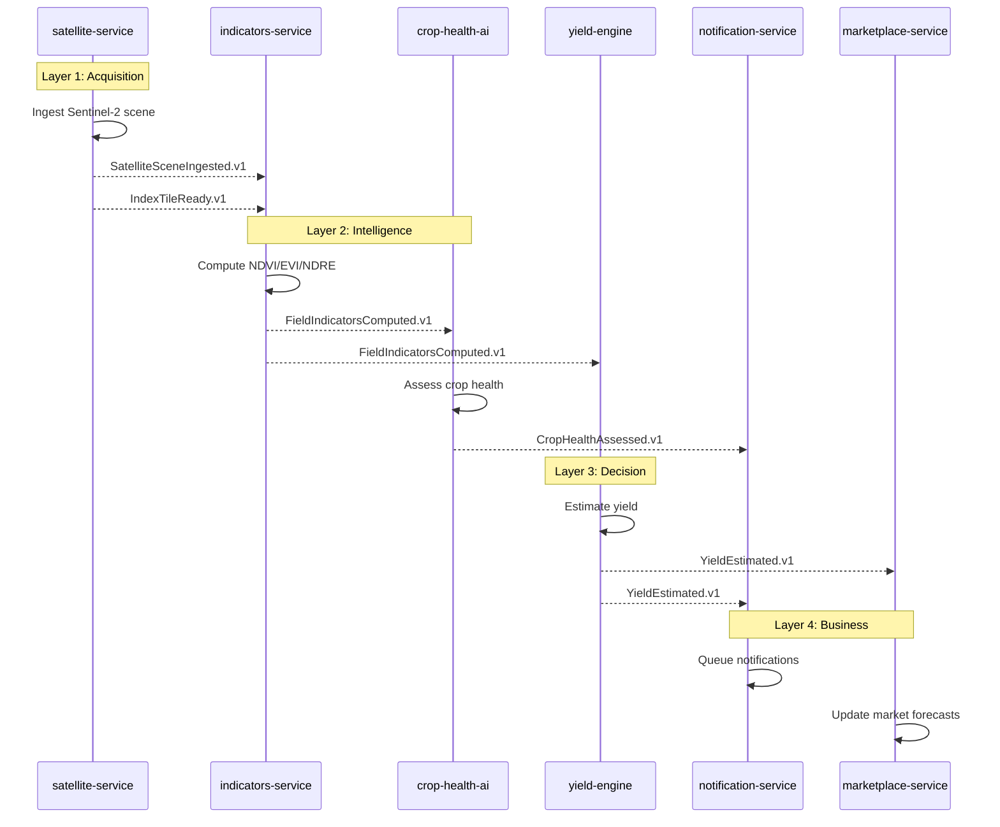
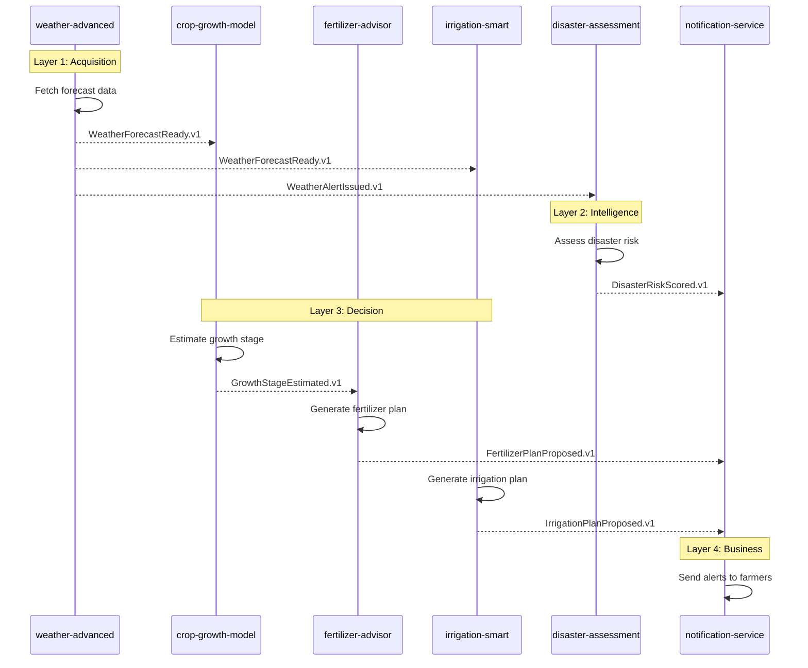
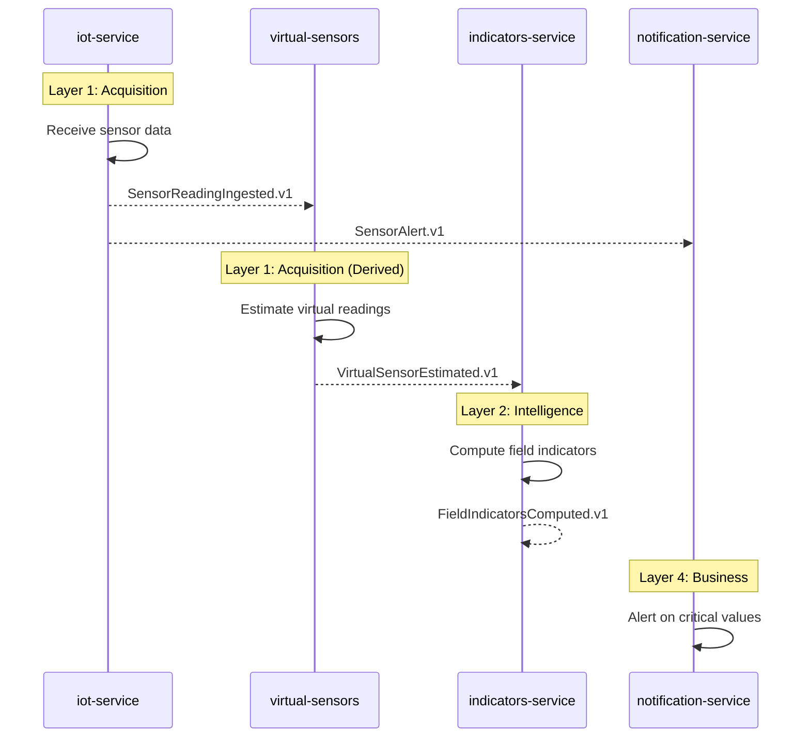
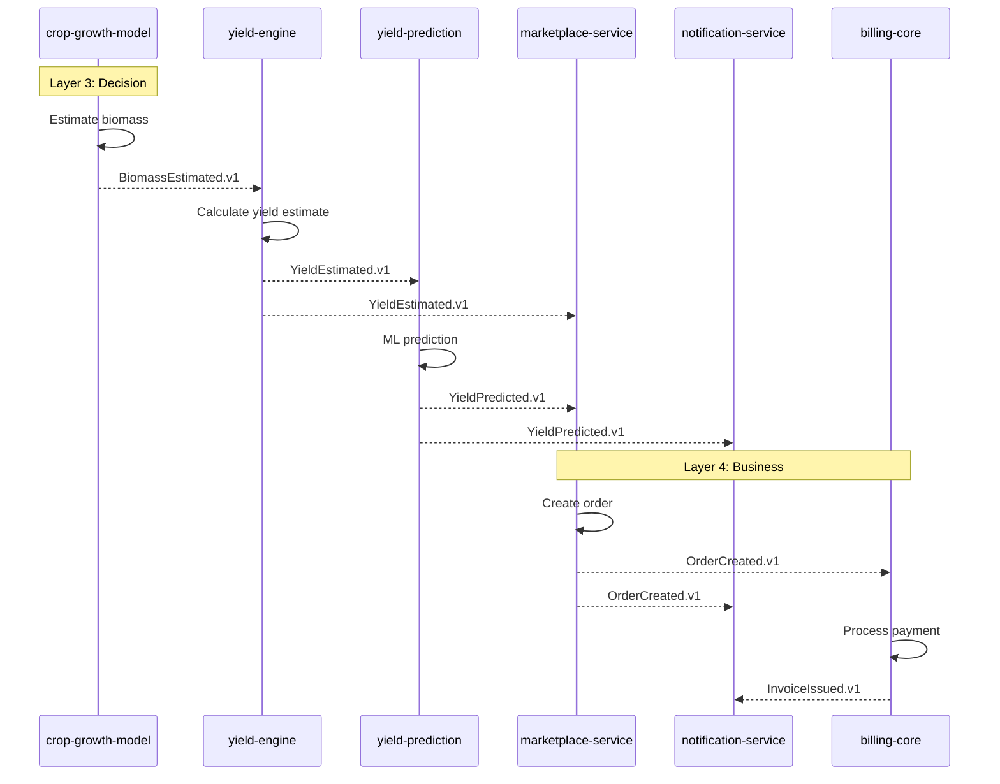

# SAHOOL Event Sequences - مخططات تسلسل الأحداث

> **Version:** 1.0.0
> **Last Updated:** 2025-12-19
> **Architecture:** Event-Driven (4-Layer)

---

## Overview | نظرة عامة

This document defines the official event sequences for SAHOOL platform. All services must follow these patterns to maintain architectural integrity.

```
┌─────────────────────────────────────────────────────────────────────┐
│                    SAHOOL Event Architecture                        │
├─────────────────────────────────────────────────────────────────────┤
│  Layer 1: ACQUISITION    → Raw data ingestion                       │
│  Layer 2: INTELLIGENCE   → Feature extraction & AI                  │
│  Layer 3: DECISION       → Advisory & planning                      │
│  Layer 4: BUSINESS       → User-facing operations                   │
└─────────────────────────────────────────────────────────────────────┘
```

---

## 1. Field Monitoring Chain | سلسلة مراقبة الحقل

### Sequence Diagram (Mermaid)



### ASCII Diagram

```
satellite-service
       │
       ├──[SatelliteSceneIngested.v1]──► indicators-service
       │                                        │
       └──[IndexTileReady.v1]──────────────────►│
                                                │
                           ┌────────────────────┴────────────────────┐
                           │                                         │
                           ▼                                         ▼
              [FieldIndicatorsComputed.v1]              [FieldIndicatorsComputed.v1]
                           │                                         │
                           ▼                                         ▼
                   crop-health-ai                              yield-engine
                           │                                         │
              [CropHealthAssessed.v1]                     [YieldEstimated.v1]
                           │                                         │
                           ├─────────────────┬───────────────────────┤
                           ▼                 ▼                       ▼
                notification-service    notification-service   marketplace-service
```

### Events Table

| Event                        | Producer           | Consumers                                        |
| ---------------------------- | ------------------ | ------------------------------------------------ |
| `SatelliteSceneIngested.v1`  | satellite-service  | indicators-service, disaster-assessment          |
| `IndexTileReady.v1`          | satellite-service  | indicators-service, lai-estimation               |
| `FieldIndicatorsComputed.v1` | indicators-service | crop-health-ai, yield-engine, fertilizer-advisor |
| `CropHealthAssessed.v1`      | crop-health-ai     | notification-service, community-chat             |
| `YieldEstimated.v1`          | yield-engine       | yield-prediction, marketplace-service            |

---

## 2. Weather & Risk Chain | سلسلة الطقس والمخاطر

### Sequence Diagram (Mermaid)



### ASCII Diagram

```
weather-advanced
       │
       ├──[WeatherForecastReady.v1]──► crop-growth-model
       │                                      │
       ├──[WeatherForecastReady.v1]──► irrigation-smart
       │                                      │
       └──[WeatherAlertIssued.v1]───► disaster-assessment
                                              │
                                    [DisasterRiskScored.v1]
                                              │
                                              ▼
       ┌──────────────────────────────────────┴──────────────────────────────────┐
       │                                                                          │
       ▼                                                                          ▼
crop-growth-model ──[GrowthStageEstimated.v1]──► fertilizer-advisor    notification-service
                                                        │
                                          [FertilizerPlanProposed.v1]
                                                        │
                                                        ▼
irrigation-smart ──[IrrigationPlanProposed.v1]──► notification-service
```

### Events Table

| Event                       | Producer            | Consumers                                              |
| --------------------------- | ------------------- | ------------------------------------------------------ |
| `WeatherObserved.v1`        | weather-advanced    | indicators-service, crop-health-ai                     |
| `WeatherForecastReady.v1`   | weather-advanced    | crop-growth-model, irrigation-smart, yield-prediction  |
| `WeatherAlertIssued.v1`     | weather-advanced    | disaster-assessment, notification-service              |
| `GrowthStageEstimated.v1`   | crop-growth-model   | fertilizer-advisor, yield-engine, notification-service |
| `FertilizerPlanProposed.v1` | fertilizer-advisor  | notification-service, marketplace-service              |
| `IrrigationPlanProposed.v1` | irrigation-smart    | notification-service, iot-service                      |
| `DisasterRiskScored.v1`     | disaster-assessment | notification-service, community-chat                   |

---

## 3. IoT Sensors Chain | سلسلة الحساسات

### Sequence Diagram (Mermaid)



### ASCII Diagram

```
iot-service (Physical Sensors)
       │
       ├──[SensorReadingIngested.v1]──► virtual-sensors
       │                                       │
       └──[SensorAlert.v1]────────────────────►│
                                               │
                              [VirtualSensorEstimated.v1]
                                               │
                                               ▼
                                      indicators-service
                                               │
                               [FieldIndicatorsComputed.v1]
                                               │
               ┌───────────────────────────────┴────────────────────────────────┐
               ▼                               ▼                                ▼
       crop-health-ai                   yield-engine                  fertilizer-advisor
```

### Events Table

| Event                       | Producer        | Consumers                            |
| --------------------------- | --------------- | ------------------------------------ |
| `SensorReadingIngested.v1`  | iot-service     | virtual-sensors, indicators-service  |
| `DeviceStatusChanged.v1`    | iot-service     | notification-service                 |
| `SensorAlert.v1`            | iot-service     | notification-service                 |
| `VirtualSensorEstimated.v1` | virtual-sensors | indicators-service, irrigation-smart |

---

## 4. Yield to Market Chain | سلسلة الإنتاج للسوق

### Sequence Diagram (Mermaid)



### ASCII Diagram

```
crop-growth-model
       │
       └──[BiomassEstimated.v1]──► yield-engine
                                        │
                           ┌────────────┴────────────┐
                           ▼                         ▼
              [YieldEstimated.v1]        [YieldEstimated.v1]
                           │                         │
                           ▼                         ▼
                  yield-prediction           marketplace-service
                           │                         │
              [YieldPredicted.v1]          [OrderCreated.v1]
                           │                         │
               ┌───────────┴───────────┐             │
               ▼                       ▼             ▼
    marketplace-service      notification-service  billing-core
                                                      │
                                          [InvoiceIssued.v1]
                                                      │
                                                      ▼
                                            notification-service
```

### Events Table

| Event                 | Producer            | Consumers                                 |
| --------------------- | ------------------- | ----------------------------------------- |
| `BiomassEstimated.v1` | crop-growth-model   | yield-engine                              |
| `YieldEstimated.v1`   | yield-engine        | yield-prediction, marketplace-service     |
| `YieldPredicted.v1`   | yield-prediction    | marketplace-service, notification-service |
| `OrderCreated.v1`     | marketplace-service | billing-core, notification-service        |
| `OrderPaid.v1`        | marketplace-service | billing-core                              |
| `InvoiceIssued.v1`    | billing-core        | notification-service                      |

---

## Architecture Rules | قواعد المعمارية

### Layer Communication Rules

```
┌─────────────────────────────────────────────────────────────────────────────┐
│  ALLOWED                           │  FORBIDDEN                             │
├────────────────────────────────────┼────────────────────────────────────────┤
│  Acquisition → Intelligence        │  Business → Acquisition                │
│  Intelligence → Decision           │  Decision → Acquisition                │
│  Decision → Business               │  Any layer skipping (1→3, 2→4)         │
│  Any layer → Notification (side)   │  Business → Intelligence               │
└────────────────────────────────────┴────────────────────────────────────────┘
```

### Event Naming Convention

```yaml
# Pattern: {Domain}.{Action}
# Version: Append to filename, field in payload

# Good Examples:
- Satellite.SceneIngested
- Crop.HealthAssessed
- Advisor.IrrigationPlanProposed

# Bad Examples:
- satellite_scene_ingested # Wrong case
- CropHealthAssessment # Missing dot separator
- IrrigationPlan # Missing action verb
```

### Transport Configuration

```yaml
transport: nats
subject_pattern: "sahool.{tenant_id}.{event_type}"

# Example subjects:
- sahool.tenant-abc.Satellite.SceneIngested
- sahool.tenant-abc.Crop.HealthAssessed
- sahool.*.Weather.AlertIssued  # Broadcast to all tenants
```

---

## Quick Reference | مرجع سريع

### All Events by Layer

| Layer            | Service              | Produces                                                  |
| ---------------- | -------------------- | --------------------------------------------------------- |
| **Acquisition**  | satellite-service    | SatelliteSceneIngested, RasterTileReady, IndexTileReady   |
|                  | iot-service          | SensorReadingIngested, DeviceStatusChanged, SensorAlert   |
|                  | weather-advanced     | WeatherObserved, WeatherForecastReady, WeatherAlertIssued |
|                  | virtual-sensors      | VirtualSensorEstimated                                    |
| **Intelligence** | indicators-service   | FieldIndicatorsComputed                                   |
|                  | lai-estimation       | LAIEstimated                                              |
|                  | crop-health-ai       | CropHealthAssessed, CropStressDetected                    |
|                  | disaster-assessment  | DisasterRiskScored, DisasterEventDetected                 |
| **Decision**     | crop-growth-model    | GrowthStageEstimated, BiomassEstimated                    |
|                  | fertilizer-advisor   | FertilizerPlanProposed                                    |
|                  | irrigation-smart     | IrrigationPlanProposed, IrrigationAlertIssued             |
|                  | yield-engine         | YieldEstimated                                            |
|                  | yield-prediction     | YieldPredicted, YieldConfidenceUpdated                    |
| **Business**     | notification-service | NotificationQueued, NotificationSent                      |
|                  | marketplace-service  | OrderCreated, OrderPaid                                   |
|                  | billing-core         | InvoiceIssued, PaymentFailed                              |
|                  | community-chat       | CommunityPostCreated                                      |
|                  | research-core        | TrialCreated, ObservationLogged                           |

---

## Related Documentation

- [services.yaml](../../governance/services.yaml) - Service registry with events
- [Event Schemas](../../packages/shared/events/) - JSON Schema definitions
- [Event Registry Index](../../packages/shared/events/index.json) - Event catalog

---

_Last verified: 2025-12-19_
