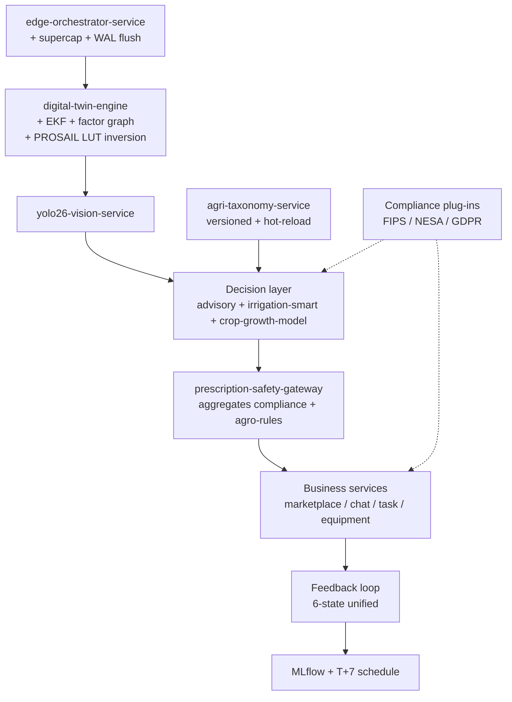

# Phase 1 — Gap Analysis: SAHOOL v3.1 vs v16

> **Status:** Phase 1 deliverable (corrected, repo-ready)
> **Owner:** Architecture Team
> **Last updated:** 2026-04-25
> **Scope:** Identify gaps between the v3.1 target architecture and the current
> v16 implementation. Preserve backward compatibility, reuse existing assets,
> and avoid breaking contracts. All NATS subjects must remain `tenant_id`-scoped.

---

## 🧭 Executive Summary (EN/AR)

**EN:** SAHOOL v16 already covers **~85%** of v3.1 requirements via its mature
microservices, NATS 4-layer eventing, PostGIS geospatial stack, AI layer, and
the white-box scientific kernel in `shared/process_models/` + `shared/digital_twin/`
+ `shared/pesticide_compliance/`. The remaining gaps are concentrated in:

1. Spatio-temporal fusion at the **physics-grade** level (full EKF + factor graph + ±500 ms alignment)
2. **Versioned, hot-reloadable** agricultural taxonomy engine
3. A unified **prescription safety gate** (single decision endpoint over existing checkers)
4. Edge **hardware resilience** (supercap + crash-safe WAL flush)
5. **Region-aware** compliance plug-in abstraction (FIPS / NESA / GDPR)
6. Drone & Field **FSM formalization** as a Proto/gRPC contract

**AR:** منصة سهول v16 تغطي **~85%** من متطلبات v3.1 بفضل خدماتها الناضجة، نظام
الأحداث (NATS 4-layer)، طبقة PostGIS الجغرافية، طبقة الذكاء الاصطناعي، والنواة
العلمية في `shared/process_models/` و `shared/digital_twin/` و
`shared/pesticide_compliance/`. الفجوات المتبقية تتركز في:

1. الدمج الزماني-المكاني بمستوى **فيزيائي** (EKF كامل + factor graph + ±500ms)
2. محرك التصنيف الزراعي **مُصدَّر مع إعادة تحميل حية**
3. **بوابة أمان الوصفات** الموحّدة (نقطة قرار واحدة فوق الفاحصين الحاليين)
4. صلابة العتاد الحافي (supercap + WAL آمن عند الانهيار)
5. طبقة امتثال إقليمية قابلة للتركيب (FIPS / NESA / GDPR)
6. تشكيل آلات الحالة (FSM) للطائرات المسيّرة والميدان كعقد Proto/gRPC

---

## 🔍 Methodology & Verification

Each row was verified by direct inspection of the v16 codebase (commit on
`copilot/design-agricultural-ai-platform`). Anchor paths:

| Concern | Verified asset path |
|---|---|
| Spatio-temporal & assimilation | `shared/digital_twin/assimilation.py` (Kalman-lite / EnKF-lite); service `apps/services/digital-twin-engine/` (port 8253) |
| Physics agronomy (PROSAIL) | `shared/process_models/radiative_transfer.py` (PROSPECT + SAIL) and full WOFOST/AquaCrop/APSIM/QUEFTS/SCS-CN/Penman-Monteith kernel under `shared/process_models/` |
| Pesticide / prescription safety | `shared/pesticide_compliance/checker.py` → `PesticideComplianceChecker` (PHI / REI / PPE / tank-mix / drift); rules engine `apps/services/agro-rules/` (port 8151); `apps/services/globalgap-compliance/` (port 8128) |
| Disease taxonomy seed | `apps/services/advisory-service/src/kb/diseases.py`; `apps/services/knowledge-graph/` (port 8140); `shared/ai/knowledge/` (13 collections, 30+ trusted sources, 6-stage ingestion) |
| Edge orchestration | `apps/services/edge-orchestrator-service/` (port 8180); `shared/mobile_sync/` |
| Vision lifecycle | `apps/services/yolo26-vision-service/` (port 8150) + MLflow |
| Eventing | `shared/events/` + NATS 4-layer (Acquisition / Intelligence / Decision / Business) |

**Legend**

- ✅ Covered (functionally present in current services; no new work required)
- 🟢 Minor gap (P2 — small lib / config tweak)
- 🟡 Moderate gap (P1 — extend an existing service)
- 🟠 Material gap (P0/P1 — extend existing AND/OR add a thin gateway)
- 🔴 Hard gap (no equivalent asset; new service justified)

---

## 📊 Phase 1 — Gap Matrix (corrected)

> **Note vs. earlier draft.** Items #4, #7, #10, #11 were originally marked
> 🔴 with new dedicated services. Verification revealed substantial existing
> assets, so they are reclassified to 🟠/🟡 with **extend-existing** actions.
> See "Corrections vs. earlier draft" below.

| # | v3.1 Requirement | Coverage | Existing service / module | Gap | Recommended action |
|---|---|---|---|---|---|
| 1 | Core objectives (E2E loop) | ✅ | NATS 4-layer + services map | No unified cross-domain SLA | Add unified SLO labels across services + tenant-scoped tracing correlation-id |
| 2 | Edge gateway + offline | 🟡 | `edge-orchestrator-service` (8180), `shared/mobile_sync` | WAL partial; no unified backpressure / compaction policy | Unify WAL policy + backpressure + jittered retry inside `edge-orchestrator-service` |
| 3 | Drone & field FSM | 🟡 | Implicit in edge-orchestrator + vision | No formal FSM contract (states / guards / timers) | Define gRPC/Protobuf FSM + guards (wind, humidity, tilt, irradiance) |
| 4 | **Spatio-temporal fusion** | 🟠 | `shared/digital_twin/assimilation.py` (Kalman-lite); `digital-twin-engine` (8253) | No full EKF / factor graph; no ±500 ms time alignment; no cubic spline | **Extend `digital-twin-engine` + new module `shared/spatiotemporal/`** with full EKF, factor graph (g2o-style), sliding-window alignment ±500 ms, cubic-spline interpolation. **No new service.** |
| 5 | Data engine (ingest + quality) | ✅ | Postgres / PostGIS + outbox + pipelines | Bloom filter not unified; CRC32 not centrally enforced | Add dedup lib in `shared/libs/` (Bloom + CRC32) |
| 6 | AI model lifecycle (edge / cloud) | 🟡 | `yolo26-vision-service` + MLflow | INT8 export not standardized; canary not wired to vision | Add INT8 export pipeline + canary routing via Kong / NATS |
| 7 | **Physics agronomy (PROSAIL)** | 🟡 | `shared/process_models/radiative_transfer.py` (PROSPECT + SAIL); plus crop_growth, agro_meteorology, hydrology, soil_carbon, pest_epidemiology, nutrient_management, uncertainty, ensemble | No LUT inversion; no REST/gRPC wrapper | **Extend `digital-twin-engine`** (or expose via `shared/process_models/`) with LUT inversion + REST endpoint. **No new service.** |
| 8 | Synthetic data (Diffusion + LoRA) | 🟡 | AI stack (vLLM / Ollama) | No standardized LoRA + CLIP-filter pipeline | Add `synthetic-data-pipeline` worker (LoRA R=16, α=32 + CLIP ≥ 0.82). May live in `shared/ai/` or a small worker service. |
| 9 | Knowledge + RAG | ✅ | Qdrant + Milvus + LLM provider | Hybrid retrieval weights / schema not standardized | Pin (dense 0.7 / BM25 0.3) + unified schema |
| 10 | **Agricultural taxonomy engine** | 🟠 | `apps/services/advisory-service/src/kb/diseases.py`; `apps/services/knowledge-graph/` (8140); `shared/ai/knowledge/` | No UUIDv4 nodes; no Latin binomials; no synonyms graph; no live versioning / hot-reload < 30 s | **New service `agri-taxonomy-service`** built as a **migration + extension** of existing KB (not from scratch). |
| 11 | **Prescription safety filter** | 🟠 | `shared/pesticide_compliance/PesticideComplianceChecker` (PHI / REI / PPE / tank-mix / drift); `agro-rules` (8151); `globalgap-compliance` (8128) | No single decision endpoint; no forbidden-substance blacklist; no dosage ±10 % gate; no APPROVED / REVIEW / REJECTED contract | **Thin gateway `prescription-safety-gateway`** that aggregates the existing checkers and returns a single decision. **Optional**: gateway may also live as a router inside `agro-rules`. |
| 12 | Feedback loop (6 states) | 🟡 | Partial across business services | No unified 6-state lifecycle | Unify workflow states + events over NATS |
| 13 | Compliance plug-in system | 🟡 | `shared/security` + Vault | No region-aware plug-in abstraction | Add `compliance-plugin-interface` (FIPS / NESA / GDPR) under `shared/security/` |
| 14 | **Edge hardware resilience** | 🔴 | `edge-orchestrator-service` | No supercap handling; no crash-safe WAL flush to eMMC | Extend `edge-orchestrator-service`: supercap hooks + eMMC flush + WAL fsync barriers |
| 15 | Cloud infra (API / NATS / K8s) | ✅ | Kong + NATS + ArgoCD | — | Covered |
| 16 | Iteration pipeline (T+7) | 🟡 | MLflow + workflows | No explicit T+7 schedule | Add scheduled workflows + model-registry promotion gates |
| 17 | API design (REST / gRPC / JWT) | ✅ | Kong + services | — | Covered |
| 18 | Output / artifacts (repo + diagrams) | 🟡 | Partial | No standard generator | Add codegen templates inside IDP |
| 19 | Performance targets | ✅ | SLO definitions | Some services missing direct metric wiring | Add the missing Prometheus rules |

---

## 🔥 Priorities

### P0 (high)
1. Spatio-temporal fusion — **extend** `digital-twin-engine` (#4)
2. Agricultural taxonomy engine — **new** `agri-taxonomy-service` (#10)
3. Prescription safety filter — **thin gateway** + reuse (#11)
4. Edge hardware resilience — **extend** `edge-orchestrator-service` (#14)

### P1 (medium)
- Compliance plug-in system (#13)
- Synthetic data pipeline (#8)
- FSM formalization (#3)
- T+7 pipeline (#16)
- Physics agronomy LUT inversion (#7)

### P2 (low)
- Bloom / CRC dedup optimization (#5)
- Artifact / codegen improvements (#18)
- Unified SLO labels & cross-domain tracing (#1, #19)

---

## 🧩 Proposed New Components (minimal)

| Component | Type | Justification |
|---|---|---|
| `agri-taxonomy-service` | **New service** | No UUIDv4 / Latin-binomial / live-versioning equivalent today. Built as a migration of `advisory-service/src/kb/diseases.py` + `knowledge-graph`. |
| `prescription-safety-gateway` | **New thin gateway** (or router inside `agro-rules`) | Aggregates `pesticide_compliance` + `agro-rules` + `globalgap-compliance` behind one decision endpoint. Optional if we host the route inside `agro-rules` instead. |
| `synthetic-data-pipeline` worker | **New worker** | Standardizes LoRA R=16 / α=32 + CLIP ≥ 0.82 on top of existing AI stack. May live as a worker in `shared/ai/`. |

> **Removed from the original proposal** (covered by extending existing assets):
> - ❌ `spatiotemporal-fusion-service` → extend `digital-twin-engine` + add `shared/spatiotemporal/`
> - ❌ `agronomy-physics-service` → extend `digital-twin-engine` + reuse `shared/process_models/`

---

## 🧭 Architecture Delta (Mermaid)

---

## 🧷 Backward-compatibility & contract guarantees

- **No breaking changes** to existing API contracts; all extensions are
  additive and live behind feature flags where appropriate.
- All NATS subjects keep the `tenant_id` scope (per
  `shared/events/subjects.py::get_tenant_subject`).
- Existing event subjects are not renamed; new subjects follow the
  `sahool.{domain}.{action}` and tenant-scoped patterns already in use.
- New services expose `/healthz`, `/readyz`, `/metrics` per the platform
  conventions in `CLAUDE.md`.
- Contract changes (if any) follow the deprecation policy in
  `packages/shared-types/src/contracts/` (alias map + `@deprecated` JSDoc +
  `CONTRACT_VERSION` bump + 2-minor-version sunset).

---

## 🔁 Corrections vs. earlier draft

The earlier Gap Analysis draft proposed **4 new services** and rated four items
as 🔴 hard gaps. Verification against the v16 codebase showed material assets
that change the picture:

| # | Earlier rating | Earlier action | Verified asset(s) | Corrected rating | Corrected action |
|---|---|---|---|---|---|
| 4 | 🔴 | New `spatiotemporal-fusion-service` | `shared/digital_twin/assimilation.py` (Kalman-lite); `digital-twin-engine` (8253) | 🟠 | Extend `digital-twin-engine` + add `shared/spatiotemporal/` (full EKF + factor graph + ±500 ms) |
| 7 | 🔴 | New `agronomy-physics-service` | `shared/process_models/radiative_transfer.py` (PROSPECT + SAIL) + full WOFOST/AquaCrop/APSIM kernel | 🟡 | Extend `digital-twin-engine` (LUT inversion + REST wrapper); reuse `shared/process_models/` |
| 10 | 🔴 | New `agri-taxonomy-service` from scratch | `advisory-service/src/kb/diseases.py`; `knowledge-graph` (8140); `shared/ai/knowledge/` | 🟠 | New `agri-taxonomy-service` **as a migration + extension** (UUIDv4, Latin binomials, synonyms, hot-reload < 30 s) |
| 11 | 🔴 | New `prescription-safety-service` | `shared/pesticide_compliance/PesticideComplianceChecker` (PHI / REI / PPE / tank-mix / drift); `agro-rules` (8151); `globalgap-compliance` (8128) | 🟠 | Thin `prescription-safety-gateway` over existing checkers (or router inside `agro-rules`); add forbidden-substance blacklist + dosage ±10 % |

**Net effect:** new services drop from **4 → 1 firm + 1 optional + 1 worker**.
Coverage estimate updates from ~75–80 % to **~85 %**.

---

## ✅ Outcome

- No system rebuild required.
- **1 new service** firmly justified (`agri-taxonomy-service`),
  **1 optional thin gateway** (`prescription-safety-gateway`),
  **1 optional worker** (`synthetic-data-pipeline`).
- The remaining gaps are **internal extensions** to:
  `digital-twin-engine`, `edge-orchestrator-service`, `agro-rules`,
  `shared/process_models/`, `shared/digital_twin/`, `shared/security/`,
  `shared/libs/`, `shared/ai/`.
- **0 breaking changes.**

---

## ⏭️ Next phase

If this corrected analysis is accepted, the next deliverable is:

**Phase 2 — Architecture Decision Records (ADRs)** under `docs/adr/`,
one ADR per gap row that requires a design choice, written in repo-ready
form following the `ADR-000-template.md` structure.
