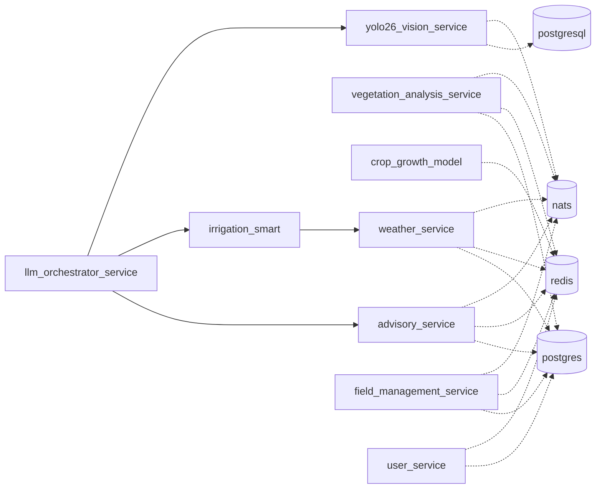

# SAHOOL Backstage Catalog — Rendered Preview

> This is what the Backstage UI would display after loading
> the catalog files in `idp/backstage/catalog/` and `idp/catalog/`.
> Generated: 2026-04-16T16:30:57.882Z

---

## 🏠 Home page

| Metric | Value |
|---|---:|
| Total components | **88** |
| Total APIs | 5 |
| Total systems | 1 |
| Total location files | 4 |
| Unique owners | 8 |

## 🗂️ Service Catalog view — grouped by Event Layer (SAHOOL-specific)

### Layer: `business`  (38 services)

| Service | Lifecycle | Owner | Port | Depends on |
|---|---|---|---:|---|
| `agent-registry` | production | group:platform-team | 8160 | resource:redis, resource:nats |
| `ai-chat-assistant` | production | group:platform-team | 8260 | component:llm-orchestrator-service |
| `alert-service` | production | group:platform-team | 8113 | resource:postgres, resource:redis, resource:nats |
| `audit-service` | production | group:platform-team | 8114 | resource:postgres, resource:redis, resource:nats |
| `billing-core` | production | group:platform-team | 8089 |  |
| `carbon-service` | production | group:agro-team | 8195 | resource:postgres |
| `chat-service` | production | group:frontend-team | 8115 | resource:postgres, resource:redis, resource:nats |
| `code-review-service` | production | group:platform-team | 8102 | resource:postgres, resource:redis |
| `community-chat` | deprecated | group:frontend-team | 8097 |  |
| `community-service` | production | group:platform-team | 8133 | resource:redis, resource:nats |
| `cooperative-service` | production | group:platform-team | 8127 | component:user-service, component:notification-service |
| `copilot-api` | production | group:platform-team | 8088 | component:llm-orchestrator-service |
| `crm-service` | production | group:frontend-team | 8131 | resource:postgres, resource:redis, resource:nats |
| `demo-data` | production | group:platform-team |  |  |
| `equipment-service` | production | group:platform-team | 8101 |  |
| `field-chat` | deprecated | group:frontend-team | 8099 | resource:postgres, resource:redis, resource:nats |
| `field-core` | production | group:platform-team | 3005 |  |
| `field-management-service` | production | group:platform-team | 3000 | resource:postgres, resource:redis, resource:nats |
| `field-ops` | production | group:platform-team | 8155 |  |
| `field-service` | production | group:platform-team | 8156 |  |
| `globalgap-compliance` | production | group:platform-team | 8128 | resource:postgres, resource:redis |
| `inventory-service` | production | group:platform-team | 8116 | resource:postgres, resource:redis |
| `logistics-service` | production | group:platform-team | 8167 | resource:postgres, resource:redis, resource:nats |
| `lowcode-engine` | production | group:platform-team | 8132 | resource:postgres, resource:redis, resource:nats |
| `marketplace-service` | production | group:frontend-team | 3010 | resource:redis |
| `mcp-server` | production | group:iot-team | 8201 | resource:kong |
| `notification-service` | production | group:platform-team | 8110 |  |
| `partner-auth-service` | production | group:platform-team | 3030 | resource:postgres, resource:redis |
| `provider-config` | production | group:platform-team | 8104 | resource:postgres, resource:redis |
| `research-core` | production | group:platform-team | 3015 |  |
| `supply-chain-service` | production | group:platform-team | 8230 | component:advisory-service, component:notification-service, component:billing-core |
| `task-service` | production | group:platform-team | 8103 |  |
| `traceability-service` | production | group:platform-team | 8123 | component:field-management-service, component:notification-service |
| `user-service` | production | group:platform-team | 3025 | resource:postgres, resource:redis |
| `ussd-gateway` | production | group:iot-team | 8183 | resource:redis, resource:nats |
| `wechat-service` | deprecated | group:frontend-team | 8135 | resource:redis, resource:nats |
| `whatsapp-bot-service` | production | group:platform-team | 8240 | component:llm-orchestrator-service, component:yolo26-vision-service, component:notification-service |
| `ws-gateway` | production | group:iot-team | 8081 | resource:nats |

### Layer: `intelligence`  (21 services)

| Service | Lifecycle | Owner | Port | Depends on |
|---|---|---|---:|---|
| `agro-rules` | production | group:agro-team |  | resource:nats |
| `ai-agents-core` | production | group:platform-team | 8161 | resource:redis |
| `ai-agents-service` | production | group:data-team | 8130 | resource:redis, resource:nats |
| `code-fix-agent` | production | group:data-team | 8162 | resource:redis |
| `code-review-agent` | production | group:data-team |  | resource:redis, resource:nats |
| `crop-health` | production | group:agro-team | 8100 | resource:postgres, resource:redis |
| `crop-health-ai` | production | group:data-team | 9095 | component:vegetation-analysis-service |
| `crop-intelligence-service` | production | group:agro-team | 8095 | component:vegetation-analysis-service |
| `digital-twin-engine` | production | group:data-team | 8253 | component:crop-growth-model |
| `disaster-assessment` | production | group:data-team | 3020 | component:weather-service, component:vegetation-analysis-service |
| `field-intelligence` | production | group:data-team | 8120 | component:indicators-service |
| `indicators-service` | production | group:data-team | 8091 | component:vegetation-analysis-service |
| `knowledge-graph` | production | group:data-team | 8140 | resource:postgres, resource:redis |
| `lai-estimation` | deprecated | group:data-team | 3022 | component:vegetation-analysis-service, resource:redis |
| `ndvi-engine` | production | group:data-team | 8107 | resource:redis |
| `ndvi-processor` | experimental | group:data-team | 8118 | component:vegetation-analysis-service |
| `pest-detection-service` | production | group:platform-team | 8125 | component:yolo26-vision-service, component:notification-service |
| `skills-service` | production | group:agro-team | 8121 | resource:postgres, resource:redis, resource:nats |
| `soil-analysis-service` | production | group:platform-team | 8134 | component:advisory-service, component:notification-service |
| `vegetation-analysis-service` | production | group:data-team | 8090 | resource:postgres, resource:redis, resource:nats |
| `vllm-deepseek` | production | group:data-team | 8270 |  |

### Layer: `decision`  (13 services)

| Service | Lifecycle | Owner | Port | Depends on |
|---|---|---|---:|---|
| `advisory-service` | production | group:platform-team | 8093 | resource:postgres, resource:redis, resource:nats |
| `agro-advisor` | production | group:agro-team | 8105 | resource:postgres, resource:redis, resource:nats |
| `ai-advisor` | production | group:data-team | 8112 | resource:postgres, resource:redis, resource:nats |
| `crop-growth-model` | deprecated | group:agro-team | 3023 | resource:redis |
| `drone-service` | production | group:platform-team | 8126 | component:weather-service, component:field-management-service |
| `fertigation-engine` | production | group:platform-team | 8252 | component:irrigation-smart, component:soil-analysis-service |
| `fertilizer-advisor` | production | group:platform-team | 9093 | component:crop-growth-model, component:vegetation-analysis-service |
| `irrigation-cycle-engine` | production | group:platform-team | 8250 | component:irrigation-smart, component:weather-service |
| `irrigation-smart` | production | group:platform-team | 8094 | component:weather-service, component:virtual-sensors |
| `llm-orchestrator-service` | production | group:data-team | 8164 | component:crop-intelligence-service, component:advisory-service, component:irrigation-smart, … |
| `yield-engine` | deprecated | group:data-team | 8098 | component:crop-growth-model, component:weather-service |
| `yield-prediction` | deprecated | group:data-team | 3021 | component:crop-growth-model, component:weather-service, component:lai-estimation |
| `yield-prediction-service` | production | group:data-team | 8152 | component:crop-growth-model, component:weather-service, resource:redis |

### Layer: `acquisition`  (10 services)

| Service | Lifecycle | Owner | Port | Depends on |
|---|---|---|---:|---|
| `astronomical-calendar` | production | group:iot-team | 8111 | resource:postgres, resource:redis |
| `ground-vision-service` | production | group:data-team | 8182 | component:vegetation-analysis-service, component:weather-service, component:iot-service |
| `iot-gateway` | production | group:iot-team | 8106 | resource:postgres, resource:redis, resource:nats, … |
| `iot-sensor-hub` | production | group:iot-team | 8251 | component:iot-service |
| `iot-service` | production | group:iot-team | 8117 |  |
| `satellite-service` | production | group:data-team | 9190 | component:sahool-eo |
| `virtual-sensors` | production | group:data-team | 8119 | component:weather-service, component:vegetation-analysis-service |
| `weather-advanced` | production | group:iot-team | 9092 |  |
| `weather-core` | production | group:iot-team | 8108 | resource:redis |
| `weather-service` | production | group:iot-team | 8092 | resource:postgres, resource:redis, resource:nats |

### Layer: `<none>`  (6 services)

| Service | Lifecycle | Owner | Port | Depends on |
|---|---|---|---:|---|
| `edge-orchestrator-service` | production | platform-team |  | component:iot-gateway, component:iot-service, resource:postgresql, … |
| `hydrology-service` | production | geospatial-team |  | component:terrain-core-service, component:weather-service, resource:postgresql, … |
| `leveling-optimizer-service` | production | geospatial-team |  | component:terrain-core-service, component:hydrology-service, resource:postgresql, … |
| `sahool-skills-library` | production | ai-team |  | component:ai-agents-core, component:agent-registry, component:llm-orchestrator-service |
| `terrain-core-service` | production | geospatial-team |  | component:field-management-service, resource:postgresql, resource:nats |
| `yolo26-vision-service` | production | ai-team |  | component:imagery-service, resource:postgresql, resource:nats |

## 📊 Filters (Backstage sidebar)

### By Lifecycle

| Lifecycle | Count |
|---|---:|
| production | 80 |
| deprecated | 7 |
| experimental | 1 |

### By Type

| Type | Count |
|---|---:|
| Python (FastAPI) | 72 |
| Node.js (NestJS) | 13 |
| Node.js | 2 |
| other | 1 |

### By Owner

| Owner | Count |
|---|---:|
| group:platform-team | 37 |
| group:data-team | 22 |
| group:iot-team | 10 |
| group:agro-team | 7 |
| group:frontend-team | 6 |
| geospatial-team | 3 |
| ai-team | 2 |
| platform-team | 1 |

## 🌐 Dependency hub — most-depended-on services

| Service | Inbound dependencies |
|---|---:|
| `weather-service` | 10 |
| `vegetation-analysis-service` | 9 |
| `notification-service` | 6 |
| `crop-growth-model` | 5 |
| `llm-orchestrator-service` | 4 |
| `field-management-service` | 3 |
| `irrigation-smart` | 3 |
| `iot-service` | 3 |
| `advisory-service` | 3 |
| `yolo26-vision-service` | 3 |

## 🧱 Resource usage

| Resource | Used by # services |
|---|---:|
| `redis` | 39 |
| `nats` | 28 |
| `postgres` | 25 |
| `postgresql` | 5 |
| `mqtt` | 1 |
| `kong` | 1 |

## 🔗 Sample dependency graph (Mermaid)



## 📄 Sample component page — `user-service`

```yaml
apiVersion: backstage.io/v1alpha1
kind: Component
metadata:
  name: user-service
  title: User Service
  description: User Service — خدمة المستخدمين
  annotations:
    github.com/project-slug: kafaat/sahool-unified-v15-idp
    backstage.io/techdocs-ref: dir:./apps/services/user-service
    backstage.io/source-location: url:https://github.com/kafaat/sahool-unified-v15-idp/tree/main/apps/services/user-service
    sahool.io/event-layer: business
    sahool.io/port: '3025'
    sahool.io/health-endpoint: /api/v1/health
  tags:
    - nodejs
    - nestjs
    - typescript
    - category-core
    - layer-business
    - tier-1
spec:
  type: service
  lifecycle: production
  owner: group:platform-team
  system: sahool-platform
  dependsOn:
    - resource:postgres
    - resource:redis

```

## 🔌 API Catalog

| API | Type | Lifecycle | Owner | Definition |
|---|---|---|---|---|
| `edge-orchestrator-api` | openapi | production | platform-team | `../../../docs/api/openapi/edge-api.yaml` (runtime) |
| `hydrology-api` | openapi | production | geospatial-team | `../../../docs/api/openapi/hydrology-api.yaml` (runtime) |
| `leveling-optimizer-api` | openapi | production | geospatial-team | `../../../docs/api/openapi/leveling-api.yaml` (runtime) |
| `terrain-core-api` | openapi | production | geospatial-team | `../../../docs/api/openapi/terrain-api.yaml` (runtime) |
| `yolo26-vision-api` | openapi | production | ai-team | `../../../docs/api/openapi/yolo26-vision-api.yaml` (runtime) |

## ⚠️ Known runtime prerequisites

Before Backstage can render the above 100%, the following env vars must be set
(see `idp/backstage/app-config.yaml`):

| Variable | Purpose | Required for |
|---|---|---|
| `GITHUB_TOKEN` | GitHub integration + Actions plugin | catalog discovery + CI summaries |
| `JAEGER_QUERY_URL` | Jaeger proxy target | traces panel |
| `K8S_CLUSTER_URL` | Kubernetes plugin | deployment status |
| `K8S_SA_TOKEN` | Kubernetes plugin | deployment status |
| `K8S_CA_DATA` | Kubernetes plugin | TLS verification |
