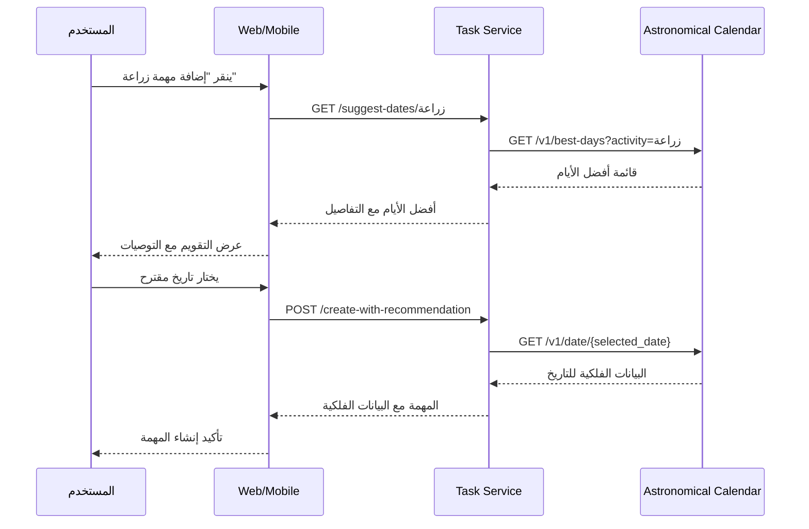
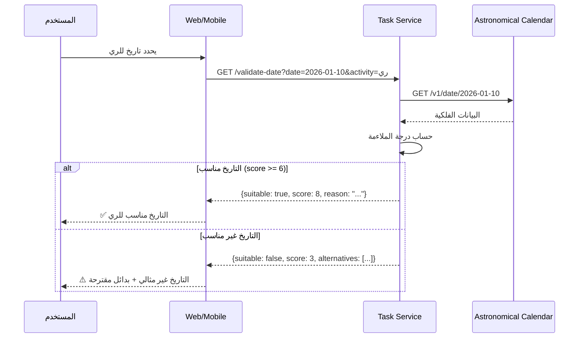

# توصيات ربط المهام بالتقويم الفلكي

# Task-Astronomical Calendar Integration Recommendations

> **التاريخ**: 2026-01-05
> **الحالة**: مقترح للتطوير المستقبلي
> **الأولوية**: عالية

---

## 1. ملخص تنفيذي

### الوضع الحالي

- خدمة التقويم الفلكي (`astronomical-calendar`) تحسب توصيات الزراعة بناءً على أطوار القمر والمنازل القمرية
- خدمة المهام (`task-service`) تدير مهام الحقل بشكل مستقل
- **لا يوجد ارتباط** بين النظامين حالياً

### الفجوة

| الميزة            | التقويم الفلكي             | خدمة المهام     |
| ----------------- | -------------------------- | --------------- |
| تاريخ البذر       | ✅ `best_planting_days`    | ❌ لا يستخدمه   |
| أطوار القمر       | ✅ `moon_phase`            | ❌ غير مرتبط    |
| المنازل القمرية   | ✅ `lunar_mansion`         | ❌ لا يؤثر      |
| التوصيات الزراعية | ✅ `FarmingRecommendation` | ❌ لا ينشئ مهام |

---

## 2. التوصيات التقنية

### 2.1 تعديلات Backend

#### 2.1.1 إضافة Endpoints جديدة في Task Service

```python
# apps/services/task-service/src/main.py

# Endpoint 1: اقتراح أفضل الأيام للنشاط
@app.get("/v1/tasks/suggest-dates/{activity}")
async def suggest_dates_for_activity(
    activity: str,  # زراعة، ري، حصاد، تسميد
    days: int = 30,
    field_id: Optional[str] = None
):
    """
    يستدعي خدمة التقويم الفلكي ويعيد أفضل الأيام للنشاط المحدد
    """
    pass

# Endpoint 2: إنشاء مهمة مع توصية فلكية
@app.post("/v1/tasks/create-with-recommendation")
async def create_task_with_recommendation(
    task: TaskCreate,
    use_astronomical: bool = True
):
    """
    ينشئ مهمة مع ربطها بالتوصية الفلكية المناسبة
    """
    pass

# Endpoint 3: التحقق من ملاءمة التاريخ
@app.get("/v1/tasks/validate-date")
async def validate_task_date(
    date: str,
    activity: str
):
    """
    يتحقق من ملاءمة التاريخ للنشاط بناءً على التقويم الفلكي
    """
    pass
```

#### 2.1.2 تعديل نموذج المهمة (Task Model)

```python
# إضافة حقول جديدة للمهمة
class Task(BaseModel):
    # الحقول الحالية...
    id: str
    title: str
    description: str
    task_type: TaskType
    due_date: datetime
    field_id: str
    status: TaskStatus
    priority: TaskPriority

    # الحقول الجديدة للربط الفلكي
    astronomical_recommendation: Optional[AstronomicalRecommendation] = None
    moon_phase_at_due_date: Optional[str] = None
    lunar_mansion_at_due_date: Optional[str] = None
    astronomical_score: Optional[int] = None  # 1-10
    suggested_by_calendar: bool = False
    optimal_time_of_day: Optional[str] = None  # الصباح الباكر، المساء
```

#### 2.1.3 إضافة Hook للربط التلقائي

```python
# apps/services/task-service/src/hooks/astronomical_integration.py

class AstronomicalTaskHook:
    """
    Hook يُنفذ عند إنشاء أو تحديث مهمة
    لإضافة البيانات الفلكية المناسبة
    """

    async def on_task_create(self, task: Task) -> Task:
        """عند إنشاء مهمة جديدة"""
        astro_data = await self._fetch_astronomical_data(task.due_date)
        task.moon_phase_at_due_date = astro_data.moon_phase.name_ar
        task.lunar_mansion_at_due_date = astro_data.lunar_mansion.name
        task.astronomical_score = self._calculate_score(task.task_type, astro_data)
        return task

    async def on_task_update(self, task: Task, changes: dict) -> Task:
        """عند تحديث تاريخ الاستحقاق"""
        if 'due_date' in changes:
            return await self.on_task_create(task)
        return task

    def _calculate_score(self, task_type: TaskType, astro_data) -> int:
        """حساب درجة ملاءمة التاريخ للنشاط"""
        activity_map = {
            TaskType.PLANTING: "زراعة",
            TaskType.IRRIGATION: "ري",
            TaskType.HARVEST: "حصاد",
            TaskType.FERTILIZATION: "تسميد",
        }
        activity = activity_map.get(task_type)
        for rec in astro_data.recommendations:
            if rec.activity == activity:
                return rec.suitability_score
        return 5  # درجة متوسطة افتراضية
```

#### 2.1.4 إنشاء مهام تلقائية من التوصيات

```python
# apps/services/task-service/src/services/auto_task_generator.py

class AutoTaskGenerator:
    """
    مولد المهام التلقائي بناءً على التقويم الفلكي
    """

    async def generate_weekly_suggestions(
        self,
        field_id: str,
        crop_type: str
    ) -> List[TaskSuggestion]:
        """
        يولد اقتراحات مهام أسبوعية بناءً على:
        - نوع المحصول
        - التقويم الفلكي
        - الموسم الحالي
        """
        weekly_forecast = await self.astronomical_api.get_weekly_forecast()
        suggestions = []

        for day in weekly_forecast.days:
            for rec in day.recommendations:
                if rec.suitability_score >= 7:  # فقط التوصيات الجيدة
                    suggestions.append(TaskSuggestion(
                        suggested_date=day.date,
                        activity=rec.activity,
                        reason=rec.reason,
                        score=rec.suitability_score,
                        best_time=rec.best_time,
                        field_id=field_id
                    ))

        return suggestions
```

---

### 2.2 تعديلات Frontend

#### 2.2.1 مكون اقتراح التاريخ (Web)

```typescript
// apps/web/src/features/tasks/components/AstronomicalDatePicker.tsx

interface AstronomicalDatePickerProps {
  activity: TaskType;
  onDateSelect: (date: Date, astronomicalData: AstronomicalData) => void;
  fieldId?: string;
}

export function AstronomicalDatePicker({
  activity,
  onDateSelect,
  fieldId
}: AstronomicalDatePickerProps) {
  const { data: bestDays } = useQuery({
    queryKey: ['best-days', activity],
    queryFn: () => taskApi.suggestDates(activity, 30)
  });

  return (
    <div className="astronomical-date-picker">
      <h4>أفضل الأيام لـ {activityLabels[activity]}</h4>

      <div className="best-days-grid">
        {bestDays?.map(day => (
          <DayCard
            key={day.date}
            date={day.date}
            score={day.astronomicalScore}
            moonPhase={day.moonPhase}
            lunarMansion={day.lunarMansion}
            reason={day.reason}
            onClick={() => onDateSelect(day.date, day)}
          />
        ))}
      </div>

      <MoonPhaseIndicator />
    </div>
  );
}
```

#### 2.2.2 بطاقة المهمة مع البيانات الفلكية

```typescript
// apps/web/src/features/tasks/components/TaskCardWithAstro.tsx

export function TaskCardWithAstro({ task }: { task: Task }) {
  return (
    <Card>
      <CardHeader>
        <TaskTitle>{task.title}</TaskTitle>
        {task.astronomicalScore && (
          <AstronomicalBadge score={task.astronomicalScore} />
        )}
      </CardHeader>

      <CardContent>
        <TaskDetails task={task} />

        {task.moon_phase_at_due_date && (
          <div className="astro-info">
            <MoonPhaseIcon phase={task.moon_phase_at_due_date} />
            <span>{task.moon_phase_at_due_date}</span>

            {task.lunar_mansion_at_due_date && (
              <span className="lunar-mansion">
                {task.lunar_mansion_at_due_date}
              </span>
            )}
          </div>
        )}

        {task.optimal_time_of_day && (
          <div className="optimal-time">
            أفضل وقت: {task.optimal_time_of_day}
          </div>
        )}
      </CardContent>
    </Card>
  );
}
```

#### 2.2.3 تطبيق الموبايل (Flutter)

```dart
// apps/mobile/lib/features/tasks/presentation/widgets/astronomical_task_form.dart

class AstronomicalTaskForm extends ConsumerWidget {
  @override
  Widget build(BuildContext context, WidgetRef ref) {
    final bestDays = ref.watch(bestDaysProvider(BestDaysParams(
      activity: selectedActivity,
      days: 30,
    )));

    return Column(
      children: [
        // اختيار النشاط
        ActivitySelector(
          onChanged: (activity) => ref.read(selectedActivityProvider.notifier).state = activity,
        ),

        // عرض أفضل الأيام
        bestDays.when(
          data: (days) => BestDaysGrid(
            days: days,
            onDaySelected: (day) {
              ref.read(selectedDateProvider.notifier).state = day.date;
              ref.read(astronomicalDataProvider.notifier).state = day;
            },
          ),
          loading: () => CircularProgressIndicator(),
          error: (e, _) => Text('خطأ في تحميل البيانات'),
        ),

        // عرض طور القمر للتاريخ المحدد
        if (ref.watch(selectedDateProvider) != null)
          MoonPhaseCard(date: ref.watch(selectedDateProvider)!),
      ],
    );
  }
}
```

---

### 2.3 تعديلات قاعدة البيانات

#### 2.3.1 Prisma Schema

```prisma
// packages/shared-db/prisma/schema.prisma

model Task {
  id          String   @id @default(cuid())
  title       String
  description String?
  taskType    TaskType
  dueDate     DateTime
  fieldId     String
  status      TaskStatus @default(PENDING)
  priority    TaskPriority @default(MEDIUM)

  // الحقول الفلكية الجديدة
  astronomicalScore       Int?      // 1-10
  moonPhaseAtDueDate      String?   // طور القمر
  lunarMansionAtDueDate   String?   // المنزلة القمرية
  optimalTimeOfDay        String?   // أفضل وقت
  suggestedByCalendar     Boolean   @default(false)
  astronomicalRecommendation Json?  // توصية كاملة

  // العلاقات
  field     Field    @relation(fields: [fieldId], references: [id])
  createdAt DateTime @default(now())
  updatedAt DateTime @updatedAt

  @@index([fieldId])
  @@index([dueDate])
  @@index([taskType, dueDate])
}
```

---

## 3. واجهات API المقترحة

### 3.1 Task Service APIs

| Endpoint                               | Method | الوصف                     |
| -------------------------------------- | ------ | ------------------------- |
| `/v1/tasks/suggest-dates/{activity}`   | GET    | اقتراح أفضل الأيام للنشاط |
| `/v1/tasks/create-with-recommendation` | POST   | إنشاء مهمة مع توصية فلكية |
| `/v1/tasks/validate-date`              | GET    | التحقق من ملاءمة التاريخ  |
| `/v1/tasks/auto-suggestions`           | GET    | اقتراحات مهام تلقائية     |
| `/v1/tasks/{id}/astronomical-data`     | GET    | البيانات الفلكية للمهمة   |

### 3.2 Kong Gateway Routes

```yaml
# إضافة في kong.yml
- name: task-astronomical-integration
  url: http://task-service:8103
  routes:
    - name: task-astronomical-route
      paths:
        - /api/v1/tasks/suggest-dates
        - /api/v1/tasks/validate-date
        - /api/v1/tasks/auto-suggestions
      strip_path: false
```

---

## 4. سيناريوهات الاستخدام

### 4.1 إنشاء مهمة زراعة مع اقتراح التاريخ



### 4.2 التحقق من ملاءمة تاريخ الري



---

## 5. خطة التنفيذ المقترحة

### المرحلة 1: البنية التحتية (أسبوعان)

- [ ] إضافة حقول فلكية لنموذج المهمة
- [ ] إنشاء migration لقاعدة البيانات
- [ ] إضافة endpoint اقتراح التواريخ
- [ ] إضافة endpoint التحقق من التاريخ

### المرحلة 2: الربط الأساسي (أسبوعان)

- [ ] إنشاء Hook للربط التلقائي
- [ ] تحديث إنشاء المهمة لاستدعاء التقويم الفلكي
- [ ] إضافة caching للبيانات الفلكية
- [ ] اختبارات الوحدة

### المرحلة 3: واجهات المستخدم (3 أسابيع)

- [ ] مكون اقتراح التاريخ (Web)
- [ ] بطاقة المهمة مع البيانات الفلكية (Web)
- [ ] شاشة إنشاء المهمة الفلكية (Mobile)
- [ ] عرض طور القمر في قائمة المهام

### المرحلة 4: الميزات المتقدمة (أسبوعان)

- [ ] اقتراحات المهام التلقائية
- [ ] إشعارات الأيام المثالية
- [ ] تقارير الارتباط الفلكي
- [ ] تكامل مع خدمة الإشعارات

---

## 6. المخاطر والتحديات

| المخاطر                     | التأثير | التخفيف                            |
| --------------------------- | ------- | ---------------------------------- |
| تأخر استجابة التقويم الفلكي | متوسط   | استخدام caching وتحميل مسبق        |
| عدم توفر الخدمة             | عالي    | fallback للإنشاء بدون بيانات فلكية |
| تعقيد واجهة المستخدم        | متوسط   | تصميم UX بسيط وتدريجي              |
| زيادة حجم البيانات          | منخفض   | فهرسة مناسبة وتنظيف دوري           |

---

## 7. مؤشرات النجاح (KPIs)

- **معدل استخدام التوصيات**: % المهام المنشأة باستخدام التاريخ المقترح
- **رضا المستخدم**: تقييم سهولة اختيار التاريخ
- **دقة التوصيات**: مقارنة نتائج المحاصيل مع درجات الملاءمة
- **وقت إنشاء المهمة**: هل يقلل الاقتراح من الوقت؟

---

## 8. الملفات المتأثرة

### Backend

```
apps/services/task-service/src/
├── main.py                          # إضافة endpoints جديدة
├── models/task.py                   # تحديث نموذج المهمة
├── hooks/astronomical_integration.py # جديد
├── services/auto_task_generator.py   # جديد
└── api/astronomical_routes.py        # جديد
```

### Frontend Web

```
apps/web/src/features/tasks/
├── components/
│   ├── AstronomicalDatePicker.tsx   # جديد
│   ├── TaskCardWithAstro.tsx        # جديد
│   └── MoonPhaseIndicator.tsx       # جديد
├── hooks/useAstronomicalTasks.ts    # جديد
└── api/astronomical-task-api.ts     # جديد
```

### Frontend Mobile

```
apps/mobile/lib/features/tasks/
├── presentation/
│   ├── widgets/
│   │   ├── astronomical_task_form.dart  # جديد
│   │   ├── best_days_grid.dart          # جديد
│   │   └── moon_phase_card.dart         # جديد
│   └── pages/
│       └── create_task_page.dart        # تحديث
└── providers/
    └── astronomical_task_providers.dart  # جديد
```

---

## 9. المراجع

- [ASTRONOMICAL_CALENDAR_SERVICE.md](./ASTRONOMICAL_CALENDAR_SERVICE.md)
- [Task Service API Documentation](../api/tasks.md)
- [Mobile Architecture Analysis](./MOBILE_ARCHITECTURE_ANALYSIS.md)

---

> **ملاحظة**: هذه التوصيات قابلة للتعديل بناءً على متطلبات العمل والأولويات.
