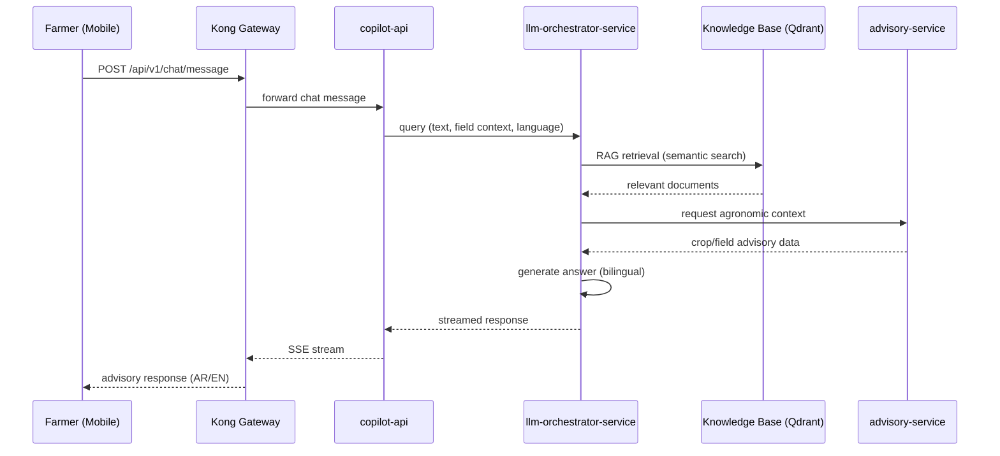

The farmer sends a natural-language question (Arabic or English) via the mobile chat interface. Kong routes to copilot-api which forwards the query to the llm-orchestrator-service. The orchestrator performs RAG retrieval from the knowledge base, optionally consults the advisory-service for agronomic context, and returns a bilingual answer streamed back to the farmer.

