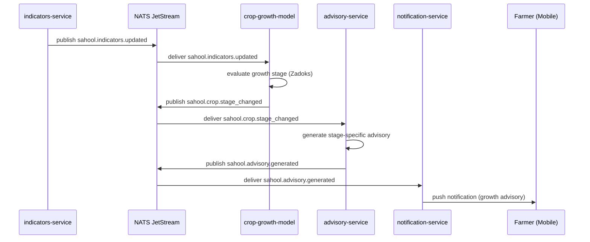

When the indicators-service detects threshold-crossing changes, the crop-growth-model evaluates whether a growth stage transition has occurred. On stage change, the advisory-service generates bilingual recommendations (fertilisation, irrigation, pest scouting) for the new stage. The notification-service delivers the advisory to the farmer via push notification.

