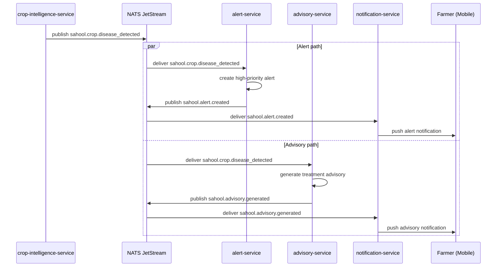

The crop-intelligence-service detects a disease through spectral or visual analysis and publishes a detection event. Both the alert-service and advisory-service consume this event in parallel. The alert-service creates a high-priority alert. The advisory-service generates a bilingual treatment recommendation. Both services trigger notifications to the farmer.

