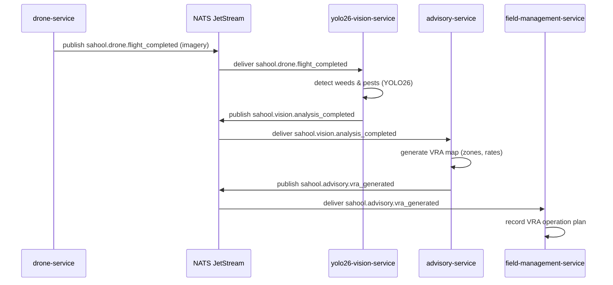

The drone-service completes an aerial survey and publishes the captured imagery. The yolo26-vision-service performs weed and pest detection across the flight mosaic. Results feed into the advisory-service which generates a variable-rate application (VRA) map for targeted spraying or fertilisation. The field-management-service records the VRA operation plan.

