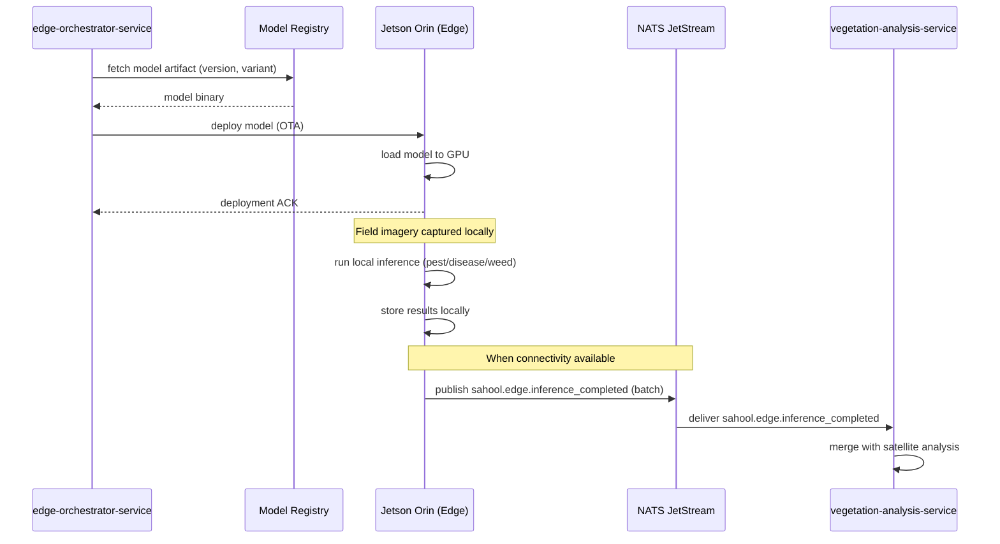

The edge-orchestrator-service selects a model version from the registry and deploys it to a Jetson Orin edge device. The device runs local inference on field imagery without cloud connectivity. When connectivity is available, inference results are synced back via NATS to the vegetation-analysis-service for aggregation with satellite data.

