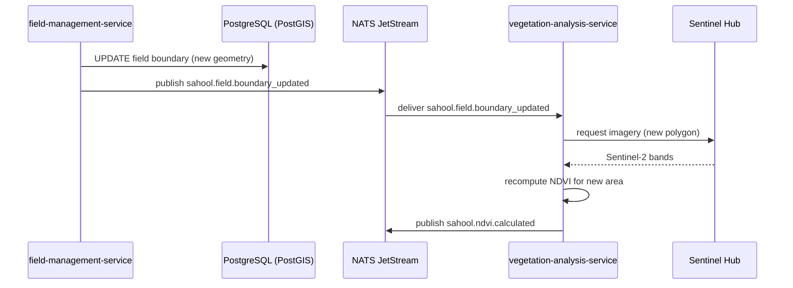

A farmer edits a field boundary in the mobile or web app. The field-management-service persists the new PostGIS geometry and publishes a boundary update event. The vegetation-analysis-service fetches fresh Sentinel Hub imagery matching the new polygon and recomputes the NDVI, publishing the updated result for downstream consumers.

