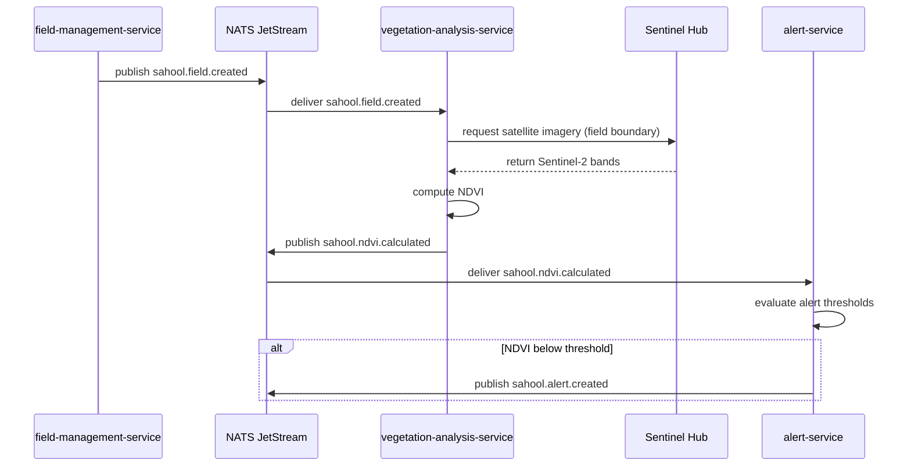

A newly created field triggers an automated vegetation analysis pipeline. The field-management-service publishes a `sahool.field.created` event via NATS. The vegetation-analysis-service picks it up, fetches Sentinel Hub imagery for the field boundary, computes the NDVI, and publishes the result. The alert-service evaluates whether the NDVI falls below a critical threshold and raises an alert if needed.

