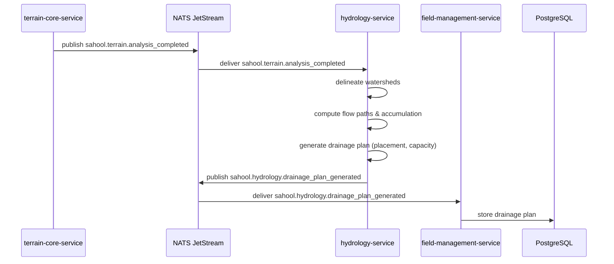

The terrain-core-service publishes completed terrain analysis data (DEM, slope, flow accumulation). The hydrology-service consumes it, delineates watersheds, computes flow paths, and generates a drainage plan with recommended drain placement and capacity. The field-management-service persists the drainage plan in the field record for farmer review.

