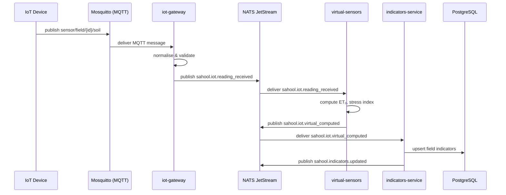

Field IoT devices (soil moisture, temperature, EC) publish readings over MQTT to the iot-gateway. The gateway normalises payloads, validates data quality, and publishes to NATS. The virtual-sensors service derives computed values (ET₀, crop stress index). Finally, the indicators-service aggregates raw and virtual readings into field-level indicators stored in PostgreSQL.

