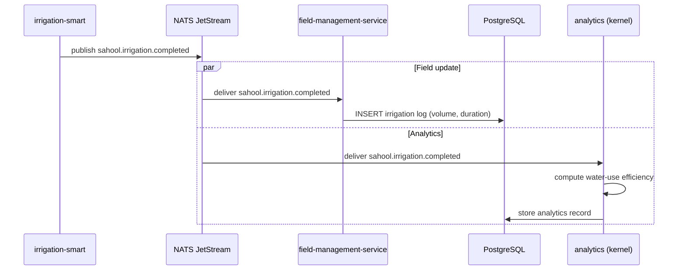

The irrigation-smart service signals cycle completion with volume and duration data. The field-management-service updates the field's irrigation log in PostgreSQL. In parallel, the analytics kernel processes water-use data for efficiency reporting and historical trend analysis, making results available on the dashboard.

