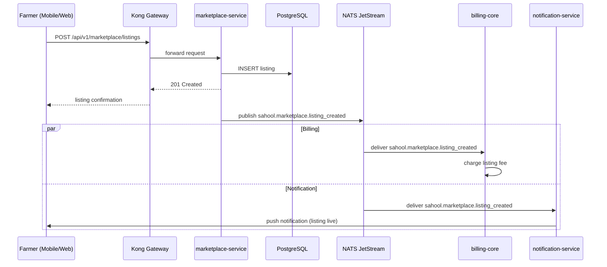

The farmer submits a new produce listing through the mobile or web app. Kong routes the request to the marketplace-service which persists it in PostgreSQL. A listing-created event is published; billing-core charges the listing fee and notification-service sends a confirmation to the farmer with listing details.

