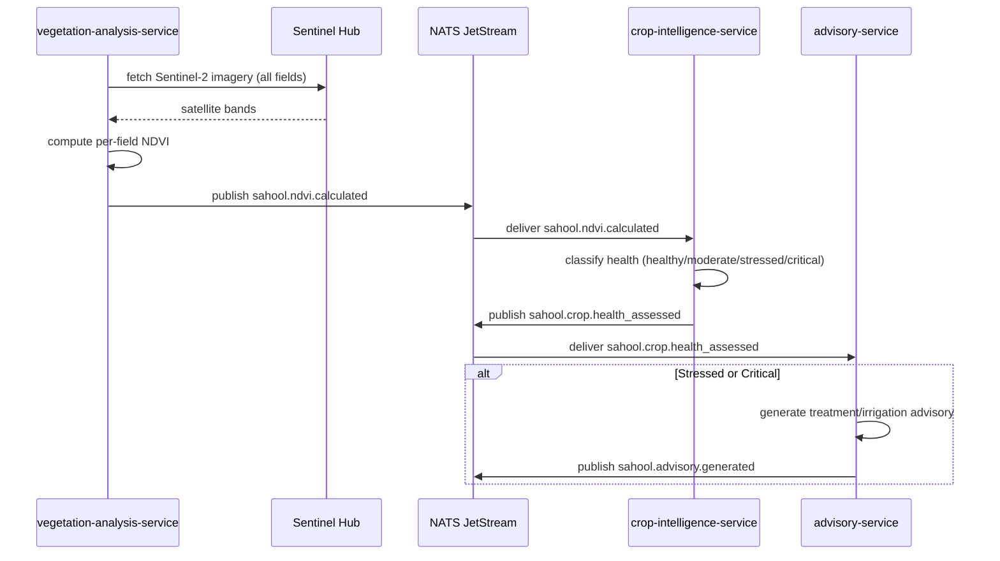

The vegetation-analysis-service periodically fetches Sentinel-2 imagery from Sentinel Hub, computes NDVI per field, and publishes the results. The crop-intelligence-service classifies health status (healthy, moderate, stressed, critical) and identifies anomaly zones. For stressed or critical fields, the advisory-service generates targeted treatment or irrigation advice.

