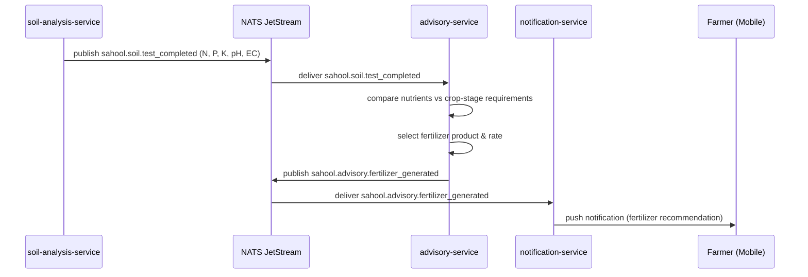

The soil-analysis-service processes lab results (N, P, K, pH, EC) and publishes them via NATS. The advisory-service compares nutrient levels against crop-stage requirements, selects an appropriate fertilizer product and rate, and generates a bilingual recommendation. The notification-service delivers the advisory with a cost-benefit summary.

