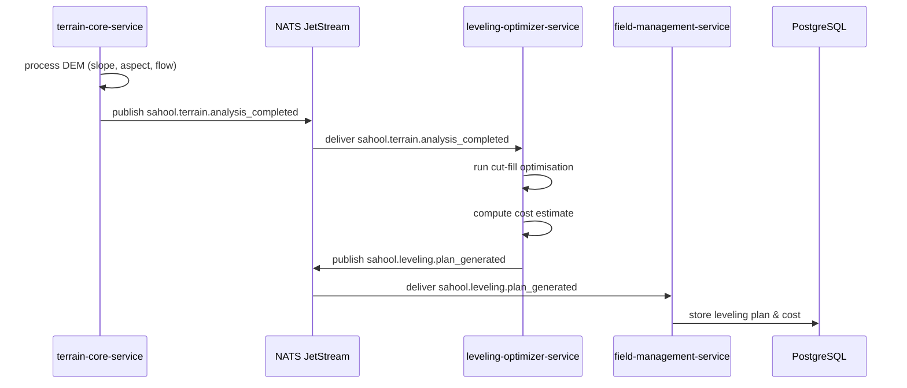

The terrain-core-service receives a Digital Elevation Model upload, computes slope, aspect, and flow direction, then publishes the analysis. The leveling-optimizer-service consumes the terrain data, runs cut-fill optimisation to minimise earthwork volume, and produces a leveling plan with a cost estimate. The field-management-service records the plan for the field.

