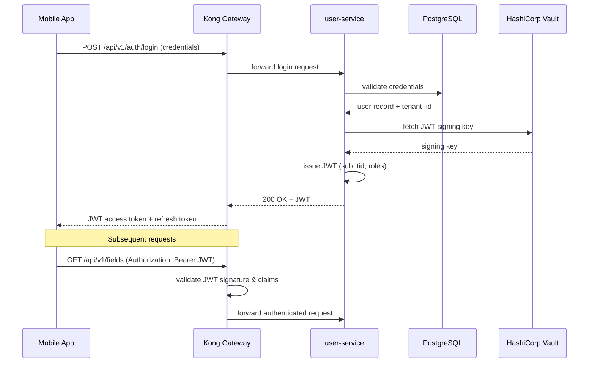

The mobile app sends credentials to Kong, which routes the request to the user-service. The user-service validates credentials against PostgreSQL, retrieves signing keys from Vault, and issues a JWT with tenant claims. Kong validates subsequent requests using the JWT and forwards authenticated traffic to backend services.

