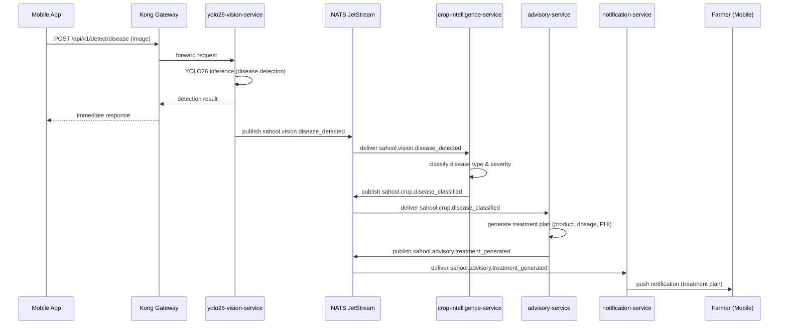

The farmer uploads an image of a symptomatic crop. The yolo26-vision-service detects disease regions and confidence scores. The crop-intelligence-service classifies the specific disease (e.g., wheat rust) and severity. The advisory-service generates a step-by-step treatment plan including product, dosage, PHI, and safety instructions. The notification-service delivers the plan.

