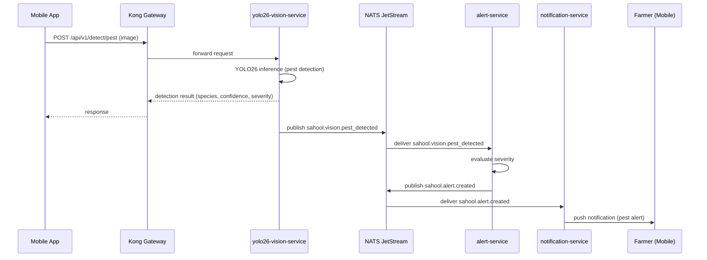

The farmer captures a photo of a suspicious crop area using the mobile app. The image is sent through Kong to the yolo26-vision-service, which runs YOLO26 inference to detect pest species and severity. Detection results are published via NATS. The alert-service creates a priority alert and the notification-service informs the farmer with actionable details.

