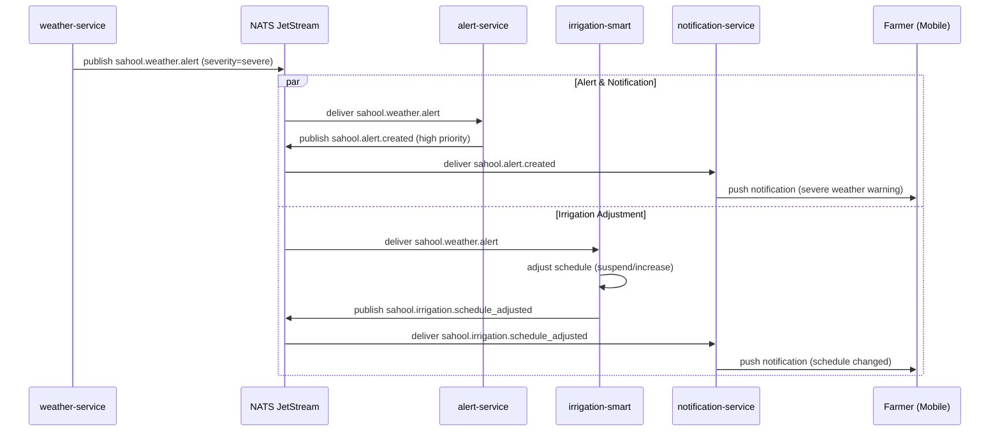

The weather-service detects an incoming severe event (frost, heatwave, heavy rain) and publishes a `sahool.weather.alert` event with `severity="severe"` in the payload. The alert-service creates a high-priority alert and the notification-service warns the farmer immediately. In parallel, the irrigation-smart service adjusts schedules — for example, suspending irrigation ahead of expected heavy rain or increasing frequency before a heatwave. Severity is a payload field, not a distinct subject, so consumers subscribe once and filter on payload.

