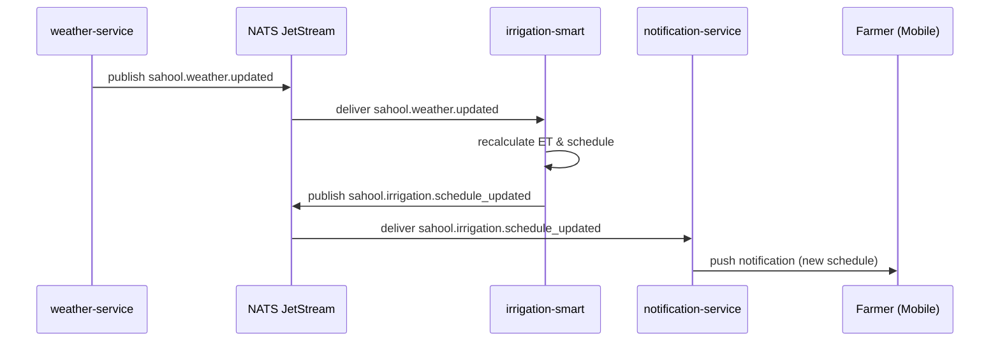

When the weather-service fetches fresh forecast data it publishes a `sahool.weather.updated` event. The irrigation-smart service recalculates ET-based schedules for affected fields and publishes a schedule update. The notification-service delivers a push notification to the farmer with the revised irrigation plan.

