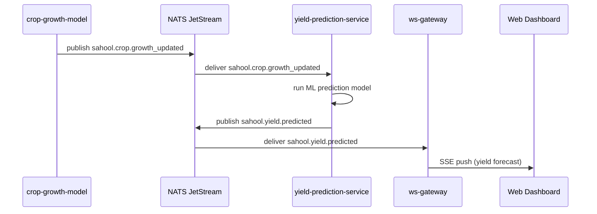

The crop-growth-model service publishes updated phenological stage and biomass accumulation data. The yield-prediction-service consumes this event, runs its ML model to produce a yield estimate with confidence intervals, and publishes the prediction. The ws-gateway pushes the result as a Server-Sent Event to the web dashboard for real-time display.

