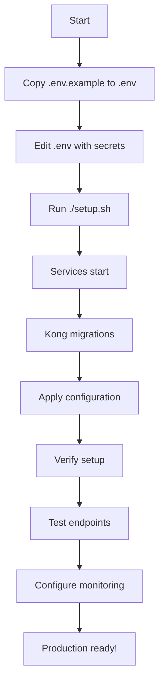

# Kong API Gateway Configuration Index

# فهرس تكوين بوابة Kong API

## Quick Navigation | التنقل السريع

### 🚀 Getting Started | البدء

1. **First Time Setup**
   - Read: [SUMMARY.md](SUMMARY.md) - Overview of what was created
   - Read: [QUICKSTART.md](QUICKSTART.md) - 5-minute setup guide
   - Run: `./setup.sh` - Automated setup

2. **Understanding the Platform**
   - Read: [SERVICES.md](SERVICES.md) - All 39 services explained
   - Read: [README.md](README.md) - Comprehensive documentation

### 📋 File Reference | مرجع الملفات

#### Core Configuration (Must Read)

- **[kong.yml](kong.yml)** (31K) - Main Kong configuration with all 39 services
- **[kong-packages.yml](kong-packages.yml)** (29K) - Package-based routes
- **[consumers.yml](consumers.yml)** (20K) - Consumer groups and ACLs

#### Setup & Operations

- **[setup.sh](setup.sh)** (13K) - Automated setup script ⚡
- **[Makefile](Makefile)** (14K) - 40+ commands for easy operations
- **[docker-compose.yml](docker-compose.yml)** (9.8K) - Docker services

#### Configuration

- **[.env.example](.env.example)** (8.7K) - Environment variables template
- **[prometheus.yml](prometheus.yml)** (9.3K) - Monitoring configuration

#### Documentation

- **[README.md](README.md)** (15K) - Main documentation
- **[QUICKSTART.md](QUICKSTART.md)** (9.2K) - Quick start guide
- **[SERVICES.md](SERVICES.md)** (17K) - Service registry
- **[SUMMARY.md](SUMMARY.md)** (11K) - Configuration summary

#### Monitoring

- **[grafana/datasources/prometheus.yml](grafana/datasources/prometheus.yml)** (683 bytes)
- **[grafana/dashboards/dashboard-provider.yml](grafana/dashboards/dashboard-provider.yml)** (835 bytes)

### 🎯 Common Tasks | المهام الشائعة

| Task            | Command            | Documentation                               |
| --------------- | ------------------ | ------------------------------------------- |
| Setup Kong      | `./setup.sh`       | [QUICKSTART.md](QUICKSTART.md)              |
| Start services  | `make start`       | [Makefile](Makefile)                        |
| Stop services   | `make stop`        | [Makefile](Makefile)                        |
| View logs       | `make logs`        | [Makefile](Makefile)                        |
| Test setup      | `make test`        | [README.md](README.md#testing)              |
| Apply config    | `make config-sync` | [README.md](README.md#apply-configurations) |
| Validate config | `make validate`    | [Makefile](Makefile)                        |
| Backup          | `make backup`      | [README.md](README.md#backup--restore)      |

### 📊 By Role | حسب الدور

#### For System Administrators

1. Start here: [QUICKSTART.md](QUICKSTART.md)
2. Then read: [README.md](README.md)
3. Configure: [.env.example](.env.example) → `.env`
4. Deploy: `./setup.sh`
5. Monitor: Check Grafana at http://localhost:3002

#### For Developers

1. Understand services: [SERVICES.md](SERVICES.md)
2. Review routes: [kong-packages.yml](kong-packages.yml)
3. Test endpoints: [QUICKSTART.md](QUICKSTART.md#testing)
4. Use Makefile: `make help`

#### For DevOps Engineers

1. Review infrastructure: [docker-compose.yml](docker-compose.yml)
2. Check monitoring: [prometheus.yml](prometheus.yml)
3. Backup strategy: [README.md](README.md#backup--restore)
4. Security: [README.md](README.md#security-best-practices)

#### For Project Managers

1. Overview: [SUMMARY.md](SUMMARY.md)
2. Service breakdown: [SERVICES.md](SERVICES.md)
3. Package comparison: [SERVICES.md](SERVICES.md#package-distribution)

### 🔍 By Topic | حسب الموضوع

#### Configuration

- Main config: [kong.yml](kong.yml)
- Package routes: [kong-packages.yml](kong-packages.yml)
- Consumers: [consumers.yml](consumers.yml)
- Environment: [.env.example](.env.example)

#### Setup & Deployment

- Automated setup: [setup.sh](setup.sh)
- Docker compose: [docker-compose.yml](docker-compose.yml)
- Quick start: [QUICKSTART.md](QUICKSTART.md)

#### Operations

- Makefile commands: [Makefile](Makefile)
- Troubleshooting: [README.md](README.md#troubleshooting)
- Backup/Restore: [README.md](README.md#backup--restore)

#### Monitoring

- Prometheus: [prometheus.yml](prometheus.yml)
- Grafana datasource: [grafana/datasources/prometheus.yml](grafana/datasources/prometheus.yml)
- Dashboards: [grafana/dashboards/dashboard-provider.yml](grafana/dashboards/dashboard-provider.yml)

#### Security

- JWT configuration: [consumers.yml](consumers.yml)
- ACL groups: [consumers.yml](consumers.yml)
- Best practices: [README.md](README.md#security-best-practices)

#### Services

- Service registry: [SERVICES.md](SERVICES.md)
- Service definitions: [kong.yml](kong.yml)
- Package access: [kong-packages.yml](kong-packages.yml)

### 📦 Package Tiers | مستويات الباقات

| Package      | Services | Rate Limit | File Reference                         |
| ------------ | -------- | ---------- | -------------------------------------- |
| Trial        | 5        | 50/min     | [consumers.yml](consumers.yml)         |
| Starter      | 5        | 100/min    | [kong-packages.yml](kong-packages.yml) |
| Professional | 18       | 1,000/min  | [kong-packages.yml](kong-packages.yml) |
| Enterprise   | 29       | 10,000/min | [kong-packages.yml](kong-packages.yml) |
| Research     | 14       | 10,000/min | [kong-packages.yml](kong-packages.yml) |

### 🛠 Tools & Utilities | الأدوات والمساعدات

#### Setup Tools

- `./setup.sh` - Automated setup with colored output
- `make setup` - Makefile-based setup
- `make install-deck` - Install Kong deck CLI

#### Testing Tools

- `make test` - Run basic tests
- `make test-health` - Test health endpoint
- `make test-services` - List all services
- `make test-routes` - List all routes

#### Operation Tools

- `make start` - Start all services
- `make stop` - Stop all services
- `make restart` - Restart services
- `make logs` - View logs

#### Configuration Tools

- `make config-sync` - Sync configuration
- `make config-diff` - Show differences
- `make validate` - Validate configuration
- `make config-dump` - Export current config

#### Monitoring Tools

- `make metrics` - Show Kong metrics
- `make prometheus` - Open Prometheus
- `make grafana` - Open Grafana
- `make konga` - Open Konga UI

### 🔗 External Links | الروابط الخارجية

- Kong Documentation: https://docs.konghq.com/
- Kong Declarative Config: https://docs.konghq.com/gateway/latest/production/deployment-topologies/db-less-and-declarative-config/
- Prometheus: https://prometheus.io/docs/
- Grafana: https://grafana.com/docs/

### 📝 Configuration Workflow | سير عمل التكوين



### 🚨 Troubleshooting Quick Reference | مرجع استكشاف الأخطاء السريع

| Issue               | Solution                  | Reference                                  |
| ------------------- | ------------------------- | ------------------------------------------ |
| Kong won't start    | Check logs: `make logs`   | [README.md](README.md#troubleshooting)     |
| 401 Unauthorized    | Verify JWT token          | [QUICKSTART.md](QUICKSTART.md#testing)     |
| 429 Rate Limited    | Check package tier        | [README.md](README.md#rate-limiting-tiers) |
| 502 Bad Gateway     | Check service health      | [README.md](README.md#troubleshooting)     |
| Config not applying | Validate: `make validate` | [Makefile](Makefile)                       |

### 📈 Monitoring Quick Access | الوصول السريع للمراقبة

| Service      | URL                           | Purpose            |
| ------------ | ----------------------------- | ------------------ |
| Kong Proxy   | http://localhost:8000         | API Gateway        |
| Kong Admin   | http://localhost:8001         | Admin API          |
| Kong Health  | http://localhost:8000/health  | Health Check       |
| Konga UI     | http://localhost:1337         | Web Interface      |
| Prometheus   | http://localhost:9090         | Metrics            |
| Grafana      | http://localhost:3002         | Dashboards         |
| Kong Metrics | http://localhost:8001/metrics | Prometheus Metrics |

### 🎓 Learning Path | مسار التعلم

#### Beginner

1. Read [SUMMARY.md](SUMMARY.md)
2. Read [QUICKSTART.md](QUICKSTART.md)
3. Run `./setup.sh`
4. Test with `make test`

#### Intermediate

1. Read [README.md](README.md)
2. Understand [SERVICES.md](SERVICES.md)
3. Explore [kong.yml](kong.yml)
4. Try different packages

#### Advanced

1. Study [kong-packages.yml](kong-packages.yml)
2. Review [consumers.yml](consumers.yml)
3. Configure [prometheus.yml](prometheus.yml)
4. Customize plugins

### 📞 Support | الدعم

For issues or questions:

1. Check [README.md](README.md#troubleshooting)
2. Review [QUICKSTART.md](QUICKSTART.md#troubleshooting)
3. Run `make help`
4. Check logs with `make logs`

### 🎉 Quick Start Commands | أوامر البدء السريع

```bash
# 1. Navigate to directory
cd /home/user/sahool-unified-v15-idp/infrastructure/kong

# 2. Run setup
./setup.sh

# 3. Verify
curl http://localhost:8000/health

# 4. View services
make test-services

# 5. Open Grafana
make grafana
```

### 📊 File Statistics | إحصائيات الملفات

- **Total Files:** 15
- **Total Size:** ~170 KB
- **Configuration Files:** 3 (kong.yml, kong-packages.yml, consumers.yml)
- **Documentation Files:** 5 (README.md, QUICKSTART.md, SERVICES.md, SUMMARY.md, INDEX.md)
- **Setup Files:** 2 (setup.sh, Makefile)
- **Infrastructure Files:** 3 (docker-compose.yml, prometheus.yml, .env.example)
- **Monitoring Files:** 2 (Grafana configs)

---

**Last Updated:** 2025-12-25
**Version:** 1.0.0
**Platform:** SAHOOL Agricultural Intelligence Platform
**منصة سهول للذكاء الزراعي**

**Need help? Start with [QUICKSTART.md](QUICKSTART.md)**
**تحتاج مساعدة؟ ابدأ بـ [QUICKSTART.md](QUICKSTART.md)**
